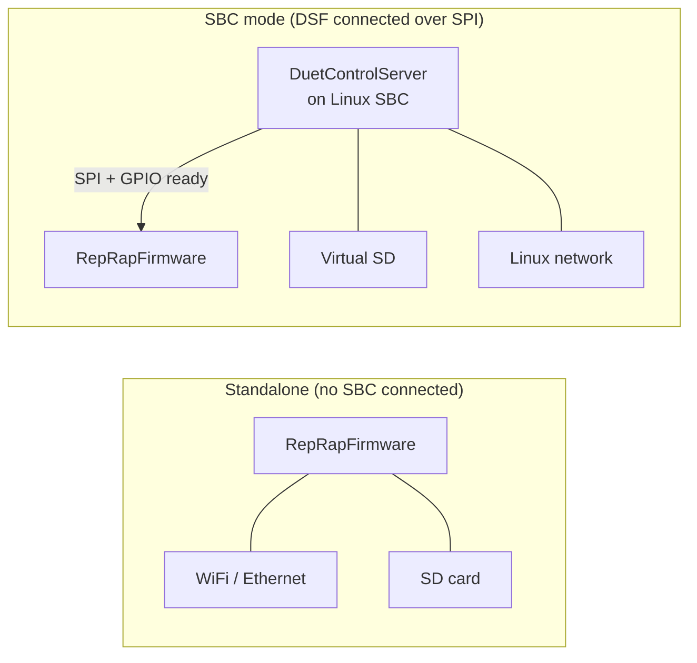
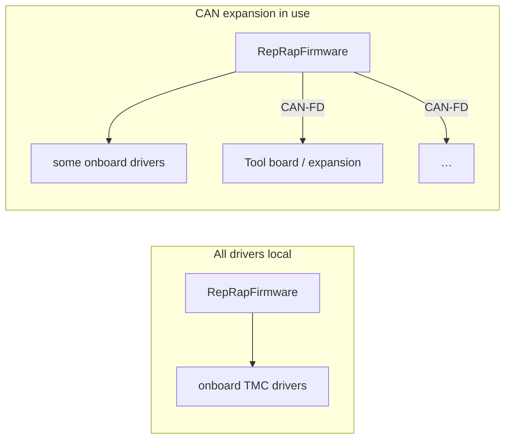
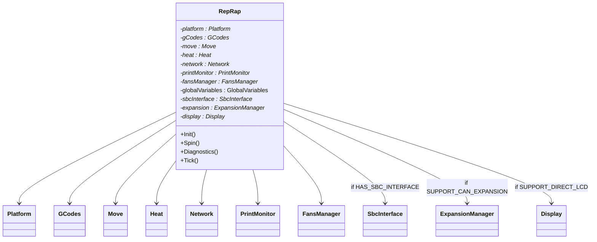
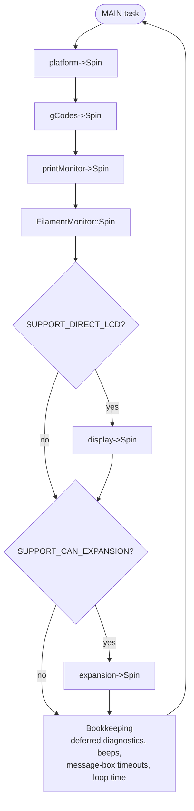
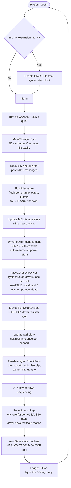
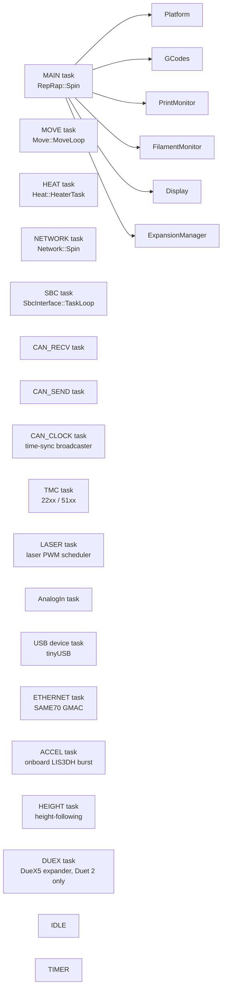
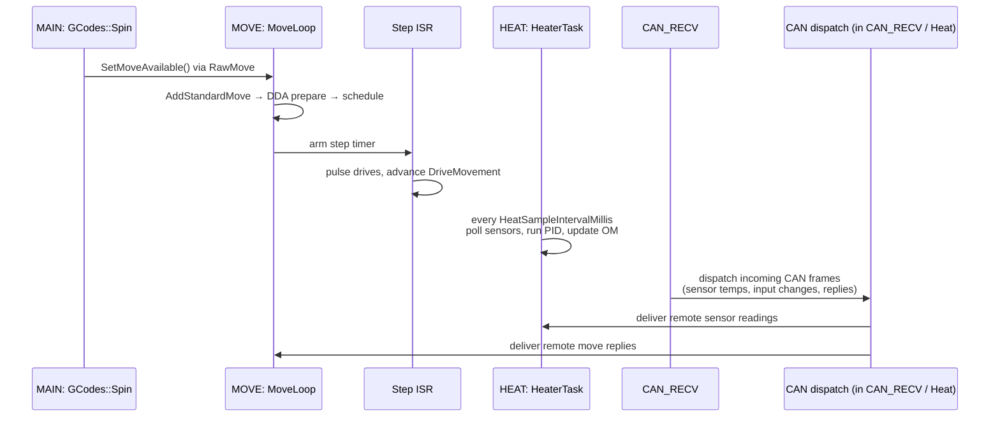
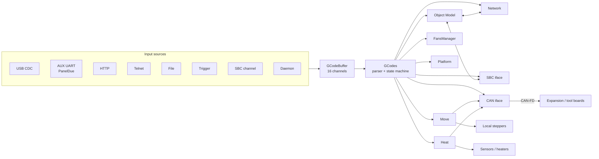
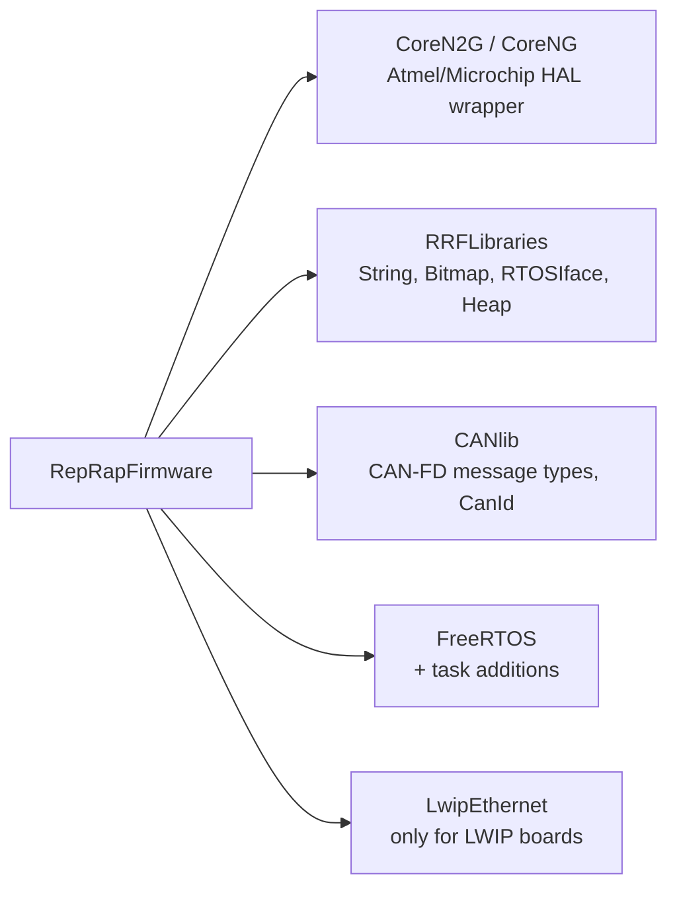

# RepRapFirmware Architecture

This document describes the top-level structure of RepRapFirmware (RRF). It is the entry point for navigating the rest of the developer docs.

## 1. What RepRapFirmware is

RRF is a single C++ application running on bare-metal ARM Cortex-M (no Linux). It targets:

| Processor family | Example boards |
|---|---|
| ATSAME70 | Duet 3 MB6HC, Duet 3 MB6XD |
| ATSAME5x (SAME51) | Duet 3 Mini 5+, FMDC |
| ATSAM4E / ATSAM4S | Duet 2 WiFi/Ethernet, Duet 2 Maestro |

It is a 3D printer / CNC / laser controller: it consumes G/M/T-codes, plans motion, drives steppers, controls heaters and fans, and exposes a network and / or SBC interface for control.

## 2. Two orthogonal deployment axes

What RRF does at runtime is decided along **two independent axes**, both compiled in if the target supports them.

### Axis A — front-end: standalone vs SBC



The mode is detected at runtime from the SPI handshake — RRF interprets a non-`0x60` format-code byte from the SBC as "DSF is here" and disables its own HTTP / file system. Without the SBC, RRF brings up its own network stack. See [SBC_INTERFACE.md](SBC_INTERFACE.md) and [NETWORKING.md](NETWORKING.md).

### Axis B — driver location: local-only vs CAN expansion



CAN expansion is a feature of the firmware, **independent of standalone vs SBC**. A Duet 3 main board running standalone with three CAN tool boards is normal; so is SBC + CAN; so is SBC + no CAN; so is standalone + no CAN. Whether motion / sensors / heaters / fans are forwarded over CAN is decided by the user at configuration time (`M584`, `M308`, `M569`, `M950`, …).

CAN expansion is enabled at compile time on Duet 3 boards via `SUPPORT_CAN_EXPANSION` ([per-board `Pins_*.h`](../../src/Config)). It compiles in `src/CAN/`, the `ExpansionManager`, the CAN tasks, and the cross-board `DriverId` encoding.

## 3. The `RepRap` container

The whole firmware revolves around one global object — `reprap` of class `RepRap` ([src/Platform/RepRap.h](../../src/Platform/RepRap.h), [src/Platform/RepRap.cpp](../../src/Platform/RepRap.cpp)). It owns one instance of every major module and forwards lifecycle calls to them:



Every module has the same shape: a constructor that allocates only, an `Init()` called from `RepRap::Init()` once at boot, and either a `Spin()` called from `RepRap::Spin()` repeatedly forever **or** its own dedicated FreeRTOS task. Which it is depends on the cadence and blocking behaviour the module needs.

The system is built around the principle stated in [src/RepRapFirmware.cpp](../../src/RepRapFirmware.cpp):

> *No class does, or ever should, wait inside one of its functions for anything to happen or call any sort of delay() function. Can I do a thing? — Yes — do it. No — set a flag/timer to remind me to do it next-time-I'm-called and return.*

This cooperative discipline applies to the modules whose `Spin()` is called from `RepRap::Spin()`. The modules that own a dedicated task are allowed to block on RTOS notifications because they only block their own task.

## 4. The `RepRap::Spin()` cooperative loop

`RepRap::Spin()` ([src/Platform/RepRap.cpp:737](../../src/Platform/RepRap.cpp)) runs on the **MAIN** FreeRTOS task and dispatches to a fixed list of subsystem `Spin()` methods in order:



Module priority is set by frequency of call, not by FreeRTOS priority — anything called more often inside `Spin()` is implicitly more responsive. Each entry into a module records `spinningModule` so the watchdog can name the offender on a hang.

### What each `Spin()` actually does

| Method | Source | Per-call work |
|---|---|---|
| `Platform::Spin` | [src/Platform/Platform.cpp:787](../../src/Platform/Platform.cpp) | The biggest of the cooperative routines. See section 5. |
| `GCodes::Spin` | [src/GCodes/GCodes.cpp:436](../../src/GCodes/GCodes.cpp) | If `SERIAL_USB_DEVICE`, calls `usbInput->Spin()` (USB → buffer, urgent-code sniff for M112/M122/M108). Calls `CheckTriggers()` to fire `M581` triggers. Spins the `Autopause` `GCodeBuffer` first (it has priority). Then round-robins one `GCodeBuffer` per call across the other 15 channels — parsing and dispatching one code per buffer. |
| `PrintMonitor::Spin` | [src/PrintMonitor/PrintMonitor.cpp:213](../../src/PrintMonitor/PrintMonitor.cpp) | If a print file isn't yet parsed, parse another chunk of slicer metadata. Update layer / time-remaining estimates. In SBC mode, only consume metadata pushed by DSF. |
| `FilamentMonitor::Spin` (static) | [src/FilamentMonitors/FilamentMonitor.cpp:306](../../src/FilamentMonitors/FilamentMonitor.cpp) | Walk all configured monitors. Sample any `Duet3DFilamentMonitor`-style sensors, correlate with extruder commanded position, and report runout / slip events to `GCodes`. In CAN-expansion mode, this also packs status into a `CanMessageFilamentMonitorsStatusV2` for sending. |
| `Display::Spin` | [src/Display/Display.cpp:94](../../src/Display/Display.cpp) | Poll the rotary encoder, redraw the LCD if the menu changed or a refresh is forced. (Maestro / PanelDue-mounted small LCDs only.) |
| `ExpansionManager::Spin` | [src/CAN/ExpansionManager.cpp:531](../../src/CAN/ExpansionManager.cpp) | Walk every known `boards[N]` slot. Mark a board `timedOut` if no status report has been received within `StatusMessageTimeoutMillis`. Update `boards[]` in the Object Model. |

## 5. Inside `Platform::Spin`

`Platform::Spin` is large — it owns several housekeeping responsibilities that don't justify their own task. In order:



Notes on the nested calls:

- **`MassStorage::Spin`** ([src/Storage/MassStorage.cpp](../../src/Storage/MassStorage.cpp)) — handles SD card mount/unmount edges, idle timer for closing recently-opened files, and runs FatFs housekeeping that has to be done on a regular task.
- **`FansManager::CheckFans`** ([src/Fans/FansManager.cpp](../../src/Fans/FansManager.cpp)) — iterates over every fan; for thermostatic fans, samples its monitored sensors; for tachometer-aware fans, computes RPM. Its return value tells `Platform::Spin` whether to defer power-down.
- **`Move::PollOneDriver`** ([src/Movement/Move.cpp](../../src/Movement/Move.cpp)) — polls just *one* TMC driver per call so the work is amortised. Each call advances `nextDriveToPoll` until it wraps. It checks for stall, over-temperature pre-warning, over-temperature shutdown, open-load, and short-to-VS/GND.
- **`Move::SpinSmartDrivers`** ([src/Movement/Move.cpp:3688](../../src/Movement/Move.cpp)) — keeps the TMC driver register cache in sync. On boards with TMC2660 this is a SPI poll loop; on TMC22xx / TMC51xx it uses a separate task (see section 6), and `SpinSmartDrivers` only nudges that task / handles state transitions when drivers power on or off.

## 6. The full FreeRTOS task table

Cooperative `Spin()` cannot serve every responsibility. Anything that needs to block on hardware (CAN RX, SPI I/O, ADC DMA), needs guaranteed cadence (heater PID, motion planning), or runs on a slow stack (filesystem, TLS, SBC link) lives on its own task.



Priorities (from [src/Platform/TaskPriorities.h](../../src/Platform/TaskPriorities.h), higher number = higher priority):

| Task | Priority | Purpose | Blocks on |
|---|---|---|---|
| `IDLE` | 0 | FreeRTOS idle hook | nothing |
| `MAIN` (`Spin`) | 1 (`SpinPriority`) | The cooperative `RepRap::Spin()` loop | nothing — never blocks |
| `NETWORK` (`Network::Spin`) | 1 (`SpinPriority`) | Network stack drive + responder polling | yields when no work; raises its own priority briefly while serving a responder |
| `SBC` (`SbcInterface::TaskLoop`) | 2 (`SbcPriority`) | SPI link state machine, file ops on RRF side | TfrReady GPIO interrupt, SPI DMA-complete |
| `HEAT` (`Heat::HeaterTask`) | 3 (`HeatPriority`) | 250 ms PID loop, sensor poll, CAN broadcast of temperatures | `TaskBase::TakeIndexed` with `HeatSampleIntervalMillis` timeout |
| `USB` (tinyUSB) | 3 (`UsbPriority`) | USB device stack | USB ISR notifications |
| `MOVE` (`Move::MoveLoop`) | 4 (`MovePriority`) | Pull next move, run look-ahead, prepare DDA, schedule step ISR | a step-timer callback, or until `CanAddMove()` is satisfied |
| `TMC` | 4 (`TmcPriority`) | TMC22xx / TMC51xx UART/SPI register sync | UART/SPI DMA-complete |
| `ANALOG` | 4 (`AinPriority`) | ADC scan completion processing, oversample → averaging filter | ADC DMA-complete |
| `HEIGHT` | 4 | `M593`-style height-following on a Z scanning probe | scanning sensor sample notify |
| `LASER` | 5 (`LaserPriority`) | Schedule laser PWM transitions during a move | step-timer notify |
| `CAN_SEND` | 5 (`CanSenderPriority`) | Async CAN TX | TX FIFO not-full event |
| `ETHERNET` | 5 (`EthernetPriority`) | SAME70 GMAC RX/TX | DMA / phy events |
| `CAN_RECV` | 6 (`CanReceiverPriority`) | CAN-FD RX dispatch | RX FIFO not-empty event |
| `ACCEL` | 6 | Onboard LIS3DH sample-burst when M956 active | I²C DMA-complete |
| `CAN_CLOCK` | 7 (`CanClockPriority`) | Periodic `CanMessageTimeSync` broadcast | timer tick |
| `DUEX` | 5 | I²C poll of the DueX5 GPIO expander (Duet 2 only) | I²C DMA-complete |
| `TIMER` | (FreeRTOS) | Software timer service | nothing |

The watchdog ticks live in `RepRap::Tick()` ([RepRap.cpp](../../src/Platform/RepRap.cpp)), which is invoked from the FreeRTOS 1 ms tick hook (`vApplicationTickHook` in [Tasks.cpp](../../src/Platform/Tasks.cpp)). The MAIN task watchdog (`MaxMainTaskTicksInSpinState = 20000` ≈ 20 s, [`RepRap.h`](../../src/Platform/RepRap.h)) and the HEAT task watchdog (`MaxHeatTaskTicksInSpinState = 4000` ≈ 4 s) therefore both count milliseconds. If either expires, the firmware does a software reset with a reason of `StuckInSpin` or `HeatTaskStuck` so post-mortem `M122` shows the cause.

### How the long-running task loops interact



`MOVE` is the busiest custom task during a print. It spends most of its time waiting on the step timer to free space in the DDA ring, then immediately tries to add the next G-code move that `GCodes` has produced.

## 7. Module map

Module enumeration in [src/RepRapFirmware.h:330](../../src/RepRapFirmware.h):

```cpp
NamedEnum(Module, uint8_t,
    Platform, Network, Webserver, Gcodes, Move, Heat, Kinematics, InputShaping,
    Debug, PrintMonitor, Storage, PortControl, DuetExpansion, FilamentSensors, WiFi, Display,
    SbcInterface, CAN, Expansion,
    numModules);
```



| Module | Path | Responsibility |
|---|---|---|
| Platform | [src/Platform/Platform.cpp](../../src/Platform/Platform.cpp) | Pins, ADC, voltage / current monitoring, beeper, message routing, file logging, software reset reasons. |
| GCodes | [src/GCodes/GCodes.cpp](../../src/GCodes/GCodes.cpp) and `GCodes2.cpp`–`GCodes7.cpp` | G/M/T parser, channel state machines, command dispatch. |
| Move | [src/Movement/Move.cpp](../../src/Movement/Move.cpp) | DDA queue, step ISR, kinematics, input shaping, mesh compensation. |
| Heat | [src/Heating/Heat.cpp](../../src/Heating/Heat.cpp) | Heaters, PID, autotune, sensor abstraction, safety cutoffs. |
| Network | [src/Networking/Network.cpp](../../src/Networking/Network.cpp) | Network interfaces, responders (HTTP/FTP/Telnet/MQTT), `rr_*` API. |
| ObjectModel | [src/ObjectModel/](../../src/ObjectModel) | Reflected machine state, M409 serialisation, sequence numbers. |
| PrintMonitor | [src/PrintMonitor/PrintMonitor.cpp](../../src/PrintMonitor/PrintMonitor.cpp) | File parsing, layer / time estimation. |
| FansManager | [src/Fans/](../../src/Fans) | PWM fans, thermostatic fans, RPM monitoring. |
| FilamentMonitors | [src/FilamentMonitors/](../../src/FilamentMonitors) | Optical / magnetic / pulsed monitors, calibration. |
| Endstops | [src/Endstops/](../../src/Endstops) | Endstops, Z-probes, scanning probes (incl. CAN remote handles). |
| LedStrips | [src/LedStrips/](../../src/LedStrips) | DotStar / NeoPixel patterns. |
| Storage | [src/Storage/](../../src/Storage) | FatFs, SD card, embedded files, CRC. |
| Logger | [src/Platform/Logger.cpp](../../src/Platform/Logger.cpp) | Event log persisted to SD. |
| SbcInterface | [src/SBC/SbcInterface.cpp](../../src/SBC/SbcInterface.cpp) | SPI-attached SBC. See [SBC_INTERFACE.md](SBC_INTERFACE.md). |
| CAN / ExpansionManager | [src/CAN/](../../src/CAN) | CAN-FD master role. See [CAN_BUS.md](CAN_BUS.md). |
| Display | [src/Display/](../../src/Display) | Direct LCD on Maestro. |

## 8. The four big data structures

A working mental model of RRF is easier if you know where state lives:

| Structure | Lives in | Lifetime | What it holds |
|---|---|---|---|
| `RepRap reprap` | global `BSS` | program lifetime | one of every module |
| `GCodeBuffer` (×16) | `GCodes` | program lifetime | per-channel parser state, machine state stack, current line |
| `DDA` ring buffer | `DDARing` (×N motion systems) | continually recycled | look-ahead queue of planned moves |
| `ObjectModel` tree | reflective tables | continually updated | live machine state, queried by M409 / SBC / DWC |

The relationship between them is the heart of the firmware:

```
              parsed by              fed into                   serialised by
Input bytes ─────────► GCodeBuffer ─────────► DDA queue / Heat / etc. ─────────► ObjectModel ─────────► Network / SBC
```

## 9. Hardware abstraction

RRF deliberately concentrates board / processor differences in two places:

1. **`Config/Pins_*.h`** ([src/Config](../../src/Config)) — per-board pin tables, pin counts, feature flags. One header is selected at build time by the make target.
2. **`Platform`** ([src/Platform/Platform.cpp](../../src/Platform/Platform.cpp)) — the only class that knows how to read an ADC, set a PWM, write a GPIO, talk to the smart driver chip, etc.

Everything above `Platform` works in real-world units (mm, °C, seconds). The exception is the step ISR, which works in step clocks (750 kHz on Duet 3, ~937.5 kHz on Duet 2) so that stepping can be sub-microsecond accurate without floating-point in the ISR.

## 10. External libraries

The firmware does not build standalone — it pulls in five Git submodules (see [`Makefile`](../../Makefile)):



`CANlib` is shared verbatim with [Duet3Expansion](https://github.com/Duet3D/Duet3Expansion/tree/3.7-docker) and contains the on-the-wire message structs. The two firmwares **must** be built from compatible CANlib versions.

## 11. Where to go next

- A code change touching motion → start at [MOTION_PIPELINE.md](MOTION_PIPELINE.md).
- A new G/M-code → start at [GCODE_PROCESSING.md](GCODE_PROCESSING.md).
- A new sensor type or heater control feature → [HEATING.md](HEATING.md).
- A change visible to DWC or DSF → [OBJECT_MODEL.md](OBJECT_MODEL.md).
- Anything talking to a tool / expansion board → [CAN_BUS.md](CAN_BUS.md).
- Anything talking to an SBC → [SBC_INTERFACE.md](SBC_INTERFACE.md).
