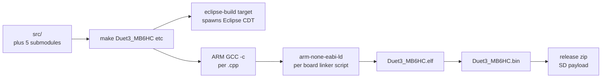

# Build Variants

How RepRapFirmware is sliced across boards, processors, and feature combinations. Setup-level prerequisites are in [../DEVELOPER.md](../DEVELOPER.md); this file documents *what* gets built.

## 1. Make targets

The top-level [`Makefile`](../../Makefile) has one target per supported board and one or more combined / variant targets:

| Target | Board | Processor | Notable flags |
|---|---|---|---|
| `Duet3_MB6HC` | Duet 3 MB6HC | SAME70 | SBC, CAN expansion, LwIP Ethernet, WiFi via co-processor |
| `Duet3_MB6XD` | Duet 3 MB6XD | SAME70 | as MB6HC; external stepper drivers |
| `Duet3Mini5plus` | Duet 3 Mini 5+ | SAME51 (SAME5x) | SBC, CAN, Ethernet (or WiFi variant) |
| `Duet3_CAN0` | Duet 3 with no SBC | SAME70 | CAN-only build for diagnostics / test rigs |
| `Duet3_MB6HC_no_SD` | MB6HC | SAME70 | dropped SD support to free flash |
| `FMDC_V03` | FMDC v0.3 (filament-monitoring controller) | SAME5x | small variant |
| `Duet2WiFi` / `Duet2Ethernet` / `Duet2SBC` / `Duet2Maestro` | Duet 2 series | SAM4E / SAM4S | legacy boards, dropped CAN |

`make all` builds every target.



The build is driven by Eclipse-style `.cproject` files inside each board's subdirectory. The Makefile invokes the corresponding Eclipse build via the dev-container's headless Eclipse — most users never touch this.

## 2. Submodules

Five external submodules ([Makefiles/](../../Makefiles)):

| Submodule | What it provides |
|---|---|
| `CoreN2G` | Microchip / Atmel HAL wrapper, board init, peripheral drivers, USB, HSMCI, NVIC dispatch. |
| `RRFLibraries` | `String`, `Bitmap`, `RTOSIface`, `Heap`, `function_ref`, `NamedEnum`, etc. |
| `CANlib` | On-the-wire CAN-FD message structs shared with [Duet3Expansion](../../../Duet3Expansion). |
| `FreeRTOS` | The kernel + Duet3D's `task additions`. |
| `LwipEthernet` | LwIP wrapper for SAME70 RMII (only built on relevant boards). |

`make init-submodules` clones / pins all of them; switching a branch with `git config --global submodule.recurse true` keeps them aligned.

## 3. Conditional compilation

The biggest cross-cutting flags:

| Flag | Where set | Effect |
|---|---|---|
| `SAME70` / `SAME5x` / `SAM4E` / `SAM4S` | Pins_*.h | Selects processor-specific code paths. |
| `HAS_SBC_INTERFACE` | Pins_*.h | Compiles `src/SBC/`, declares `SbcInterface`. |
| `SUPPORT_CAN_EXPANSION` | Pins_*.h | Compiles `src/CAN/`, declares `ExpansionManager`. |
| `HAS_LWIP_NETWORKING` | Pins_*.h | Compiles `src/Networking/LwipEthernet/`. |
| `HAS_W5500_NETWORKING` | Pins_*.h | Compiles `src/Networking/W5500Ethernet/`. |
| `HAS_WIFI_NETWORKING` | Pins_*.h | Compiles WiFi co-processor SPI. |
| `HAS_MASS_STORAGE` | Pins_*.h | SD card present. |
| `SUPPORT_DIRECT_LCD` | Pins_*.h | 12864 LCD on Maestro. |
| `SUPPORT_LASER` / `SUPPORT_IOBITS` / `SUPPORT_ASYNC_MOVES` | Pins_*.h | Optional motion features. |
| `SUPPORT_REMOTE_COMMANDS` | Pins_*.h | RRF acting as a CAN slave (for ATE). |
| `DEBUG=1` | command line | `-Og`, debug symbols, asserts. |

Avoid sprinkling `#ifdef`s outside `Platform`: the project policy ([RepRapFirmware.cpp](../../src/RepRapFirmware.cpp)) is to push board variation into the Pins header and the Platform class.

## 4. Linker memory layout

Each board has a linker script (`*.ld`) defining flash and RAM regions. Notable for SAME70:

- **`.text`** — flash from `0x00400000`.
- **`.ram_nocache`** — non-cacheable RAM section used by DMA buffers (CAN, network, USB).
- **`.ramfunc`** — code copied to RAM at startup for tight ISR paths.
- IAP region — reserved at top of flash, used during firmware update.

Check the M122 "Memory" section to see how much each region is using.

## 5. Output and deployment

After `make Duet3_MB6HC`:

```
Duet3_MB6HC/
├── Duet3_MB6HC.elf
├── Duet3_MB6HC.bin            ← binary that gets written to flash
├── Duet3_MB6HC.map            ← linker map (for stack high-water analysis)
└── Duet3Firmware_MB6HC.bin    ← release blob name expected by M997
```

`M997` flashes the new file via the IAP. The VS Code task **Build and Deploy to Target** ([../DEVELOPER.md](../DEVELOPER.md)) automates upload+flash.

For SBC-mode systems, DSF can also flash the firmware: `DuetControlServer --update` writes the bundled `Duet3Firmware_*.bin` to the connected board over SPI. See [SBC_INTERFACE.md#iap--firmware-update-over-spi](SBC_INTERFACE.md#iap--firmware-update-over-spi).

## 6. Compatibility contracts

A given RRF build commits to a few external interfaces:

| Contract | Constant | Must match |
|---|---|---|
| SBC SPI protocol | `SbcProtocolVersion` (currently 7) | DSF's [`Defaults.cs`](../../../DuetSoftwareFramework/src/DuetAPI/Connection/Defaults.cs) |
| SBC buffer size | `SbcTransferBufferSize` (8192) | DSF's `Consts.cs` |
| CAN-FD message struct layouts | (CANlib commit) | [Duet3Expansion](../../../Duet3Expansion) build with same CANlib |
| `M409` JSON keys | descriptor table entries | DSF [`DuetAPI/ObjectModel/`](../../../DuetSoftwareFramework/src/DuetAPI/ObjectModel) |
| `rr_*` URL family | [HttpResponder](../../src/Networking/HttpResponder.cpp) | DWC, DWS proxy |
| G/M/T-code numbers | [GCodes2.cpp](../../src/GCodes/GCodes2.cpp) | published wiki, slicer presets |

Bumping any of the first three without updating the matching repo will produce hard incompatibility errors at first contact.

## 7. Where this connects to the rest of the system

- See [Duet3Expansion's BUILD_VARIANTS](../../../Duet3Expansion/docs/devel/BUILD_VARIANTS.md) for the corresponding board matrix on the expansion side.
- See [DSF Build Variants](../../../DuetSoftwareFramework/docs/devel/BUILD_VARIANTS.md) (and `pkg/`) for which `.deb` packages are produced from DSF.
- The cross-repo version compatibility table is maintained in [DuetSoftwareFramework/docs/architecture/COMPATIBILITY.md](../../../DuetSoftwareFramework/docs/architecture/COMPATIBILITY.md).
