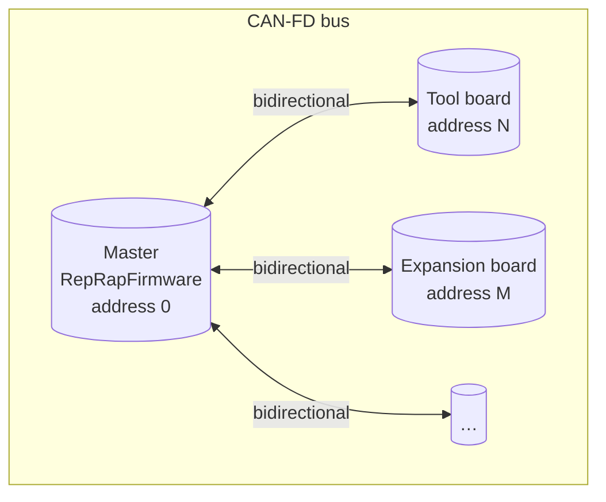
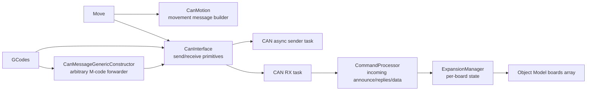
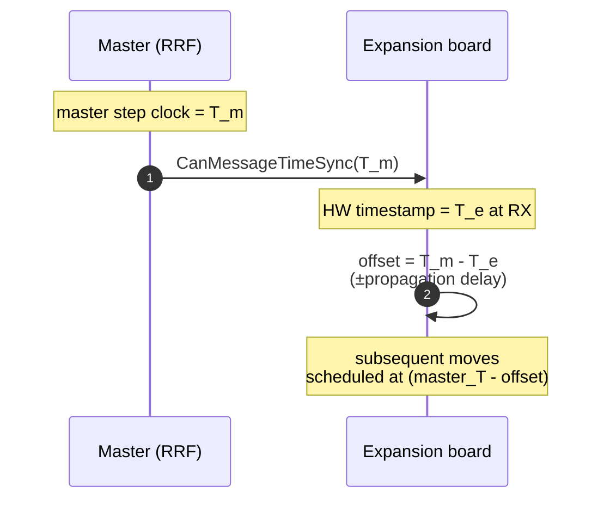
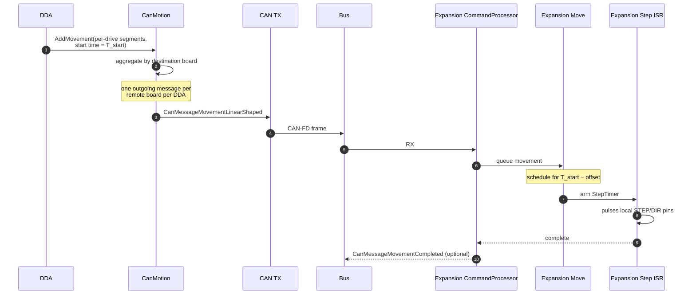
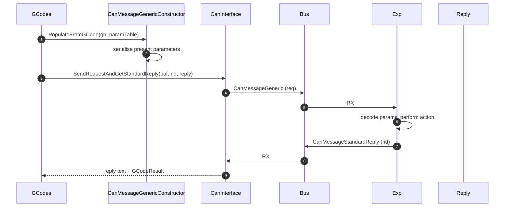
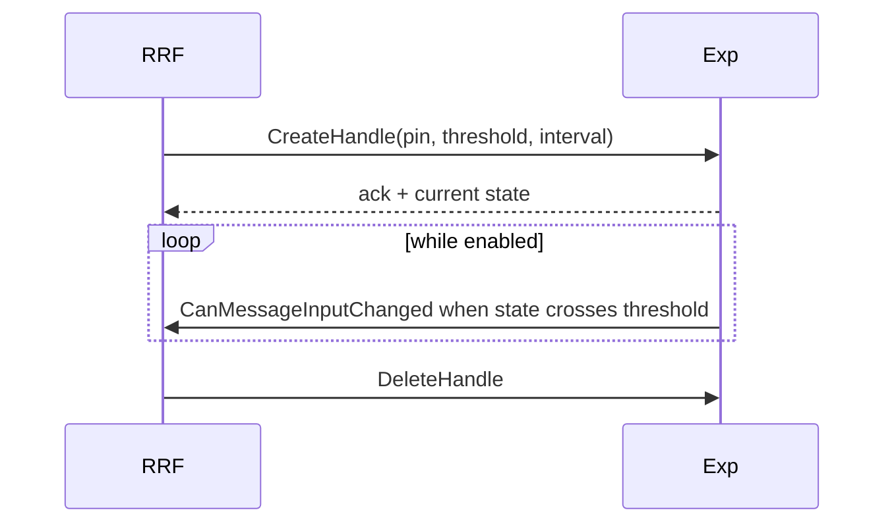
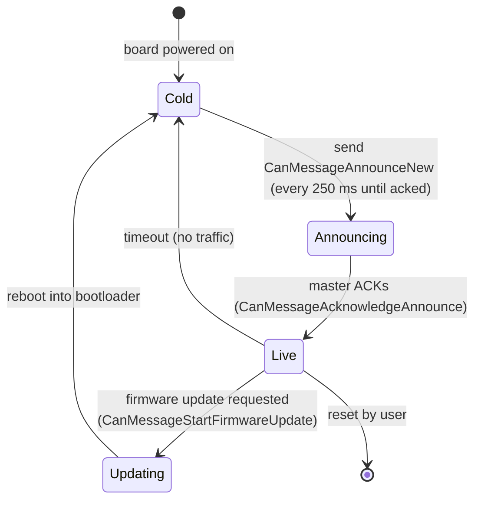

# CAN-FD Bus

This document describes the CAN-FD bus that links a Duet 3 main board (running RRF) to its expansion / tool boards (running [Duet3Expansion](../../../Duet3Expansion)).

The on-the-wire types described here are defined in the **CANlib** submodule and shared verbatim between RRF and Duet3Expansion. If you change a message struct you must rebuild *both* firmwares.

## 1. Topology and addressing

- The main board running RRF is **always address 0** (`CanId::MasterAddress`, [CanId.h](../../src/RepRapFirmware.h)). It is the only initiator of normal traffic.
- Each expansion board has a `uint8_t` address. New boards arrive on `CanId::DefaultAddress` and the user assigns them via `M952` — addresses are persisted in NVRAM on the expansion board.
- Maximum useful address is `CanId::MaxCanAddress`. Addresses are encoded into both the CAN identifier (so the silicon can hardware-filter) and into the message body.

A **`DriverId`** ([src/RepRapFirmware.h:226](../../src/RepRapFirmware.h)) packs `(boardAddress, localDriver)` into the universal "driver number" used by `M584`, `M906`, `M569`, etc. A driver `0.0` is local (board 0, driver 0); `1.0` is the first driver on board 1.

## 2. Software components

| Component | Role |
|---|---|
| [`CanInterface`](../../src/CAN/CanInterface.cpp) | Buffer pool, hardware queue, RX dispatch, `SendRequestAndGetStandardReply` request/response helper, time-sync TX. |
| [`CanMotion`](../../src/CAN/CanMotion.cpp) | Aggregates per-DDA moves into one outgoing motion message per remote board. Handles late-add, abort, probe-triggered cancels. |
| [`CanMessageGenericConstructor`](../../src/CAN/CanMessageGenericConstructor.cpp) | Builds a `CanMessageGeneric` from a `GCodeBuffer` so any M-code can be forwarded to a remote board with parameter letters preserved. |
| [`ExpansionManager`](../../src/CAN/ExpansionManager.cpp) | Tracks announced boards, their firmware version, hardware capabilities, alive/timeout status. Populates `boards[]` in the Object Model. |
| [`CommandProcessor`](../../src/CAN/CommandProcessor.cpp) | Receives non-reply messages: announces, errors, generic responses, fan tachos, sensor temperatures, input changes. |

## 3. Message families

CAN-FD allows up to 64 data bytes per frame. Long payloads are fragmented across multiple frames using sequence numbers (`CanMessageBuffer::fragmentNumber`).

The on-the-wire types live in `CANlib/src/CanMessageFormats.h`. They split into four families:

| Family | Examples | Direction |
|---|---|---|
| **Time-sync / housekeeping** | `CanMessageTimeSync`, `CanMessageAnnounceNew`, `CanMessageAnnounceOld`, `CanMessageAcknowledgeAnnounce` | bidirectional |
| **Motion** | `CanMessageMovementLinearShaped`, `CanMessageStopMovement`, `CanMessageRevertPosition` | master → expansion |
| **Generic command / reply** | `CanMessageGeneric`, `CanMessageStandardReply`, `CanMessageExtendedReply` | bidirectional |
| **Streaming data** | `CanMessageInputChanged`, `CanMessageSensorTemperatures`, `CanMessageFansReport`, `CanMessageDriversStatus`, `CanMessageClosedLoopData`, `CanMessageAccelerometerData` | expansion → master |

## 4. Time sync

The expansion firmware needs to start each move at the same instant the master starts the local-drive portion of the same move. Because both sides count step clocks at 750 kHz, the only thing that has to be agreed is the *offset* between the two clocks.

`CanMessageTimeSync` ([CANlib](../../src/CAN/CanInterface.cpp) calling site) is broadcast by the master every `CanClockIntervalMillis = 211` ms by a dedicated **`CAN_CLOCK`** task at the highest CAN priority. It carries the master's current step-clock value at the moment of transmission. The expansion board uses CAN's hardware timestamp on the received frame to compute the round-trip and thus its local offset to the master clock — see Duet3Expansion's [CAN_PROTOCOL.md](../../../Duet3Expansion/docs/devel/CAN_PROTOCOL.md).

The choice of 211 ms (a prime number) avoids accidental beating against any other periodic activity in the system.

Without time sync, the boards would drift, simultaneous-axis moves split across boards would tear, and homing couldn't be coordinated.

## 5. Motion message flow

Per-DDA, a board only receives **one** message — the entire shaped acceleration profile fits into a single CAN-FD frame for a typical move (more frames if input shaping produces a long segment chain). The expansion board's local step ISR is responsible for the actual stepping.

If the master decides to abort an in-flight move (e.g. probe triggered, emergency stop), it broadcasts `CanMessageStopMovement` and every board immediately halts its DDA queue.

## 6. Generic forwarded commands

Most M-codes that touch hardware can be addressed at a remote board by including a board address in their parameters (`P40.1` selects driver `0` on board `1`). The forwarder is `CanMessageGenericConstructor`:

The request id (`rid`) is allocated by `CanInterface::AllocateRequestId` and matched by the CommandProcessor on reception so that concurrent requests from different GCode channels don't get crossed.

## 7. Remote handles

For inputs the master needs to observe in real time (endstops, Z-probe, filament sensor, GP-in pin) RRF allocates a **`RemoteInputHandle`** on the expansion board. The expansion board then sends a `CanMessageInputChanged` message whenever the input crosses a threshold or after a configured minimum interval. This is the mechanism behind every endstop, probe, filament monitor and `M581` trigger that lives on a tool board:

Handle lifecycle is owned by `CanInterface::CreateHandle / DeleteHandle / EnableHandle / ChangeHandleResponseTime` on the master side and by `InputMonitor` on the expansion side.

## 8. Streaming data

Data the master needs continuously (heater temperatures from a CAN-attached sensor, fan tachometer counts, driver status flags, accelerometer sample bursts, closed-loop telemetry) is pushed asynchronously by expansion boards into matching topic messages that `CommandProcessor` decodes and feeds into `Heat`, `FansManager`, `SmartDrivers`, the accelerometer collector, etc.

## 9. Discovery & lifecycle

`ExpansionManager` ([src/CAN/ExpansionManager.cpp](../../src/CAN/ExpansionManager.cpp)) keeps a slot per known board with last-seen timestamp, version, hardware ID, error count, etc. M115 against a remote board is a one-shot `GetRemoteFirmwareDetails` query.

Firmware update over CAN is handled by `CanMessageFirmwareUpdate*` requests / responses; the bootloader on the expansion board is what actually receives and writes the new image.

## 10. Diagnostics

`M122 B<addr>` runs `CanInterface::RemoteDiagnostics` against a board and prints its diagnostic dump. `M122 P<n>` against the master selects subsystems including CAN — the bus statistics (queue depth, error count, retransmits, last error code) come from the silicon driver layer in [CoreN2G](../../src/CAN).

## 11. Where this connects to the rest of the system

- The CAN-FD address space is also used by **DSF**: a remote `M409` for a CAN-attached board is forwarded by RRF, and the result is merged into the global Object Model that DSF replicates over SPI. See [SBC_INTERFACE.md](SBC_INTERFACE.md) and [OBJECT_MODEL.md](OBJECT_MODEL.md).
- For the expansion-side view of every protocol described here (announce, time-sync, motion reception, input handles, streaming) see [Duet3Expansion's CAN docs](../../../Duet3Expansion/docs/devel/CAN_PROTOCOL.md).
- `DUAL_CAN` boards (some hardware variants) support a second CAN bus for user / non-master traffic; see [`SendPlainMessageNoFree`](../../src/CAN/CanInterface.cpp).
