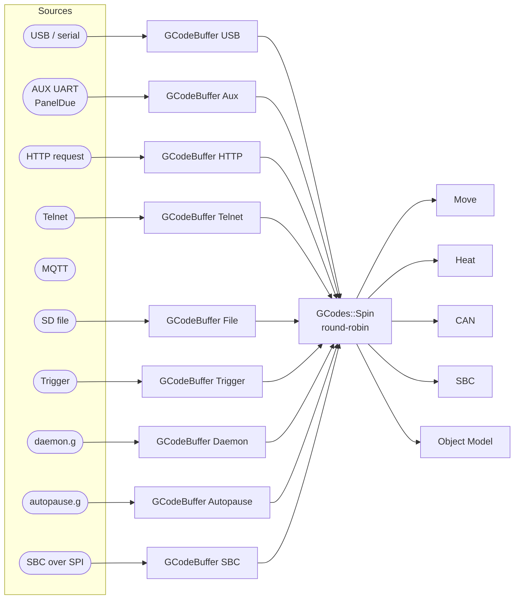
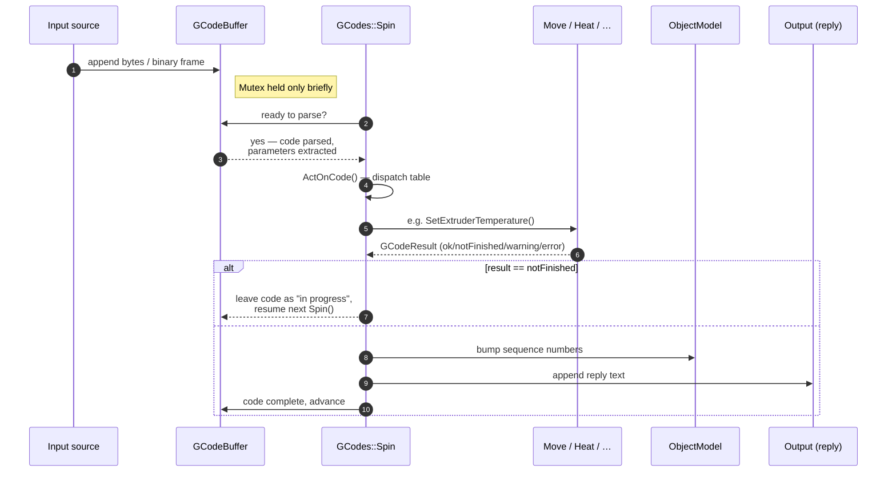
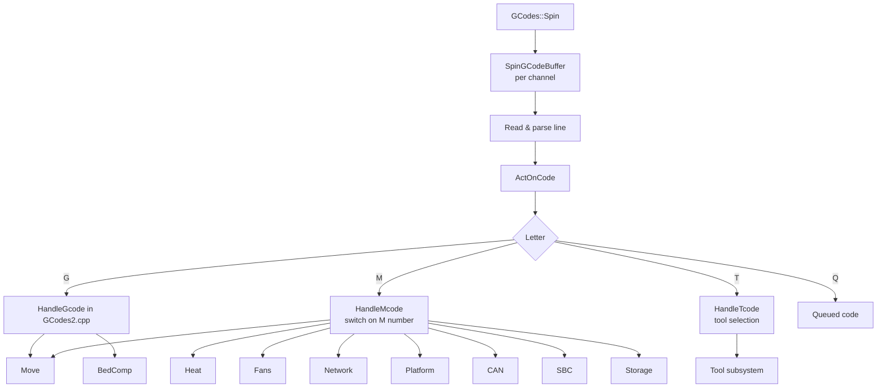
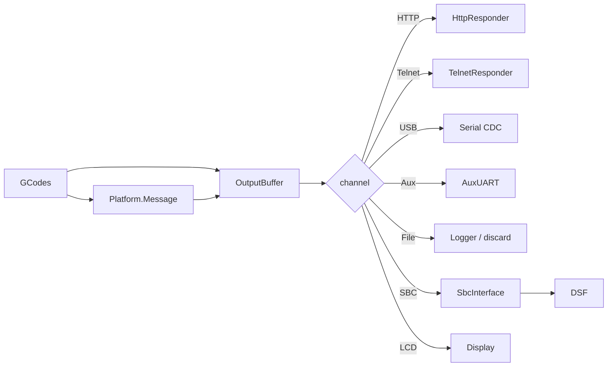

# G-code Processing

This document describes how G/M/T-codes flow from an input source to the modules that execute them. It is the most-trafficked control path in the firmware — almost every external interaction is a G-code.

## 1. Channels

RRF accepts codes from many sources concurrently. Each source is a *channel*, defined in [src/GCodes/GCodeChannel.h](../../src/GCodes/GCodeChannel.h):

```cpp
NamedEnum(GCodeChannel, uint8_t,
    HTTP, Telnet, File, USB, Aux, Trigger, Queue, LCD, SBC,
    Daemon, Aux2, Autopause, File2, Queue2, USB2);
```

Every channel has its own **`GCodeBuffer`** ([src/GCodes/GCodeBuffer/](../../src/GCodes/GCodeBuffer)) — an isolated parser state with its own machine state stack, restore points, and current line number. This is what lets a macro running on `File` happily coexist with the user typing M122 in the web console (`HTTP`).



In SBC mode the **HTTP / Telnet / MQTT** channels are not used by RRF directly — the network stack lives on the SBC, and DSF feeds codes from those sources into the dedicated `SBC` channel using the [SBC SPI protocol](SBC_INTERFACE.md).

## 2. The `GCodeBuffer`

A `GCodeBuffer` (`GCodeBuffer.h`) is more than a string — it is the per-channel execution context. It owns:

- A line buffer (text or binary) plus a parser, derived classes [`StringParser`](../../src/GCodes/GCodeBuffer/StringParser.cpp) and [`BinaryParser`](../../src/GCodes/GCodeBuffer/BinaryParser.cpp).
- A stack of `GCodeMachineState` frames ([src/GCodes/GCodeMachineState.h](../../src/GCodes/GCodeMachineState.h)) so that nested macro calls are isolated. Each frame contains coordinate offsets, feed rate, drives in use, currently selected tool, conditional / loop state, error state, etc.
- A `Mutex` so other tasks (network, SBC) can hand it new data without racing the main task.
- An `ExpressionParser` for `{ … }` meta-expressions and conditional G-code.

Parsers are switched at runtime: the SBC channel uses the binary parser (codes pre-tokenised by DSF — see [SBC_INTERFACE.md](SBC_INTERFACE.md)); everything else uses the string parser.

## 3. The lifecycle of a single G-code



The `notFinished` path is the cooperative non-blocking lever: a long operation (e.g. `M116` waiting for temperatures, `G29` running a probing routine, `M291` showing a message-box) returns `notFinished` and is re-entered next loop until it can complete.

## 4. Dispatch tables

Codes are dispatched in [src/GCodes/GCodes2.cpp](../../src/GCodes/GCodes2.cpp) and split across `GCodes2.cpp`–`GCodes7.cpp` purely to keep individual files compilable:



The M-code switch is large (`GCodes2.cpp` alone is several thousand lines). A new M-code is added by:

1. Picking a number (the [G-code wiki](https://docs.duet3d.com/User_manual/Reference/Gcodes) is authoritative).
2. Adding a `case` in `HandleMcode` that delegates to the appropriate module.
3. Adding any new persisted state to the [Object Model](OBJECT_MODEL.md) so it shows up via M409 / DWC.

## 5. Conditional G-code & meta-expressions

RRF supports conditional execution, expressions, variables, loops:

```
if {move.axes[0].homed} && {sensors.probes[0].value[0] > 800}
  G28 X
elif iterations < 5
  G1 X100
else
  abort "no good"
```

Implementation:

- **Tokenisation** — handled by `StringParser` which recognises `if`, `elif`, `else`, `while`, `break`, `continue`, `abort`, `var`, `set`, `global`, `echo`.
- **Block stack** — `GCodeMachineState::commandBlock` keeps the active conditional / loop frame.
- **Evaluation** — [src/GCodes/GCodeBuffer/ExpressionParser.cpp](../../src/GCodes/GCodeBuffer/ExpressionParser.cpp) evaluates `{ ... }` expressions against the live Object Model.
- **Variables** — [src/ObjectModel/Variable.cpp](../../src/ObjectModel/Variable.cpp) (`var.x`, `global.x`).

This is also how DSF can ask RRF to evaluate an arbitrary expression without sending a full G-code (the `DoCode` / `EvaluateExpression` SPI request types — see [SBC_INTERFACE.md](SBC_INTERFACE.md)).

## 6. The Queue channel

Some codes (e.g. `M106 P0 S128`) need to take effect at the **moment in the print** their G-code line is reached, not when they reach the parser — by the time they reach the parser there are typically dozens of moves already buffered ahead of them.

`GCodeQueue` ([src/GCodes/GCodeQueue.cpp](../../src/GCodes/GCodeQueue.cpp)) and the `Queue` / `Queue2` channels solve this by tagging codes with the DDA index they should execute against. The step ISR / motion completion pops the queue at the right point.

## 7. Triggers and macros

- **Triggers** ([src/GCodes/TriggerItem.cpp](../../src/GCodes/TriggerItem.cpp)) — a configurable list (`M581`) that on input-pin change pushes a macro onto the `Trigger` channel.
- **Macros** — `M98 P"name.g"` pushes a new `GCodeMachineState` frame onto the *current* channel and points it at the file. The frame carries scope: variables `var.x` are scoped to the frame.
- **Daemon** — `daemon.g` runs once per second on the `Daemon` channel for housekeeping.
- **Autopause** — `pause.g` / `resume.g` / `cancel.g` run on the `Autopause` channel so they can never deadlock against the user's print.

## 8. Replies and message routing

When a code finishes, its reply is appended to a per-channel `OutputBuffer` ([src/Platform/OutputMemory.cpp](../../src/Platform/OutputMemory.cpp)) and routed to the **same** source that produced the code:



`MessageType` ([src/Platform/MessageType.h](../../src/Platform/MessageType.h)) is a bitfield of destination flags (Http, Telnet, USB, Aux, Generic, …) plus severity (Warning / Error). Calling `platform.MessageF(WarningMessage, "…")` fans out to whichever channels are interested.

## 9. Where this connects to the rest of the system

- The number of channels is one of the few firmware/SBC version contracts — when a new channel is added (e.g. `Aux2`, `File2`), DSF and RRF must agree, see `NumGCodeChannels` in [GCodeChannel.h](../../src/GCodes/GCodeChannel.h) and `CodeChannel` in DSF.
- Codes received from the `SBC` channel are pre-parsed by DSF and sent in **binary** form to save MCU CPU; everything else lands as text.
- Some codes (`M0`, `M1`, `M122`, `M409`, …) are short-circuited inside DSF and never reach RRF. See [`Codes/Handlers`](https://github.com/Duet3D/DuetSoftwareFramework/tree/v3.7-andy/src/DuetControlServer/Codes/Handlers) on the DSF side.
- Codes addressed to a CAN address (e.g. `M906 X1000 P40.0`) are forwarded to the relevant expansion board via [CanInterface](../../src/CAN/CanInterface.cpp) — see [CAN_BUS.md](CAN_BUS.md).
