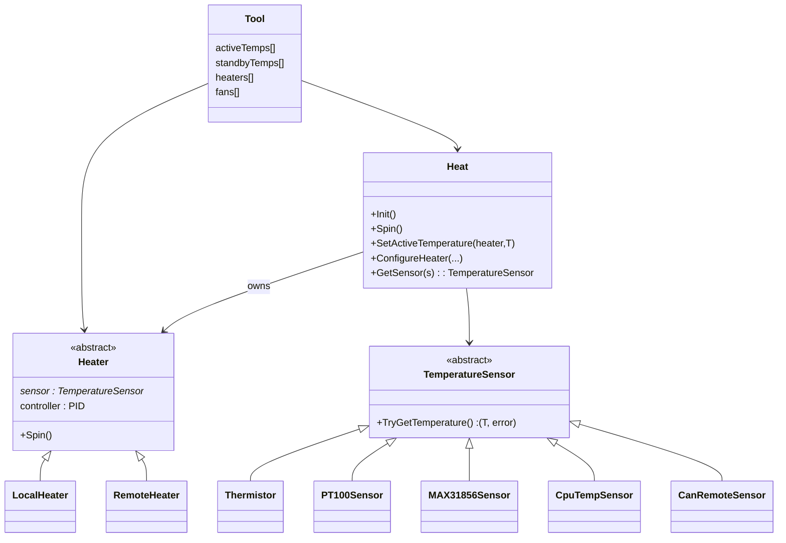
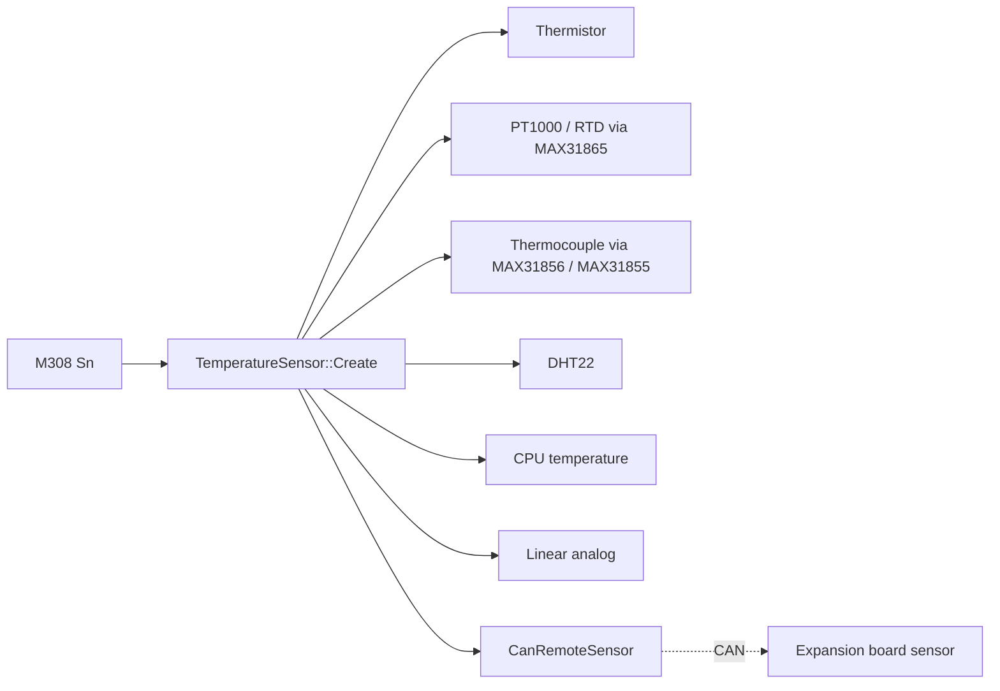
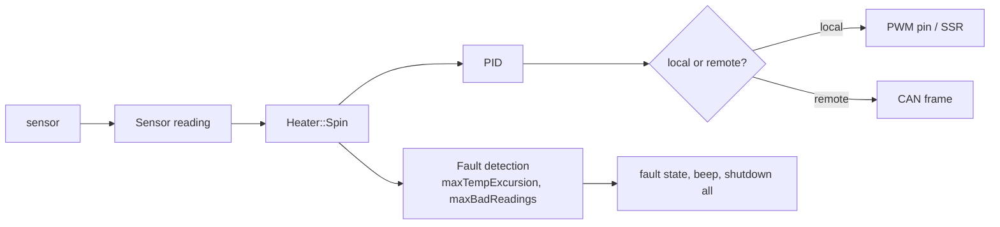
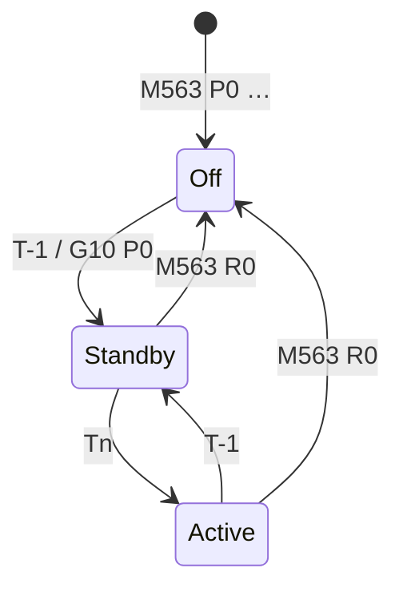
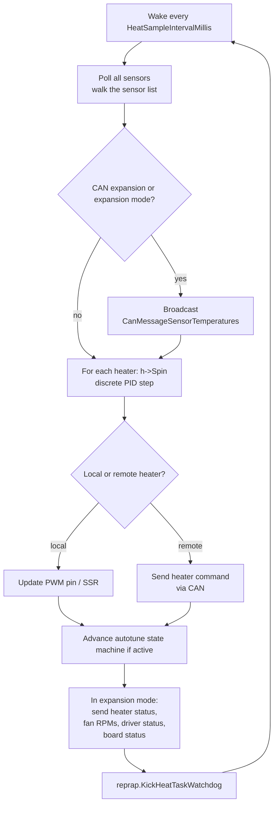

# Heating

This document describes the heating subsystem — heaters, sensors, fans, tools — and how it spans the local board, CAN-attached boards, and the SBC.

## 1. Components

| Class | Path | Role |
|---|---|---|
| `Heat` | [src/Heating/Heat.cpp](../../src/Heating/Heat.cpp) | Container, scheduling, slow protection. |
| `Heater` (abstract) / `LocalHeater` / `RemoteHeater` | [src/Heating/Heater.cpp](../../src/Heating/Heater.cpp) | One per heater id. Owns a sensor and a PID. |
| `TemperatureSensor` | [src/Heating/Sensors/](../../src/Heating/Sensors) | One per `Sn` sensor channel. |
| `FOPDT`, `PID` | [src/Heating/FOPDT.cpp](../../src/Heating/FOPDT.cpp) | Plant model used by autotune and the controller. |
| `Tool` | [src/Tools/Tool.cpp](../../src/Tools/Tool.cpp) | Aggregate of heaters and fans, the user-facing concept addressed by T-codes. |
| `FansManager` | [src/Fans/](../../src/Fans) | PWM / thermostatic / RPM fans. |

## 2. Sensor abstraction

Sensors are added with `M308`. Each sensor type registers a factory in [`TemperatureSensor::Create`](../../src/Heating/Sensors/TemperatureSensor.cpp). Reading is non-blocking: the sensor caches its last reading and an error code; `TryGetTemperature` returns both.

ADC-backed sensors (thermistor, linear analog) get their readings from the **Platform** ADC pipeline ([src/Platform/Platform.cpp](../../src/Platform/Platform.cpp)) — DMA-driven oversampling into `AveragingFilter`s, processed once per millisecond by the `HEAT` task.

`CanRemoteSensor` is a stub: the real reading lives on a CAN board, which periodically broadcasts `CanMessageSensorTemperatures`; the master decodes those frames in `CanInterface::CommandProcessor` and pushes the values into the right sensor cache. From `Heat`'s point of view there is no difference.

## 3. Heater control

Each heater runs a discrete-time PID at a fixed rate of `1000 / HeatSampleIntervalMillis = 4 Hz` (the constant lives in [`CANlib/src/RRF3Common.h`](../../libraries/CANlib/src/RRF3Common.h) so RRF and Duet3Expansion agree). On expansion / tool boards a faster rate is available via the `HEATER_POLL_RATE_MULTIPLIER` board option — for example, the TOOL board sets it to 10, giving 40 Hz local PID with the slower 4 Hz cadence still used for CAN reports. The control output is either a PWM duty cycle on a local pin or a heater-control CAN message to the owning expansion board.

The PID gains and plant model (gain, time constant, dead time, max PWM, sample time) come from `M307`. The `M303` autotune routine swings the heater output, fits a first-order plus dead-time (FOPDT) model, and writes the gains back into `M307`.

### Safety

`Heat` enforces:

- **Heater fault detection** — too-far-from-setpoint for too long, sensor disconnected, sensor returning short-circuit values. Triggers a fault and shuts off the heater (and optionally all heaters depending on `M570`).
- **Cold extrusion protection** — extruders are blocked from extruding below configured min temp, see `Tool::DisplayColdExtrusionWarnings`.
- **Sensor health** — repeated unrecoverable read errors flip the sensor into an error state, propagated through the Object Model so DWC shows a clear cause.

## 4. Tool model

A *tool* is what users address with T-codes. It bundles:

- A list of axes / extruders.
- A list of heaters and per-heater active and standby temperatures.
- A list of fans (so e.g. the part fan follows the active extruder when changing tools).
- Feedforward coefficients, retraction parameters, mix ratios, etc.

Tool state machine for temperatures:

Activating a tool tells `Heat` to drive every owned heater to its `activeTemps[]`; deactivating drops to `standbyTemps[]`.

## 5. Fans

Fans are managed by [`FansManager`](../../src/Fans/FansManager.cpp). A fan can be:

- **Pure PWM** — set explicitly by `M106 Sxxx` or by a tool change.
- **Thermostatic** — turns on when one or more sensors exceed a threshold (e.g. heatsink fan).
- **Tachometer-aware** — counts pulses to compute RPM, surfaced in the Object Model.

Fans on CAN boards behave the same way: a `RemoteFan` shadow object on the master maps to a `LocalFan` on the expansion board. The master's `M106` is forwarded with a `CanMessageGeneric`, and tachometer / RPM updates come back as `CanMessageFansReport`.

## 6. The HEAT task

The HEAT task ([Heat::HeaterTask](../../src/Heating/Heat.cpp)) runs as a dedicated FreeRTOS task at `HeatPriority = 3` — higher than the MAIN task — so that a stalled MAIN cannot delay temperature control past safety bounds. It blocks on `TaskBase::TakeIndexed` with a timeout of `HeatSampleIntervalMillis` (250 ms by default), so each pass samples sensors and runs PID at ~4 Hz unless poked sooner.

The heat task can also be woken early when an urgent message needs to be sent, e.g. a heater fault or driver fault — see `newHeaterFaultState` and `newDriverFaultState`.

## 7. M-codes that touch heating

| Code | Effect |
|---|---|
| `M105` | Report current temperatures (legacy). |
| `M106 / M107` | Fan PWM. |
| `M140 / M190` | Bed temperature (setpoint / wait-for-temp). |
| `M141 / M191` | Chamber. |
| `M143` | Heater max temperature. |
| `M303` | Autotune. |
| `M304` | Bed PID parameters. |
| `M305` | Legacy thermistor parameters (use `M308`). |
| `M307` | Heater model and PID gains. |
| `M308` | Define a sensor. |
| `M563` | Define a tool. |
| `M568` | Tool active / standby temperatures. |
| `M570` | Heater fault behaviour and timeouts. |

## 8. Where this connects to the rest of the system

- Object Model — `heat`, `sensors`, `tools`, `fans` subtrees. See [OBJECT_MODEL.md](OBJECT_MODEL.md).
- CAN — sensor / heater / fan messages live in [CANlib](../../src/CAN). Expansion-board side: see [Duet3Expansion's heating docs](https://github.com/Duet3D/Duet3Expansion/blob/3.7-docker/docs/devel/ARCHITECTURE.md#heating-stack).
- The HEAT task can run uninterrupted by a paused or crashed MAIN task — this is essential for never letting a heater run away.
