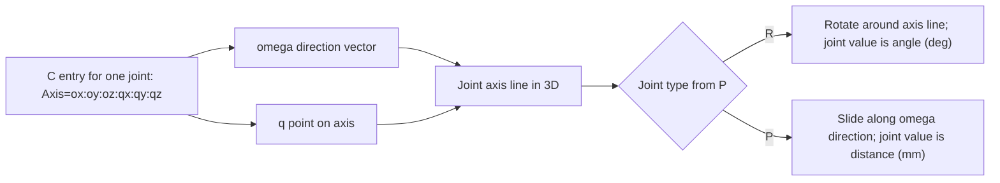

# Kinematics in RepRapFirmware

This document explains how kinematics work in RepRapFirmware (RRF), how they integrate with the motion pipeline, and how the `K13` generalized mixed-axis kinematics (`robot5axis`) is implemented.

## Overview

Kinematics in RRF convert between:

- Machine-space axes (`X Y Z A B C ...`) used by G-code and status reporting.
- Logical motor/drive positions used by the movement planner and step generation.

All kinematics derive from `Kinematics` and must provide at least:

- `CartesianToMotorSteps(...)`
- `MotorStepsToCartesian(...)`
- `GetHomingMode()`
- `Configure(...)` (typically M669/M665/M666/M671 handling)

Key integration points:

- `src/GCodes/GCodes2.cpp`: M669 dispatch and kinematics switching.
- `src/Movement/Move.cpp`: lifecycle and active kinematics instance.
- `src/Movement/DDA.cpp`: motion planning calls into kinematics methods.

## Core API responsibilities

### 1) Forward conversion (commanded motion)

`CartesianToMotorSteps(...)` is called in the move pipeline to convert a requested machine-space endpoint into logical drive steps.

Expected behavior:

- Return `MovementError::ok` on success.
- Return `MovementError::unreachable_position` when the requested point cannot be reached.
- Avoid integer overflow (`microstep_position_too_large`) when converting to steps.

### 2) Inverse conversion (state reconstruction)

`MotorStepsToCartesian(...)` maps current logical drive endpoints back to machine-space coordinates after homing, motor moves, and state restoration.

### 3) Homing semantics

Kinematics decide whether homing is:

- `homeCartesianAxes` (axis-oriented), or
- `homeIndividualDrives` (joint/drive-oriented).

They also influence:

- endstop trigger coordinates (`GetEndstopPosition`),
- which axes are considered homed after `G92`,
- which axes must be homed before a move.

### 4) Coupling-aware planner limits

`LimitSpeedAndAcceleration(...)` must ensure no coupled drive exceeds configured max feedrate/acceleration.

### 5) Reachability and move limiting

`LimitPosition(...)` may clamp final coordinates and may report that intermediate points are unreachable, which is important around singularities and nonlinear kinematics.

## K13 (`robot5axis`) architecture

Files:

- `src/Movement/Kinematics/Robot5AxisKinematics.h`
- `src/Movement/Kinematics/Robot5AxisKinematics.cpp`

Factory registration:

- `src/Movement/Kinematics/Kinematics.cpp` (`KinematicsType::robot5axis`)

Build flag:

- `SUPPORT_ROBOT5AXIS` (default on in `src/Config/Pins.h`, disabled in some constrained board configs).

### Dual-mode model

`robot5axis` supports two conversion modes:

1. **Matrix mode** (compatible with Core-style mapping)
- Uses configurable inverse matrix rows from axis letters in M669.
- Efficient for purely linear/coupled mappings.

2. **Screw-solver mode** (generalized mixed rotary/linear chains)
- Uses screw-axis chain definitions and numerical IK.
- Supports mixed rotational (`R`) and prismatic (`P`) joints.

The mode is selected by M669 `U` parameter:

- `U0`: matrix mode
- `U1`: screw-solver mode

### Internal representation

The generalized solver uses:

- Chain order (`chainLetters`) to define joint sequence.
- Joint type per chain element (`jointTypes`: `R`/`P`).
- Screw axis orientation `omega` and point-on-axis `q` for each joint.
- Optional joint limits and home/reference offsets.
- Tool transform matrix appended at chain end.

Forward kinematics uses chained rigid transforms in SE(3):

- Rotational joints: exponential map from `(omega, q, theta)`.
- Prismatic joints: translation along `omega`.

### Numerical IK

For screw-solver mode, inverse kinematics is solved iteratively:

- Target pose built from machine axes (`X/Y/Z` + `A/B/C` orientation).
- Damped least-squares update (Levenberg-style regularization).
- Finite-difference Jacobian in pose space.
- Convergence checks using weighted residual norm.

Tunable M669 parameters:

- `I`: max IK iterations
- `D`: damping factor
- `E`: residual tolerance
- `W`: rotation error weight relative to translation

### Reachability behavior

If IK does not converge for a target or intermediate check sample:

- move conversion returns `MovementError::unreachable_position`, or
- `LimitPosition(...)` returns an intermediate-unreachable result as appropriate.

## M669 K13 configuration reference

`M669 K13` selects `robot5axis` kinematics. The same command then carries all K13 configuration parameters.

### Parameter quick reference

- `K13`
	Selects kinematics type `robot5axis`.

- Axis-letter parameters (`X`, `Y`, `Z`, `A`, `B`, `C`, ...)
	Matrix row factors. These define how each machine axis contributes to each motor in matrix mode, and remain the projection layer in screw-solver mode.

- `B"..."`
	Chain order by axis letters. This defines joint sequence for FK/IK, e.g. `B"XYZBC"` means joint 1 is X, then Y, then Z, then B, then C.

- `P"..."`
	Joint type string aligned to `B` order.
	`R` = rotary joint (value interpreted in degrees).
	`P` = prismatic joint (value interpreted in linear axis units, normally mm).

- `C"..."`
	Screw definition per chain axis:
	`Axis=ox:oy:oz:qx:qy:qz`
	where:
	`o*` is axis direction vector `omega` (normalized internally),
	`q*` is one point on that axis.
	For prismatic joints, movement direction is `omega`.
	For rotary joints, axis line is defined by `omega` and `q`.

- `L"..."`
	Joint limits (and optional home) per chain axis:
	`Axis=min:max[:home]`
	`min/max` are hard solver clamps in joint space.
	`home` is optional joint reference offset used as zero-reference seed.

- `M"..."`
	Tool transform, 12 values (3x4 row-major):
	`r11:r12:r13:px:r21:r22:r23:py:r31:r32:r33:pz`
	This is appended after the chain transform.

- `R"..."`
	Continuous rotation axis letters. For listed rotary axes, pathing may choose equivalent wrapped angles for shortest-path behavior.

- `A"..."`
	Explicit homing position assignments:
	`Axis:value`
	Used when homing mode is `H1` (`homeIndividualDrives`).

- `H0|1`
	Homing mode selector.
	`H0` = `homeCartesianAxes`.
	`H1` = `homeIndividualDrives`.

- `U0|1`
	Solver mode selector.
	`U0` = matrix mode only.
	`U1` = screw-solver mode (IK/FK) with matrix projection to motors.

- `I<number>`
	Maximum IK iterations per solve attempt.

- `D<number>`
	IK damping factor (Levenberg-style regularization). Larger values are typically more stable but may converge slower.

- `E<number>`
	IK residual tolerance. Smaller values demand tighter convergence.

- `W<number>`
	Orientation-vs-translation error weight in pose residual. Larger values prioritize orientation matching.

- `S`, `T`
	Segmentation parameters inherited from base kinematics behavior.

### Understanding screw definitions (plain-language)

If you are not familiar with IK, treat each `C` entry as a physical axis description:

- `omega = (ox, oy, oz)` answers: which way does this joint axis point.
- `q = (qx, qy, qz)` answers: where is that axis located in space.

Together, they define a 3D line (the joint axis).

For a rotary joint (`R`):

- the joint rotates around that line.
- changing the joint value changes angle (degrees).

For a prismatic joint (`P`):

- the joint slides along `omega`.
- changing the joint value changes distance (typically mm).
- `q` is still accepted but is less critical than for rotary joints.

Important practical points:

- `omega` does not need to be unit length; firmware normalizes it.
- if `omega` is all zeros, the definition is invalid.
- for rotary joints, moving `q` along the same axis line does not change the axis itself.
  Example: if `omega` is `(0,0,1)`, then `(0,0,0)` and `(0,0,100)` describe the same Z-axis line.
- coordinate units for `q` should match your machine coordinates (normally mm).

Quick mental model:

- `omega` is the direction of a rod.
- `q` is one point where that rod passes.
- the rod is the rotation/slide axis used by the solver.

Mermaid sketch (conceptual geometry):



Coordinate interpretation notes:

- all `q` values are expressed in machine coordinates (same frame as axes like X/Y/Z).
- if your machine origin changes, screw definitions should be re-checked because `q` depends on frame location.
- for rotary joints, `q` should lie on the real hinge/pivot axis.
- for prismatic joints, `q` can be any point on the motion line; direction (`omega`) is the critical part.

Mini examples:

- `A=0:0:1:0:0:0`
  Axis points along +Z and passes through origin.

- `B=0:1:0:0:0:120`
  Axis points along +Y and passes through point `(0,0,120)`.

- `X=1:0:0:0:0:0` with prismatic `P`
  Linear motion along +X.

Recommended setup workflow for each joint:

1. Pick the joint letter order in `B`.
2. Mark each as `R` or `P` in `P`.
3. For each joint, choose `omega` from the real mechanical axis direction.
4. For rotary joints, choose `q` from a known pivot point on that axis.
5. Add conservative `L` limits before tuning IK.
6. Verify with small test moves, then refine `q` and limits.

### Full beginner parameter guide (`M669 K13`)

This section explains every parameter as if you are configuring K13 for the first time.

#### Command structure

- You start with `M669 K13`.
- Then you add parameters that define geometry, limits, behavior, and solver tuning.
- You can provide all parameters in one command or spread them over multiple `M669 K13 ...` commands.

#### `K13`

- Purpose: choose the `robot5axis` kinematics implementation.
- Without `K13`, you are not in this kinematics mode.

#### Axis-letter parameters: `X`, `Y`, `Z`, `A`, `B`, `C`, ...

- Purpose: define matrix coupling between machine axes and motor drives.
- These are matrix rows used by the projection layer.
- In matrix mode (`U0`), this is the core transform.
- In screw-solver mode (`U1`), IK solves chain joints first, then this matrix maps to motors.
- Typical use: leave as identity-style mapping unless you need custom coupling.

#### `B"..."` (chain order)

- Purpose: define joint sequence.
- Syntax: string of axis letters, e.g. `B"XYZBC"`.
- Why it matters: FK/IK is order-dependent. Changing order changes physical meaning.
- Rule: each letter should appear once in the chain.

#### `P"..."` (joint types)

- Purpose: mark each chain joint as rotary or prismatic.
- Syntax: string aligned with `B`, using only `R` or `P`.
- Example: `B"XYZBC"` + `P"PPPRR"` means X/Y/Z are linear, B/C are rotary.
- Units:
	`R` joints use degrees.
	`P` joints use linear units (normally mm).

#### `C"..."` (screw definitions)

- Purpose: describe each joint axis in 3D.
- Syntax per axis: `Axis=ox:oy:oz:qx:qy:qz`.
- Meaning:
	`omega (ox,oy,oz)` = axis direction.
	`q (qx,qy,qz)` = one point on that axis.
- Required for reliable geometric behavior in screw-solver mode.
- Common mistakes:
	zero `omega` vector (invalid),
	wrong coordinate frame for `q`,
	mismatch between `P` type and physical meaning.

#### `L"..."` (joint limits and home seed)

- Purpose: constrain solver joint search and define optional reference seed.
- Syntax per axis: `Axis=min:max[:home]`.
- `min/max`:
	hard clamp range in joint space.
	rotary joints: degrees.
	prismatic joints: mm (or your linear unit).
- `home` (optional): initial reference offset for that joint.
- Why it matters: good limits reduce wrong-solution branches and improve convergence.

#### `M"..."` (tool transform)

- Purpose: apply a final rigid transform from chain end to actual tool frame.
- Syntax: 12 values in row-major 3x4 form:
	`r11:r12:r13:px:r21:r22:r23:py:r31:r32:r33:pz`.
- `r**` are rotation matrix terms, `p*` is translation.
- Use when the modeled chain endpoint is not exactly the tool tip or tool frame.

#### `R"..."` (continuous rotary axes)

- Purpose: declare rotary axes that can wrap continuously.
- Syntax: axis letters, e.g. `R"C"` or `R"ABC"`.
- Behavior: planner may use equivalent wrapped angles for shorter motion.
- Typical use: true continuous rotary joints (not limited tilt joints).

#### `A"..."` (homing position assignments)

- Purpose: define explicit homing/known positions per axis.
- Syntax: comma-separated `Axis:value` entries.
- Mainly relevant for individual-drive style homing (`H1`).

#### `H0|1` (homing mode)

- `H0`: home as cartesian axes (`homeCartesianAxes`).
- `H1`: home as individual drives/joints (`homeIndividualDrives`).
- Choose based on machine homing hardware/strategy.

#### `U0|1` (solver mode)

- `U0` matrix mode:
	fast and simple,
	no screw-chain IK.
- `U1` screw-solver mode:
	uses chain geometry (`B/P/C/L/M`) and iterative IK,
	required for general mixed rotary/linear robots.

#### IK tuning parameters: `I`, `D`, `E`, `W`

- `I<number>` max iterations:
	higher = more chance to converge,
	but slower worst-case solve.

- `D<number>` damping:
	higher = more stable near singularities/noise,
	but can slow or bias convergence.

- `E<number>` residual tolerance:
	lower = tighter final accuracy requirement,
	but may increase failures if too strict.

- `W<number>` orientation weight:
	higher = prioritize A/B/C orientation error,
	lower = prioritize XYZ position error.

#### Segmentation parameters: `S`, `T`

- Purpose: inherited motion segmentation behavior from base kinematics.
- Practical effect: can influence interpolation granularity and path handling for nonlinear transforms.

#### Good first-time setup checklist

1. Start with `K13 U1` and simple `B/P` that matches real mechanism order.
2. Enter approximate `C` axes from CAD or measured pivots.
3. Set conservative `L` bounds for all joints.
4. Keep `M` identity unless you need tool offset/orientation correction.
5. Start IK with moderate values, e.g. `I40 D0.05 E0.03 W50`.
6. Run small moves, inspect behavior, then refine `C`, `L`, and IK tuning.

### How K13 parameters interact

- `B` + `P` + `C` define chain topology and geometry.
- `L` constrains solver search space and stabilizes convergence.
- `M` shifts/rotates the final tool frame after chain FK.
- `U` chooses matrix-only vs full screw-solver behavior.
- `I`, `D`, `E`, `W` tune convergence behavior and pose priorities.

## Object model

`move.kinematics` for `robot5axis` exposes:

- `name`
- `solver`
- `chain`
- `jointTypes`
- `homingMode`
- `ik.*` diagnostics (`iterations`, `damping`, `tolerance`, `rotationWeight`, `solveCount`, `failCount`, `lastResidual`)

## Practical notes

- Matrix mapping remains active in both modes and is used to map machine/joint quantities to physical motor drives.
- In screw-solver mode, chain joints are solved first, then projected through the matrix mapping to produce motor steps.
- For robust setups, define explicit screw axes and limits for every chain joint.
- Keep `W` high enough when orientation tracking is important, but avoid values that starve translational convergence.

## Example topology configurations

The examples below show the intended modeling style. Values are illustrative and should be replaced with machine-specific geometry.

### 1) 6-axis robot arm

```gcode
M669 K13 U1 B"ABCXYZ" P"RRRRRR" \
	C"A=0:0:1:0:0:0,B=0:1:0:0:0:120,C=0:1:0:0:0:250,X=1:0:0:0:0:320,Y=0:1:0:0:0:380,Z=0:0:1:0:0:430" \
	L"A=-180:180:0,B=-120:120:0,C=-170:170:0,X=-180:180:0,Y=-120:120:0,Z=-360:360:0" \
	R"ABCXYZ" I50 D0.08 E0.02 W70
```

Parameter description:

- `K13`: enable `robot5axis`.
- `U1`: use screw-solver mode (full FK/IK chain).
- `B"ABCXYZ"`: six-joint chain in the order A->B->C->X->Y->Z.
- `P"RRRRRR"`: all six joints are rotary.
- `C"..."`:
	`A=0:0:1:0:0:0` -> A rotates about global Z through origin.
	`B=0:1:0:0:0:120` -> B rotates about Y through point z=120.
	`C=0:1:0:0:0:250` -> C rotates about Y through point z=250.
	`X=1:0:0:0:0:320` -> X rotates about X through point z=320.
	`Y=0:1:0:0:0:380` -> Y rotates about Y through point z=380.
	`Z=0:0:1:0:0:430` -> Z rotates about Z through point z=430.
- `L"..."`: symmetric angle limits (degrees) plus home seed `0` for each joint.
- `R"ABCXYZ"`: all rotary joints are treated as continuous/wrappable.
- `I50`: allow up to 50 IK iterations.
- `D0.08`: moderate damping for robustness near singular geometry.
- `E0.02`: tight residual tolerance.
- `W70`: orientation error heavily weighted relative to translation.

### 2) XYZ cartesian tool head with rotating/tilting bed

```gcode
M669 K13 U1 B"XYZBC" P"PPPRR" \
	C"X=1:0:0:0:0:0,Y=0:1:0:0:0:0,Z=0:0:1:0:0:0,B=1:0:0:0:0:0,C=0:1:0:0:0:0" \
	L"X=0:300:0,Y=0:300:0,Z=0:300:0,B=-35:35:0,C=-180:180:0" \
	R"C" I35 D0.05 E0.03 W45
```

Parameter description:

- `B"XYZBC"`: joints are linear X/Y/Z, then rotary B/C bed axes.
- `P"PPPRR"`: first three prismatic, last two rotary.
- `C"..."`:
	`X=1:0:0:0:0:0` -> X prismatic direction is +X.
	`Y=0:1:0:0:0:0` -> Y prismatic direction is +Y.
	`Z=0:0:1:0:0:0` -> Z prismatic direction is +Z.
	`B=1:0:0:0:0:0` -> B rotates about X at origin (bed tilt).
	`C=0:1:0:0:0:0` -> C rotates about Y at origin (bed rotate/tilt axis per machine convention).
- `L"..."`: XYZ travel limits in mm, B/C angle limits in degrees, zero home seeds.
- `R"C"`: only C is treated as continuous rotation.
- `I35`: cap IK iterations at 35.
- `D0.05`: lighter damping than example 1.
- `E0.03`: slightly looser tolerance.
- `W45`: balanced orientation/translation weighting.

### 3) XZ tool head with rotating/tilting bed that moves in Y

```gcode
M669 K13 U1 B"XZYBC" P"PPPRR" \
	C"X=1:0:0:0:0:0,Z=0:0:1:0:0:0,Y=0:1:0:0:0:0,B=1:0:0:0:0:0,C=0:1:0:0:0:0" \
	L"X=0:300:0,Z=0:300:0,Y=0:250:0,B=-30:30:0,C=-180:180:0" \
	R"C" I35 D0.05 E0.03 W45
```

Parameter description:

- `B"XZYBC"`: chain order matches this mechanism's physical sequence: X, Z, Y, then B/C bed rotations.
- `P"PPPRR"`: translational X/Z/Y plus rotary B/C.
- `C"..."`: same axis meanings as example 2, but with X/Z/Y joint order matching `B`.
- `L"..."`: reduced Y stroke (`0:250`) with B/C angular limits.
- `R"C"`: C axis wraps continuously.
- `I35 D0.05 E0.03 W45`: same solver tuning as example 2 for similar kinematic complexity.

### 4) XYZ tool head that rotates and tilts

```gcode
M669 K13 U1 B"XYZAB" P"PPPRR" \
	C"X=1:0:0:0:0:0,Y=0:1:0:0:0:0,Z=0:0:1:0:0:0,A=1:0:0:0:0:0,B=0:1:0:0:0:0" \
	L"X=0:300:0,Y=0:300:0,Z=0:300:0,A=-45:45:0,B=-45:45:0" \
	I40 D0.06 E0.025 W55
```

Parameter description:

- `B"XYZAB"`: translational XYZ gantry with two tool-orientation joints A and B.
- `P"PPPRR"`: XYZ are linear; A/B are rotary.
- `C"..."`:
  `A=1:0:0:0:0:0` -> A rotates around X at origin.
  `B=0:1:0:0:0:0` -> B rotates around Y at origin.
- `L"..."`: 300 mm cartesian travel and +/-45 deg tilt/rotation envelope.
- `I40`: higher iteration allowance than examples 2/3.
- `D0.06`: moderate damping.
- `E0.025`: tighter tolerance than 0.03.
- `W55`: orientation given stronger weight than in examples 2/3.

### 5) XYZ tool head that tilts with a rotating bed

```gcode
M669 K13 U1 B"XYZAC" P"PPPRR" \
	C"X=1:0:0:0:0:0,Y=0:1:0:0:0:0,Z=0:0:1:0:0:0,A=1:0:0:0:0:0,C=0:1:0:0:0:0" \
	L"X=0:300:0,Y=0:300:0,Z=0:300:0,A=-40:40:0,C=-180:180:0" \
	R"C" I40 D0.06 E0.025 W55
```

Parameter description:

- `B"XYZAC"`: XYZ translation with A tool tilt and C bed rotation.
- `P"PPPRR"`: linear XYZ, rotary A/C.
- `C"..."`:
  `A=1:0:0:0:0:0` -> tool tilt axis around X.
  `C=0:1:0:0:0:0` -> bed rotation/tilt axis around Y (machine-dependent interpretation).
- `L"..."`: A limited to +/-40 deg, C allowed full +/-180 deg range.
- `R"C"`: C treated as continuous.
- `I40 D0.06 E0.025 W55`: same tuning as example 4 due to similar orientation demands.

## Limitations and future extensions

Current generalized solver is designed for broad mixed-axis support in firmware constraints, but further enhancements are possible:

- Analytic IK shortcuts for known robot families to improve speed and reliability.
- Better singularity metrics and adaptive damping policy.
- Additional orientation conventions beyond current Euler extraction/injection path.
- Expanded object-model exposure of per-joint chain state.
