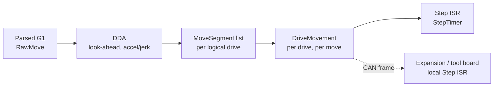
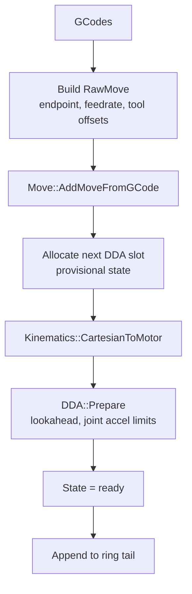
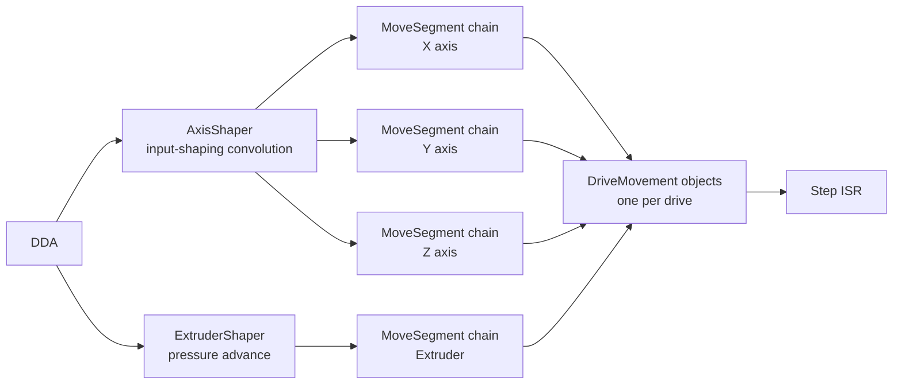
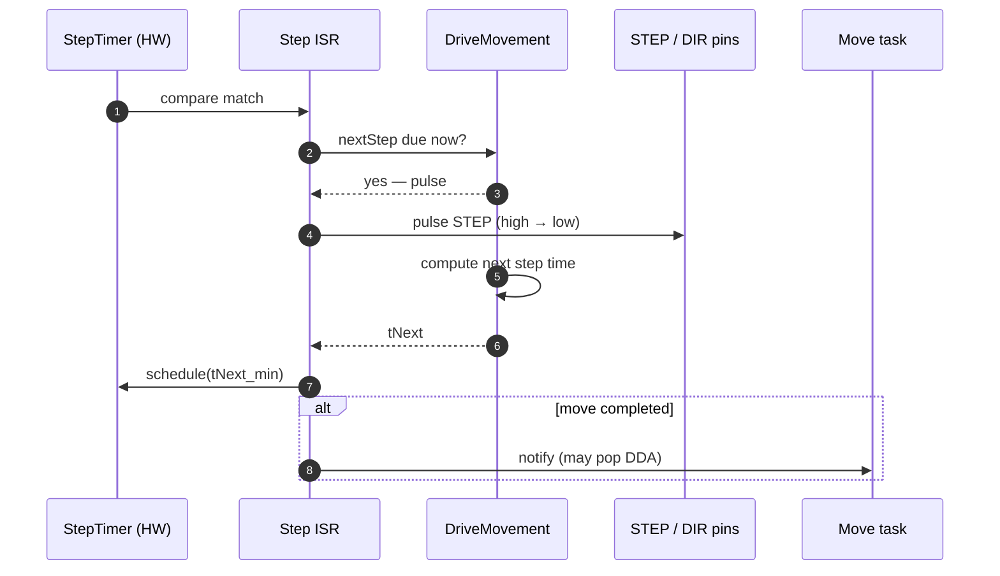
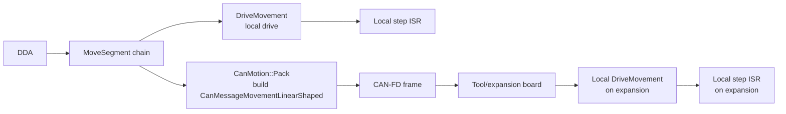

# Motion Pipeline

How a `G1` line travels from the parser to a stepper pulse on a wire (or to a CAN frame on the bus). This is the most performance-critical path in the firmware.

## 1. The five stages

| Stage | File | Domain |
|---|---|---|
| `RawMove` | [src/Movement/RawMove.cpp](../../src/Movement/RawMove.cpp) | mm / sec |
| `DDA` | [src/Movement/DDA.cpp](../../src/Movement/DDA.cpp) | mm / step clocks |
| `MoveSegment` | [src/Movement/MoveSegment.cpp](../../src/Movement/MoveSegment.cpp) | step clocks, per drive |
| `DriveMovement` | [src/Movement/DriveMovement.cpp](../../src/Movement/DriveMovement.cpp) | step clocks, per drive, per move |
| Step ISR | [src/Movement/StepTimer.cpp](../../src/Movement/StepTimer.cpp) | step-clock ticks |

The conversion to step clocks happens once, at the DDA stage — the ISR never multiplies floats.

## 2. RawMove → DDA

`GCodes` builds a `RawMove` from parsed parameters and calls [`Move::AddMoveFromGCode`](../../src/Movement/Move.cpp). The DDA queue lives inside `DDARing` ([src/Movement/DDARing.cpp](../../src/Movement/DDARing.cpp)); RRF maintains one `DDARing` per **motion system** (one in standard builds, more if `SUPPORT_ASYNC_MOVES` is set, e.g. tool-changers with independent X/Y pairs).

Look-ahead links each new DDA to the previous one and adjusts entry / exit speeds so that consecutive moves can be joined without a stop, subject to per-axis jerk and acceleration limits.

## 3. DDA — the rich state per move

Each `DDA` holds:

- Cartesian start / end points (mm) and per-axis `endCoordinates`.
- Required step counts per logical drive (axes + extruders).
- A piecewise acceleration / cruise / deceleration profile (clocks, distance, speed at each inflection).
- Look-ahead linkage to neighbours.
- Optional per-move metadata: laser PWM, IO bits (M425), filament weight delta, `ScheduleSync` flags for keep-out zones, async moves, etc.

DDAs go through the states `provisional` → `ready` → `executing` → `completed`. Once a DDA is `executing`, `Move::Spin` is no longer allowed to mutate it.

## 4. MoveSegments and DriveMovement

When a DDA reaches the head of the ring it is converted into per-drive plans. For each drive the DDA emits a chain of `MoveSegment` records (constant accel, cruise, deceleration, possibly multiple sub-segments after input shaping is applied) and a `DriveMovement` record that owns the iterator over those segments.

- **Input shaping** ([src/Movement/AxisShaper.cpp](../../src/Movement/AxisShaper.cpp)) reduces ringing by convolving each axis's acceleration profile with an impulse train (ZV / ZVD / MZV / EI / 2-hump EI / 3-hump EI / Custom). This *adds* segments — a single accel becomes several short accel sub-segments.
- **Pressure advance** ([src/Movement/ExtruderShaper.cpp](../../src/Movement/ExtruderShaper.cpp)) injects extra extrusion proportional to upstream acceleration, scheduled ahead of the move.

## 5. The step ISR

The step ISR ([`StepTimer::Interrupt`](../../src/Movement/StepTimer.cpp)) is the only place in the firmware where time matters at the microsecond level. On Duet 3 the step clock runs at **750 kHz** (chosen so the same value can be transmitted intact over CAN time-sync messages — see [CAN_BUS.md](CAN_BUS.md#time-sync)).

The ISR algorithm:

1. The hardware compare interrupt fires at the next-due step time across all drives.
2. For every drive that is due:
   - Generate a pulse (set DIR if changed, then STEP rising edge).
   - Ask its `DriveMovement` for the time of its next step.
3. Find the minimum next-step time across all drives, schedule the next interrupt at that absolute step-clock value.
4. Advance the DDA state machine if the move just completed.
5. Wake the **MOVE** task if a new look-ahead pass is needed.

Because pulses are only ~1 μs wide and back-to-back stepping can be at hundreds of kHz, the ISR runs at the highest priority that is still allowed to be preemptable — `NvicPriorityStep = 5` on the SAME70/SAME5x ([src/RepRapFirmware.h](../../src/RepRapFirmware.h)). It does **no** floating-point.

## 6. Kinematics

The mapping from cartesian to motor space is delegated to a kinematics class ([src/Movement/Kinematics/](../../src/Movement/Kinematics)):

| Class | Geometry |
|---|---|
| `CartesianKinematics` | XY, XZ, dependent-stage corexy/h-bot |
| `CoreXYKinematics`, `CoreXZKinematics`, `CoreXYUKinematics`, `CoreXYUVKinematics` | corexy variants |
| `LinearDeltaKinematics` | classic delta |
| `RotaryDeltaKinematics` | scara / robot-arm-style delta |
| `ScaraKinematics` | five-bar / scara |
| `PolarKinematics` | polar |
| `HangprinterKinematics` | cable-driven |
| `FiveBarScaraKinematics`, `MarkforgedKinematics` | specialty |

Switching kinematics at runtime is allowed (`M669 K…`); the active kinematics object is held by `Move`.

## 7. Multi-board motion (CAN)

When a logical drive is assigned to a CAN board (e.g. `M584 X0.0 Y0.1 Z1.0`, where `1.0` means board #1, driver #0), the motion pipeline forks at the `MoveSegment` stage:

[`CanMotion`](../../src/CAN/CanMotion.cpp) batches the segments destined for each remote board into a single `CanMessageMovementLinearShaped` message and tags them with the master's step-clock time at which the move starts. The expansion board, having clock-synced with the master ([CAN_BUS.md#time-sync](CAN_BUS.md#time-sync)), reproduces the move locally at the same wall-clock instant. From the user's perspective the bus is invisible — `G1 X100 Y100 E5` works identically whether all three drives are local or split across three boards.

## 8. The MOVE task

Move planning runs on a dedicated FreeRTOS task at high priority ([src/Movement/Move.cpp](../../src/Movement/Move.cpp), `MoveTask`). It is woken by:

- The main task adding a new move (look-ahead chain may need extending).
- A DDA completing (next DDA needs preparing).
- An external timer if it is idle and DDAs are still ahead.

This separation lets long planning passes (esp. with input-shaping enabled) run without blocking GCode parsing on the MAIN task.

## 9. Cross-references

- **Endstops** ([src/Endstops/](../../src/Endstops)) interrupt the running DDA when `homing` mode is active. Stall-detect endstops backed by TMC drivers behave identically.
- **Probing** (`G29`, `G30`) drives short DDAs and watches the active probe; bed-mesh data is stored in [src/Movement/BedProbing/Grid.cpp](../../src/Movement/BedProbing/Grid.cpp) and applied as a Z offset by `Move::AxisAndBedTransform`.
- **Closed-loop drives** ([src/ClosedLoop/](../../src/ClosedLoop)) and **phase-stepping** drives ([src/Movement/PhaseStep.cpp](../../src/Movement/PhaseStep.cpp)) replace the open-loop step ISR with a current-mode loop fed by DriveMovement; the upstream pipeline is unchanged.
- **Async moves** (`SUPPORT_ASYNC_MOVES`) use a second DDARing for the second motion system; collisions between systems are mediated by [`CollisionAvoider`](../../src/GCodes/CollisionAvoider.cpp).
- For motion as it appears on an expansion board, see [Duet3Expansion's motion docs](../../../Duet3Expansion/docs/devel/MOTION.md).
