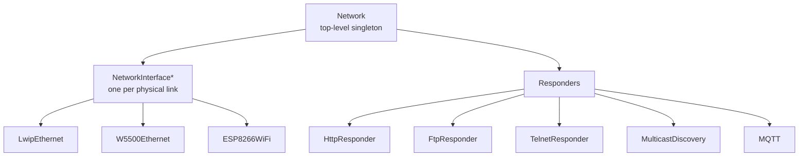
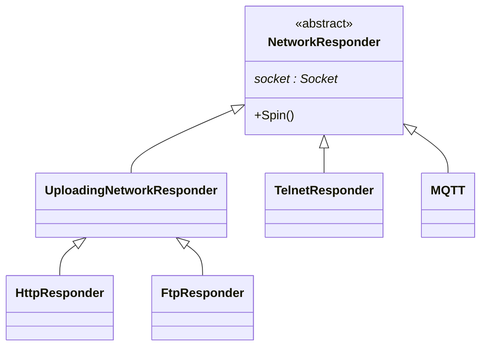
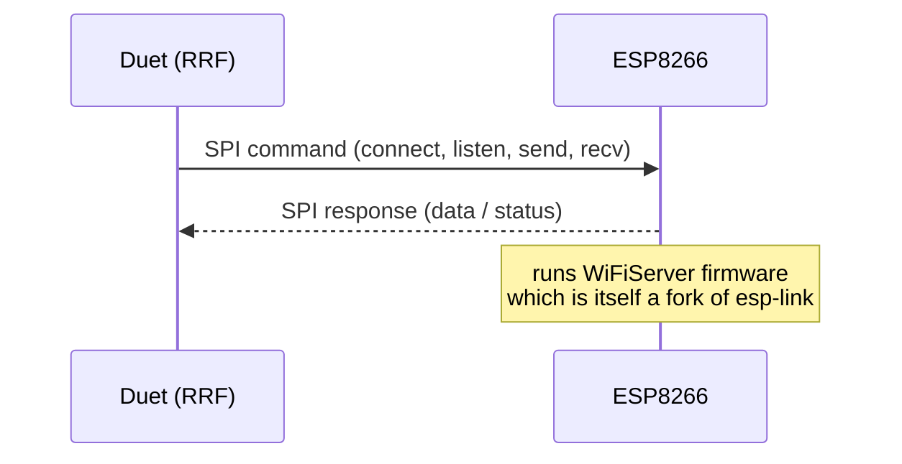
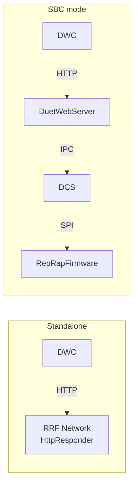

# Networking

This document covers the on-firmware networking stack: physical interfaces, the responder model, and the legacy `rr_*` API. In **SBC mode** these subsystems are dormant — the SBC running [DuetSoftwareFramework](../../../DuetSoftwareFramework) provides the user-facing HTTP server. In **standalone mode** the firmware itself runs the network stack.

## 1. Build-time interfaces

Which interface(s) are compiled in is controlled by per-board `Pins_*.h` flags:

| Flag | Stack | Hardware |
|---|---|---|
| `HAS_LWIP_NETWORKING` | LwIP | RMII Ethernet on SAME70 |
| `HAS_W5500_NETWORKING` | W5500 driver | Wiznet W5500 module on SPI |
| `HAS_WIFI_NETWORKING` | ESP8266 firmware | DuetWiFi / Duet 2 / Duet 3 Mini |
| `HAS_RTOSPLUSTCP_NETWORKING` | FreeRTOS+TCP | (legacy) |

A single board may have one or two of these (e.g. Duet 3 MB6HC has both LwIP Ethernet and WiFi co-processor support).

[`Network`](../../src/Networking/Network.cpp) owns the active interface(s); each [`NetworkInterface`](../../src/Networking/NetworkInterface.h) owns the responders for its protocols.

## 2. Responders

A *responder* is a state machine handling one accepted socket. The number of concurrent responders per protocol is fixed at compile time so memory budgets are deterministic — typically 4 HTTP responders, 1 FTP-control + 1 FTP-data, 1 Telnet, 1 MQTT.

`UploadingNetworkResponder` factors out the chunked-upload bookkeeping so HTTP `POST /rr_upload` and FTP `STOR` share code.

### HTTP

`HttpResponder` ([src/Networking/HttpResponder.cpp](../../src/Networking/HttpResponder.cpp)) implements the legacy `rr_*` URL family which DWC uses when talking to a standalone Duet:

| URL | Effect |
|---|---|
| `rr_connect?password=…` | Open a session, return session key. |
| `rr_disconnect` | End session. |
| `rr_status?type=…` | Status snapshot (legacy types). |
| `rr_model?key=…&flags=…` | Object Model query (same as `M409`). |
| `rr_gcode?gcode=…` | Send a code line. |
| `rr_reply` | Pull queued reply text. |
| `rr_filelist` / `rr_files` | List a directory. |
| `rr_download` / `rr_upload` | File transfer. |
| `rr_thumbnail` | Slicer thumbnail extraction. |

The HTTP server here is intentionally minimal — one persistent connection per session, no TLS. `rr_*` is a stable contract: DWC uses it both natively (standalone) and indirectly (DSF's `RepRapFirmwareController` proxies the same URLs). Both implementations must behave the same for a consumer.

### FTP / Telnet / MQTT

- `FtpResponder` — RFC959 subset, used by hobby uploaders.
- `TelnetResponder` — interactive raw-text G-code console.
- `MQTT` — outbound publish to a configured broker (`M586`), useful for pushing live status.

## 3. The Network task

`Network::Spin()` is called from `RepRap::Spin()` and only does the parts safe to do cooperatively (configuration, status updates). The actual packet processing for LwIP / W5500 happens on dedicated FreeRTOS tasks ([src/Networking/LwipEthernet/](../../src/Networking/LwipEthernet), [W5500Ethernet/](../../src/Networking/W5500Ethernet)). The WiFi interface uses a separate co-processor (ESP8266) and communicates over SPI.

## 4. WiFi co-processor

The ESP8266 runs its own firmware ([DuetWiFiSocketServer](https://github.com/Duet3D/DuetWiFiSocketServer), shipped alongside RRF as a binary blob `DuetWiFiServer.bin`). RRF treats it as a SPI-attached "smart NIC". Sending an HTTP `200 OK` from `HttpResponder` ultimately becomes a `SendData` SPI command to the ESP.

## 5. Multicast discovery

Implemented in [src/Networking/MulticastDiscovery/](../../src/Networking/MulticastDiscovery). RRF participates in the Duet3D multicast announcement so a "Find my Duet" tool can locate boards on the LAN even without DNS / mDNS.

## 6. Standalone vs SBC mode

The `Network` module (and all its responders) is **only built and started** when there is no SBC interface. When the SBC link is up:

- The SBC owns the network. DWC and any HTTP API consumers talk to **DuetWebServer** which is part of DSF.
- `rr_*` URLs are proxied by DWS's `RepRapFirmwareController` for backwards compatibility.
- The Duet's onboard Ethernet / WiFi may still be active for *unrelated* services (PanelDue, MQTT) but is not used as the primary control surface.

## 7. Where this connects to the rest of the system

- **Replies** — `HttpResponder`, `TelnetResponder`, `FtpResponder` are message destinations in `MessageType` flags. See [GCODE_PROCESSING.md](GCODE_PROCESSING.md#replies-and-message-routing).
- **Object Model** — `network` subtree describes interface state, IP addresses, MAC, configured protocols.
- **In SBC mode** — the equivalent path lives in DSF; see [DuetSoftwareFramework's HTTP_API](../../../DuetSoftwareFramework/docs/devel/HTTP_API.md).
