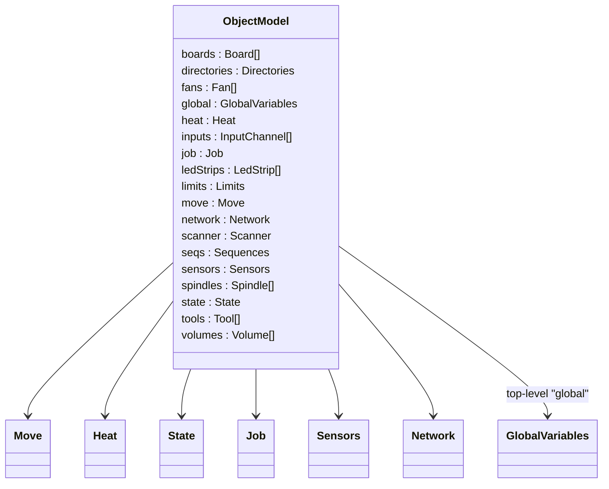
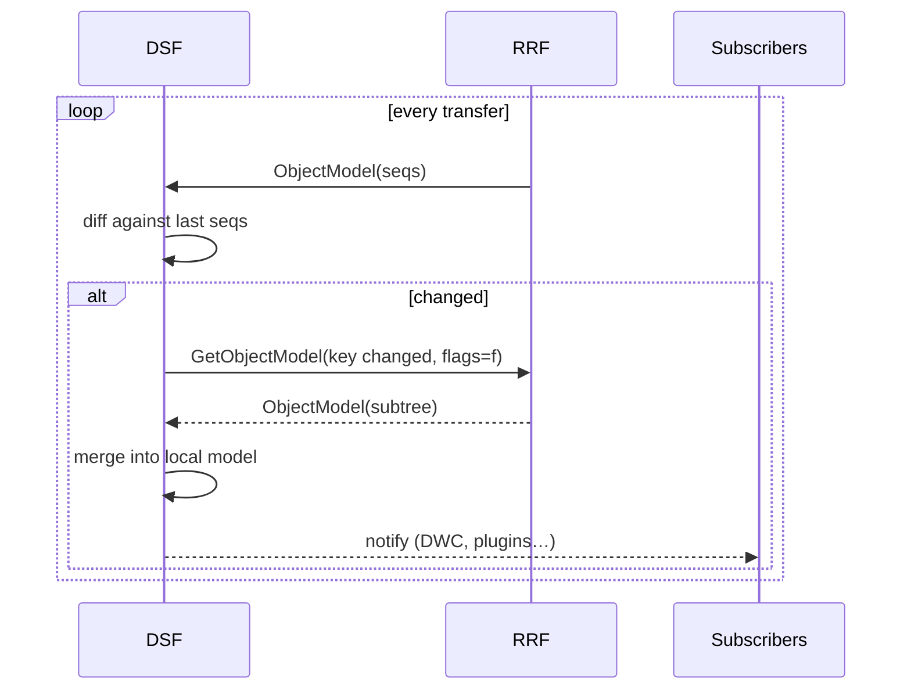

# Object Model

The **Object Model** is the live, reflected machine state. Almost every piece of state that is observable from outside the firmware — coordinates, axis homed flags, heater temperatures, fan PWMs, configured tools, attached boards, the move queue, sensor readings, plugin metadata — appears in the Object Model.

It is the contract that connects RRF, DSF, Duet Web Control (DWC), PanelDue and any third-party plugin / API consumer.

## 1. Where it lives

The implementation is in [src/ObjectModel/](../../src/ObjectModel):

| File | Purpose |
|---|---|
| `ObjectModel.h/.cpp` | Base class for all reflected objects, descriptor tables, JSON writer. |
| `Variable.h/.cpp` | Backing store for a set of named user variables (`var.x`, `global.x`). Used both by `GlobalVariables` and per-`GCodeMachineState` for local `var`. |
| `GlobalVariables.h/.cpp` | A single instance held by `RepRap::globalVariables`. Stores user-defined runtime globals (created by the `global` keyword from G-code). Exposed in the OM as the top-level `global` key. Custom JSON serialiser because the keys are dynamic. |

```cpp
// in src/Platform/RepRap.cpp at line 264 — the descriptor entry that exposes globals:
{ "global", OBJECT_MODEL_FUNC(&(self->globalVariables)), ObjectModelEntryFlags::none },
```

So `M409 K"global.foo"` returns the user variable `global.foo` if it exists. There is no compile-time list of fields here — each `global x = …` statement adds an entry, each `set global.x = …` mutates one.

Every "leaf" subsystem class that has reflected fields inherits `ObjectModel` and declares its descriptor table with the `DECLARE_OBJECT_MODEL` / `DEFINE_GET_OBJECT_MODEL_TABLE` macros — these tables are the static, compile-time-defined fields, in contrast to `GlobalVariables` which holds dynamic ones.

## 2. Descriptor tables

Every reflected class has a table at the top of its `.cpp` file that lists its fields. Real example, from [src/Fans/Fan.cpp](../../src/Fans/Fan.cpp):

```cpp
constexpr ObjectModelTableEntry Fan::objectModelTable[] =
{
    // 0. Fan members — entries within a section MUST be in alphabetical order
    { "actualValue",     OBJECT_MODEL_FUNC(self->GetPwm(), 2),                ObjectModelEntryFlags::live },
    { "blip",            OBJECT_MODEL_FUNC(0.001f * (float)self->blipTime, 2), ObjectModelEntryFlags::none },
    { "frequency",       OBJECT_MODEL_FUNC((int32_t)self->pwmFreq),           ObjectModelEntryFlags::none },
    { "max",             OBJECT_MODEL_FUNC(self->maxVal, 2),                  ObjectModelEntryFlags::none },
    { "min",             OBJECT_MODEL_FUNC(self->minVal, 2),                  ObjectModelEntryFlags::none },
    { "name",            OBJECT_MODEL_FUNC(self->name),                       ObjectModelEntryFlags::none },
    { "requestedValue",  OBJECT_MODEL_FUNC(self->val, 2),                     ObjectModelEntryFlags::live },
    { "rpm",             OBJECT_MODEL_FUNC(self->GetRPM()),                   ObjectModelEntryFlags::live },
    { "tachoPpr",        OBJECT_MODEL_FUNC(self->tachoPulsesPerRev, 1),       ObjectModelEntryFlags::none },
    { "thermostatic",    OBJECT_MODEL_FUNC(self, 1),                          ObjectModelEntryFlags::none },

    // 1. Fan.thermostatic members
    { "highTemperature", OBJECT_MODEL_FUNC_IF(self->sensorsMonitored.IsNonEmpty(),
                                              self->triggerTemperatures[1], 1),
                                                                              ObjectModelEntryFlags::none },
    { "lowTemperature",  OBJECT_MODEL_FUNC_IF(self->sensorsMonitored.IsNonEmpty(),
                                              self->triggerTemperatures[0], 1),
                                                                              ObjectModelEntryFlags::none },
    { "sensors",         OBJECT_MODEL_FUNC(self->sensorsMonitored),           ObjectModelEntryFlags::none },
};

constexpr uint8_t Fan::objectModelTableDescriptor[] = { 2, 10, 3 };  // 2 sections: 10 entries then 3

DEFINE_GET_OBJECT_MODEL_TABLE(Fan)
```

Three things deserve attention:

- **Sections** — one `objectModelTable` can describe several sub-objects. The `objectModelTableDescriptor` lists, in order, the count of sections, then the size of each section. Section 0 is the class itself; sections ≥ 1 are sub-trees referenced by `OBJECT_MODEL_FUNC(self, n)`.
- **Alphabetical order** — entries within each section *must* be alphabetical. A `static_assert` enforces this at compile time (`OMT_ORDERING_OK`), so a misplaced entry is a build error, not a runtime surprise.
- **Lambda macros** — every `OBJECT_MODEL_FUNC*` expands to a stateless C++ lambda matching the `DataFetchPtr_t` signature. The table is a `constexpr` array placed in flash.

## 3. The `OBJECT_MODEL_FUNC*` family

Pick the one that matches the field's needs. All are defined in [src/ObjectModel/ObjectModel.h](../../src/ObjectModel/ObjectModel.h) and become available after the per-file `#define OBJECT_MODEL_FUNC(...)` shim.

| Macro | When to use | Lambda body |
|---|---|---|
| `OBJECT_MODEL_FUNC(...)` | Standard scalar field of `self` | `return ExpressionValue(__VA_ARGS__);` |
| `OBJECT_MODEL_FUNC_IF(cond, ...)` | Scalar that is sometimes "not present"; reports null when `cond` is false | `return cond ? ExpressionValue(__VA_ARGS__) : ExpressionValue(nullptr);` |
| `OBJECT_MODEL_FUNC_NOSELF(...)` | Field doesn't depend on `self` (often references a singleton like `reprap.…`) | same, no `self` cast |
| `OBJECT_MODEL_FUNC_IF_NOSELF(cond, ...)` | Combination | — |
| `OBJECT_MODEL_FUNC_BODY_NONLEAF(_class, ...)` | The class is a polymorphic base whose subclasses extend the model further | uses `_ecv_from` to satisfy the eCv polymorphic-self check |
| `OBJECT_MODEL_FUNC_IF_BODY_NONLEAF(...)` | Combination | — |
| `OBJECT_MODEL_FUNC_ARRAY(n)` | Field is a sub-array described by `objectModelArrayTable[n]` | references the array table |
| `OBJECT_MODEL_FUNC_ARRAY_IF_BODY(_class, cond, n)` | Sub-array, conditionally present | — |

Set the per-file shim once at the top of the .cpp, e.g.:

```cpp
#define OBJECT_MODEL_FUNC(...)         OBJECT_MODEL_FUNC_BODY(Fan, __VA_ARGS__)
#define OBJECT_MODEL_FUNC_IF(cond, ...) OBJECT_MODEL_FUNC_IF_BODY(Fan, cond, __VA_ARGS__)
```

## 4. ExpressionValue — supported types

The `ExpressionValue` constructor used inside the lambda determines the JSON type that comes out. Pick from:

| C++ value | Constructor | JSON output |
|---|---|---|
| `bool` | `ExpressionValue(b)` | `true` / `false` |
| `char` | `ExpressionValue(c)` | string of length 1 |
| `int32_t` | `ExpressionValue(i)` — **always cast integer fields to `int32_t`** | number |
| `uint32_t` | use `(int32_t)` if it fits, else `Set56BitValue` | number |
| `uint64_t` | `ExpressionValue((uint64_t)v)` | number (≤ 56 bits) |
| `float` | `ExpressionValue(f)` or `ExpressionValue(f, decimals)` | number |
| `const char *` | `ExpressionValue(s)` | string |
| `IPAddress` | `ExpressionValue(ip)` | string |
| `DateTime{t}` | `ExpressionValue(DateTime{t})` | ISO date string |
| `DriverId` | `ExpressionValue(did)` | `"<board>.<drv>"` |
| `Bitmap<uint16_t/32_t/64_t>` | `ExpressionValue(bm)` | array of bit indices |
| `MacAddress` | `ExpressionValue(mac)` | string |
| `const ObjectModel *` | `ExpressionValue(obj)` or `ExpressionValue(obj, tableIdx)` | nested object — descend |
| `nullptr` | `ExpressionValue(nullptr)` | `null` |
| `IoPort&` | `ExpressionValue(port)` | port name string |
| `UniqueId&` | `ExpressionValue(id)` | hex string |
| `(self, arrayIdx, true)` | array of sub-objects (via `OBJECT_MODEL_FUNC_ARRAY`) | array |

Always pass the *number of decimal digits* for floats where the precision matters — e.g. `OBJECT_MODEL_FUNC(self->maxVal, 2)` reports two decimals. Forgetting the digit count uses the `MaxFloatDigitsDisplayedAfterPoint` default, which can be excessive.

## 5. Entry flags

`ObjectModelEntryFlags` controls visibility:

| Flag | Effect |
|---|---|
| `none` | Reported on a default snapshot. |
| `live` | Marked as fast-changing — included when the user requests "live only" with `M409 K"…" F"f"`. |
| `liveNotPanelDue` | Live, but PanelDue is told to ignore it — saves bandwidth on the AUX UART. |
| `verbose` | Hidden by default; included when the user adds the `v` flag. |
| `obsolete` | Kept for compatibility; marked as deprecated. |
| `important` | Push to PanelDue even unsolicited. Used for message boxes. |
| `notPanelDue` | Same as `liveNotPanelDue` minus the live bit — combine with `live` if needed. |

Flags can be OR'd: `ObjectModelEntryFlags::live | ObjectModelEntryFlags::notPanelDue`.

## 6. Top-level shape



This is the same shape DSF replicates over SPI and DWC consumes. The full schema lives in [DuetSoftwareFramework/src/DuetAPI/ObjectModel/](../../../DuetSoftwareFramework/src/DuetAPI/ObjectModel) — the C# classes there mirror the JSON keys produced by the descriptor tables here.

## 7. JSON serialisation

`OutputBuffer *RepRap::GetModelResponse(...)` ([src/Platform/RepRap.cpp](../../src/Platform/RepRap.cpp)) walks the descriptor tree and produces JSON. Two parameters control the walk:

- **`key`** — a dotted path, e.g. `"move.axes[0]"`. Empty means root.
- **`flags`** — a string of one-letter flags: `f` = include "live" fields only, `v` = verbose, `n` = include null leaves, `s` = include sequence numbers, `a` = arrays as plain arrays.

The user-facing wrappers around this are:

- **`M409 K"…" F"…"`** — same machinery whether running standalone or in SBC mode.
- **`rr_model?key=…&flags=…`** — the legacy HTTP endpoint, served by [`HttpResponder.cpp`](../../src/Networking/HttpResponder.cpp). DWC uses `rr_model` as its primary OM source in **standalone** mode; in SBC mode it switches to DWS's `/machine/model` (or a WebSocket subscription).
- **DSF SPI `GetObjectModel`** — same key/flags as `M409`, sent as a binary `SbcRequest`.

Inside DSF, the `GetObjectModel` SBC request carries the same `key` and `flags`.

## 8. Sequence numbers

Whenever a non-trivial change happens in a subsystem, the corresponding sequence number is incremented. The set of sequence numbers is itself a small object model node (`seqs`):

```json
{
  "seqs": {
    "boards": 3, "fans": 1, "heat": 17,
    "move": 4321, "network": 0, "tools": 5,
    "global": 2, "sensors": 142, "state": 71,
    …
  }
}
```

DSF subscribes to `seqs` on a high cadence; when a number changes it issues a targeted `GetObjectModel` for the changed key. This is the mechanism that keeps DWC in sync without DSF having to scan the whole model on every transfer.



## 9. Updating from inside the firmware

Modules that change reflected state should call the matching helper on `RepRap` ([src/Platform/RepRap.h:156–171](../../src/Platform/RepRap.h)). The full set is:

```cpp
void BoardsUpdated() noexcept;       // bumps boardsSeq
void DirectoriesUpdated() noexcept;  // bumps directoriesSeq
void FansUpdated() noexcept;         // bumps fansSeq
void GlobalUpdated() noexcept;       // bumps globalSeq
void HeatUpdated() noexcept;         // bumps heatSeq
void InputsUpdated() noexcept;       // bumps inputsSeq
void LedStripsUpdated() noexcept;    // bumps ledStripsSeq
void JobUpdated() noexcept;          // bumps jobSeq
void MoveUpdated() noexcept;         // bumps moveSeq
void MotionSystemUpdated() noexcept; // alias for MoveUpdated()
void NetworkUpdated() noexcept;      // bumps networkSeq
void SensorsUpdated() noexcept;      // bumps sensorsSeq
void SpindlesUpdated() noexcept;     // bumps spindlesSeq
void StateUpdated() noexcept;        // bumps stateSeq
void ToolsUpdated() noexcept;        // bumps toolsSeq
void VolumesUpdated() noexcept;      // bumps volumesSeq
```

Avoid bumping `seqs` from inside an ISR — accumulate the dirty flag and bump in the next `Spin()` pass instead.

## 10. Variables

Two kinds of user variables live in the Object Model:

- **`var.<name>`** — scoped to the current `GCodeMachineState` frame (i.e. local to the macro invocation). Stored on the active `GCodeBuffer`. Disposed when the frame pops.
- **`global.<name>`** — printer-wide. Created by `global x = …`, mutated by `set global.x = …`. Stored in the single `GlobalVariables` instance held by `reprap.globalVariables` and exposed under the OM root key `global`. Persisted only in RAM — a power cycle clears them.

Both are implemented on top of the same `VariableSet` type ([src/ObjectModel/Variable.h](../../src/ObjectModel/Variable.h)). The expression parser ([ExpressionParser.cpp](../../src/GCodes/GCodeBuffer/ExpressionParser.cpp)) resolves `var.x` against the current `GCodeBuffer`'s frame and `global.x` against `reprap.GetGlobalVariablesForReading()`.

## 11. Querying remote board state

Object-model entries from CAN-attached boards (under `boards[N]`) are populated by [`ExpansionManager`](../../src/CAN/ExpansionManager.cpp) using forwarded queries. From the user's perspective `M409 K"boards[1]"` works identically whether board 1 is the master or a tool board.

## 12. M409, rr_model, and DSF subscription

Three consumers, three access patterns, but all produce the same JSON shape:

| Consumer | Path | Pattern |
|---|---|---|
| User typing `M409` in DWC console | RRF `GCodes` parser → `RepRap::GetModelResponse` → JSON | one-shot snapshot |
| DWC live status, **standalone mode** | DWC HTTP `rr_model?key=…&flags=…` → [`HttpResponder.cpp`](../../src/Networking/HttpResponder.cpp) → `RepRap::GetModelResponse` | client-driven polling |
| DWC live status, **SBC mode** | WebSocket → DWS → DCS subscription → DSF mirror → patch into DWC | continuous diff |
| DSF plugin | IPC subscription → DSF model | continuous diff |

In standalone mode the network stack and the OM walker live in the same process; the call from `HttpResponder` to `GetModelResponse` is direct. In SBC mode RRF only generates the JSON when DSF asks for it via SPI.

## 13. Adding a field — full worked examples

This section walks through every common case so you can pick the right pattern for what you're adding.

### 13a. Adding a simple scalar to an existing class

You want to expose `Heater::burnInTimeRemaining` (a `float`) under `heat.heaters[N].burnInTimeRemaining`.

1. Add the storage on `Heater` (or wherever the value is naturally produced).
2. Edit [src/Heating/Heater.cpp](../../src/Heating/Heater.cpp). Find the `objectModelTable[]` and locate the section for `Heater` members. Insert your entry **in alphabetical order** within that section:

   ```cpp
   { "burnInTimeRemaining", OBJECT_MODEL_FUNC(self->GetBurnInTimeRemaining(), 1), ObjectModelEntryFlags::live },
   ```

3. Bump the matching size in `objectModelTableDescriptor[]`. If `burnInTime…` lives in section 0 and section 0 used to have 12 entries, change it to 13.
4. Wherever you change the value, call `reprap.HeatUpdated()` so DSF/DWC notice via the `seqs.heat` change.
5. Mirror the field in DSF — add a property to the matching C# class in [DuetSoftwareFramework/src/DuetAPI/ObjectModel/Heat/](../../../DuetSoftwareFramework/src/DuetAPI/ObjectModel/Heat).

### 13b. Adding a conditionally-present scalar

You want to expose `printingAcceleration` only on machines that have an `M203`-set value, otherwise `null`. Use `OBJECT_MODEL_FUNC_IF`:

```cpp
{ "printingAcceleration",
  OBJECT_MODEL_FUNC_IF(self->IsPrintingAccelerationSet(),
                       self->GetPrintingAcceleration(), 1),
  ObjectModelEntryFlags::none },
```

The `, 1` is the float decimal-digit count.

### 13c. Adding a sub-object (new section)

You want `move.shaping` to be a nested object with `damping`, `frequency`, `type`. Two changes:

1. Add an `OBJECT_MODEL_FUNC(self, n)` entry in section 0, where `n` is a new section index:

   ```cpp
   { "shaping", OBJECT_MODEL_FUNC(self, 14), ObjectModelEntryFlags::none },
   ```

2. Append the new section at the end of the table:

   ```cpp
   // 14. move.shaping members
   { "damping",   OBJECT_MODEL_FUNC(self->shaping.damping, 3), ObjectModelEntryFlags::none },
   { "frequency", OBJECT_MODEL_FUNC(self->shaping.frequency, 1), ObjectModelEntryFlags::none },
   { "type",      OBJECT_MODEL_FUNC(self->shaping.GetTypeName()), ObjectModelEntryFlags::none },
   ```

3. Bump `objectModelTableDescriptor[]` in two places: increment the count of sections (first byte) and append the new section size (3 in this case).

### 13d. Adding an array of scalars

For arrays of scalars where each element comes from `self` indexed by position, use the *array table*. In the source file, alongside `objectModelTable[]`, declare `objectModelArrayTable[]`:

```cpp
constexpr ObjectModelArrayTableEntry MyClass::objectModelArrayTable[] =
{
    // 0. mything[]
    {
        nullptr,                                          // ReadWriteLock* — null if no locking needed
        OBJECT_MODEL_ARRAY_COUNT(self->numThings),         // count expression
        OBJECT_MODEL_ARRAY_VALUE(self->things[context.GetLastIndex()].value, 2)
    },
};
DEFINE_GET_OBJECT_MODEL_ARRAY_TABLE(MyClass)
```

Use `DECLARE_OBJECT_MODEL_WITH_ARRAYS` in the header instead of `DECLARE_OBJECT_MODEL`. Then reference the array from the regular table:

```cpp
{ "mything", OBJECT_MODEL_FUNC_ARRAY(0), ObjectModelEntryFlags::none },
```

### 13e. Adding an array of nested objects

Same pattern as 13d but the array element is itself a nested object. The `OBJECT_MODEL_ARRAY_VALUE` returns an `ObjectModel*` plus a section number — the descriptor walker recurses:

```cpp
// in objectModelArrayTable[]:
{
    nullptr,
    OBJECT_MODEL_ARRAY_COUNT_NOSELF(reprap.GetGCodes().GetTotalAxes()),
    OBJECT_MODEL_ARRAY_VALUE(self, 9)        // section 9 has the per-axis members
},
```

Section 9 of the same `objectModelTable[]` is then declared with the per-element fields, using `context.GetLastIndex()` to get the array position:

```cpp
// 9. move.axes[] members
{ "homed",   OBJECT_MODEL_FUNC_NOSELF(reprap.GetGCodes().IsAxisHomed(context.GetLastIndex())), ObjectModelEntryFlags::none },
{ "letter",  OBJECT_MODEL_FUNC_NOSELF(reprap.GetGCodes().GetAxisLetters()[context.GetLastIndex()]), ObjectModelEntryFlags::none },
…
```

This is exactly how `move.axes[]` is implemented in [Move.cpp](../../src/Movement/Move.cpp).

### 13f. Conditional inclusion via #if

Build-time conditional fields are wrapped in `#if`:

```cpp
#if SUPPORT_LASER
    { "laserPwm", OBJECT_MODEL_FUNC_IF_NOSELF(
                     reprap.GetGCodes().GetMachineType() == MachineType::laser,
                     reprap.GetPlatform().GetLaserPwm(), 2),
      ObjectModelEntryFlags::liveNotPanelDue },
#endif
```

Make sure the section size in `objectModelTableDescriptor[]` is also conditioned — add `+ SUPPORT_LASER`:

```cpp
constexpr uint8_t Move::objectModelTableDescriptor[] =
{
    …,
    7 + SUPPORT_LASER,   // section 2: move.currentMove
    …
};
```

### 13g. Class polymorphism (`OBJECT_MODEL_FUNC_BODY_NONLEAF`)

If your class is a polymorphic base whose subclasses extend the model, use the `_NONLEAF` variant of the body macro and chain the descriptor with `DEFINE_GET_OBJECT_MODEL_TABLE_WITH_PARENT`:

```cpp
// In the base (e.g. TemperatureSensor):
#define OBJECT_MODEL_FUNC(...) OBJECT_MODEL_FUNC_BODY_NONLEAF(TemperatureSensor, __VA_ARGS__)
DEFINE_GET_OBJECT_MODEL_TABLE(TemperatureSensor)

// In a subclass (e.g. Thermistor):
DEFINE_GET_OBJECT_MODEL_TABLE_WITH_PARENT(Thermistor, TemperatureSensor)
```

The walker walks the parent's table then the child's; the entries in both tables are still required to be alphabetically ordered within their own table.

### 13h. Marking a field obsolete

When deprecating a field, leave it in place but flag it:

```cpp
{ "rotation", OBJECT_MODEL_FUNC(self, 15),
  ObjectModelEntryFlags::notPanelDue | ObjectModelEntryFlags::obsolete },
```

Obsolete fields are still served when explicitly requested, but `M409` filters them out of the default snapshot. Once enough released versions of DWC / DSF stop relying on the field, the entry can be deleted.

### 13i. Quick checklist for any change

After you edit the table:

1. Build. The `static_assert`s `DESCRIPTOR_OK`, `OMT_SIZE_OK`, `OMT_ORDERING_OK` will reject:
   - a wrong number of section sizes in the descriptor;
   - a section size that doesn't match the number of entries;
   - entries within a section that aren't alphabetical.
2. Confirm `M409 K"<your.key>"` returns the value over the AUX UART or HTTP console.
3. Confirm the corresponding `seqs` counter ticks when you mutate the value (it has to, otherwise DSF/DWC won't notice).
4. Mirror the new field in [DuetSoftwareFramework/src/DuetAPI/ObjectModel/](../../../DuetSoftwareFramework/src/DuetAPI/ObjectModel) so DSF stays in sync.
5. If DWC needs to render it, add it to DWC's UI (separate repository).

## 14. Where this connects to the rest of the system

- The same JSON shape is produced for `M409` (G-code), `rr_model` (legacy network API used by DWC in standalone), and the SBC link.
- DSF mirrors the model in [`DuetControlServer.Model.ObjectModel`](../../../DuetSoftwareFramework/src/DuetControlServer/Model/ObjectModel.cs) and serves it via:
  - The IPC `Subscribe` mode (delta or patch).
  - The HTTP `/machine/model` endpoint.
- DWC, PanelDue, and plugins all observe the same model; there is no schema duplication.
- See [SBC_INTERFACE.md](SBC_INTERFACE.md) for the wire-level packets that carry `seqs` and `GetObjectModel`.
