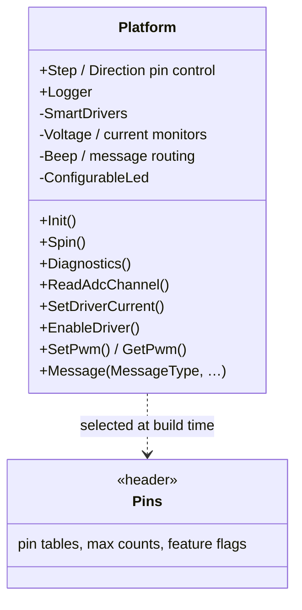
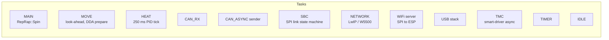
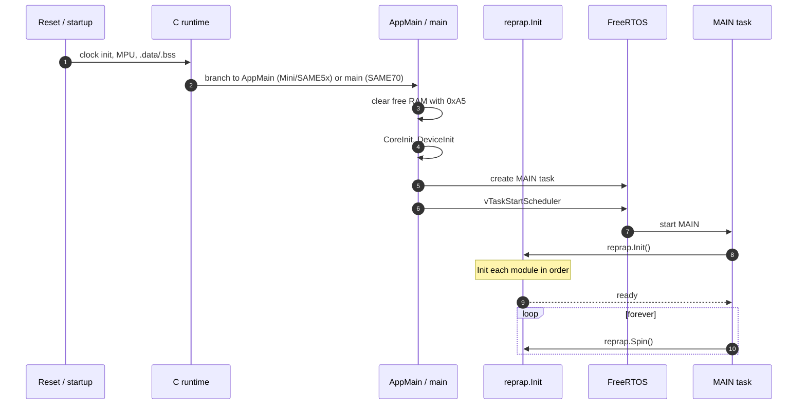

# Platform & Tasks

This document describes the hardware abstraction layer (`Platform`), the FreeRTOS task layout, interrupt priorities, and the boot sequence.

## 1. The `Platform` class

`Platform` ([src/Platform/Platform.h](../../src/Platform/Platform.h), [src/Platform/Platform.cpp](../../src/Platform/Platform.cpp)) is the **only** class in the firmware that knows about board-specific hardware. Everything above it works in real-world units.



What lives in `Platform`:

- Pin table dispatch — `Platform::SetPinFunction(…)` looks up the named pin and configures it.
- ADC pipeline — DMA scan over thermistor / Vref / Vssa / Z-probe / VIN / V12 / current sense pins, oversampled into `AveragingFilter`s.
- Smart driver bookkeeping — TMC2660 / TMC22xx / TMC51xx / TMC2160 communication (UART, SPI), microstepping, current, stallGuard, sensorless homing thresholds. See [src/Movement/StepperDrivers/](../../src/Movement/StepperDrivers).
- VIN / V12 / 5V monitoring — over- and under-voltage events, brown-out shutdown.
- Beeper and message routing.
- Logger to SD card.
- Software reset reasons.

## 2. Per-board configuration

The pin table and feature flags for a given board live in `src/Config/Pins_*.h`. The build system selects one:

```
make Duet3_MB6HC      → -DDUET3_MB6HC → includes Pins_Duet3_MB6HC.h
make Duet3_MB6XD      → -DDUET3_MB6XD → includes Pins_Duet3_MB6XD.h
make Duet3Mini5plus   → -DDUET3MINI    → includes Pins_Duet3Mini5plus.h
make FMDC_V03         → -DFMDC_V03     → includes Pins_FMDC_V03.h
…
```

Each Pins header defines:

- The processor (`SAME70`, `SAME5x`, …)
- Pin tables (`PinTable[]`) — numeric pin → name + capability bitmap.
- Number of drivers, axes, extruders, fans, heaters, sensors, GP-in/out ports, slots.
- Feature flags: `HAS_SBC_INTERFACE`, `SUPPORT_CAN_EXPANSION`, `HAS_LWIP_NETWORKING`, `HAS_WIFI_NETWORKING`, `SUPPORT_DIRECT_LCD`, `SUPPORT_LASER`, etc.

To port to a new board you write a new `Pins_*.h` and add a make target.

## 3. FreeRTOS task layout



Priorities are set in [src/Platform/TaskPriorities.h](../../src/Platform/TaskPriorities.h). Higher number = higher priority:

| Task | Priority (typ.) | Purpose |
|---|---|---|
| `IDLE` | 0 | Idle hook. |
| `MAIN` | low | Cooperative `RepRap::Spin()`. |
| `TIMER` | low | FreeRTOS timer service. |
| `MOVE` | mid | Move planning, look-ahead. |
| `HEAT` | mid | PID, sensor reads. |
| `NETWORK` | mid | TCP/IP stack tasks. |
| `SBC` | high | SPI link state machine. Must service transfers fast. |
| `CAN` | high | CAN RX / async TX. |
| Step ISR | (NVIC priority 5) | Step pulse generation. |

Hard real-time work (step generation, ADC sampling, CAN reception) is done in **interrupts** rather than tasks — see section 5.

## 4. The boot sequence



`RepRap::Init` ([src/Platform/RepRap.cpp](../../src/Platform/RepRap.cpp)) initialises modules in dependency order: `Platform`, `Move`, `Heat`, `GCodes`, `Network`, `PrintMonitor`, `FansManager`, `SbcInterface`, `Display`, `ExpansionManager`, then runs `config.g`.

`config.g` is where the user converts a generic firmware build into "their printer" — `M584` to map drivers, `M569` to configure each driver, `M308` to declare sensors, `M563` to declare tools, `M918` for displays, `M564 H0` for unhomed-axis movement, etc. In SBC mode `config.g` lives on the SBC; in standalone mode it lives on the Duet's SD card. After `config.g` finishes, RRF runs `dsf-config.g` (SBC mode only), then `homeall.g` etc on demand.

## 5. Interrupt priorities

Defined in [src/RepRapFirmware.h:730+](../../src/RepRapFirmware.h). Lower number = higher priority. FreeRTOS calls are forbidden above `configLIBRARY_MAX_SYSCALL_INTERRUPT_PRIORITY`.

| Priority | Source | Why this priority |
|---|---|---|
| 0 | Watchdog | Safety net. |
| 1–2 | UART RX (PanelDue / WiFi UART) | 1-byte buffer; must drain immediately. |
| 4 | CAN, GPIO pin (filament / endstop), TMC driver UART | Must sample exactly. |
| 5 | DMA complete, step ISR | Step-clock accuracy. |
| 6 | USB, HSMCI | Reasonably fast. |
| 7+ | Ethernet, SPI for SBC | Throughput-bound. |

## 6. Watchdogs

Two watchdogs run:

- **Hardware watchdog** — the silicon WDT, reset by a tickless heartbeat. Resets the chip if anything in the system stops feeding it.
- **Software spin watchdog** — `ticksInSpinState` and `spinningModule` ([src/Platform/RepRap.cpp](../../src/Platform/RepRap.cpp)). If a `Spin()` runs too long the periodic Tick() crashes the firmware on purpose with a software-reset reason of `SpinModule(name)` so post-mortem M122 can show which module hung.

## 7. Diagnostics (`M122`)

`M122` walks every module's `Diagnostics()` and produces a multi-page dump: free RAM, stack high-water marks, last reset reason, exception fault info, network stats, CAN stats, print monitor stats, expansion-board stats, and so on. The dump is a primary debugging aid — it is the first thing you ask a user for.

`M122 P<n>` selects subsystem-specific deeper dumps (CAN, networking, SBC link, etc.), and `M122 B<addr>` runs the same against a remote CAN board.

## 8. Software reset reasons

[src/Platform/Tasks.cpp](../../src/Platform/RepRap.cpp) writes a small NVRAM block on reset describing what caused it (user, exception, watchdog, stuck loop, hardware fault). On boot RRF reports the previous reset reason in the M122 banner and over the AUX UART so a stuck unit can be diagnosed without needing logs.

## 9. Where this connects to the rest of the system

- The SBC link runs on its own task (`SBC`); see [SBC_INTERFACE.md](SBC_INTERFACE.md).
- CAN RX / async TX runs on its own tasks; see [CAN_BUS.md](CAN_BUS.md).
- The step ISR is the lowest-level destination of the [motion pipeline](MOTION_PIPELINE.md).
- Object-model `boards[0]` reflects most of what `Platform` exposes (VIN, V12, MCU temp, accelerometer presence, unique ID, etc.). See [OBJECT_MODEL.md](OBJECT_MODEL.md).
