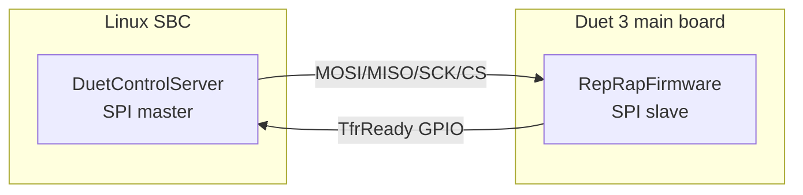
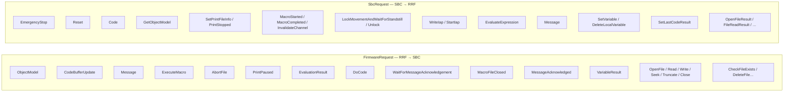
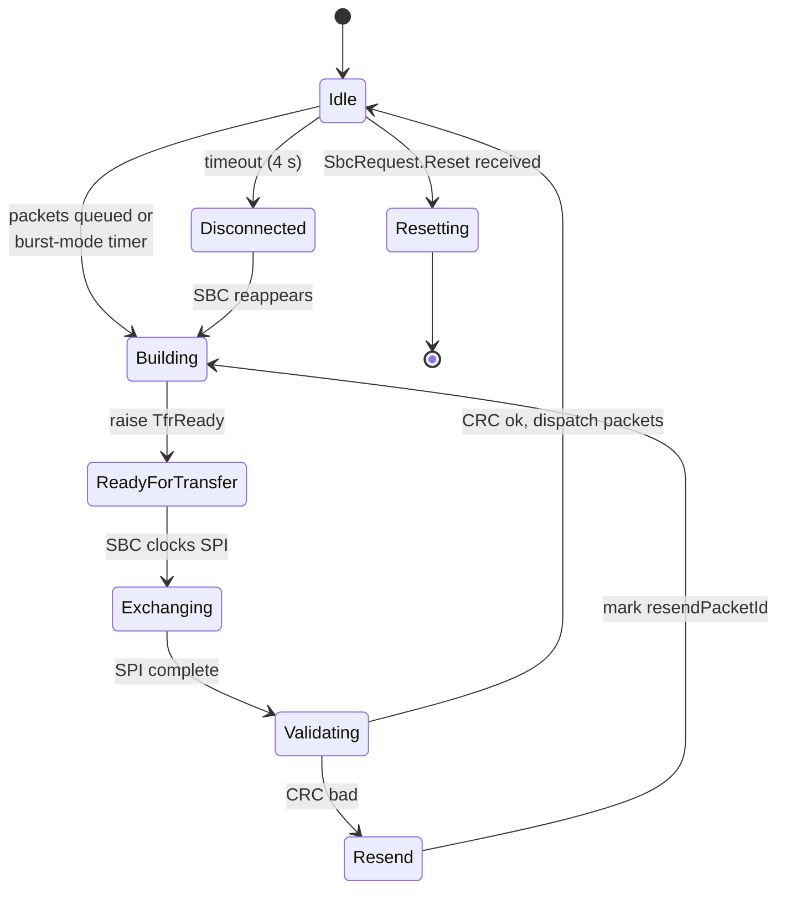
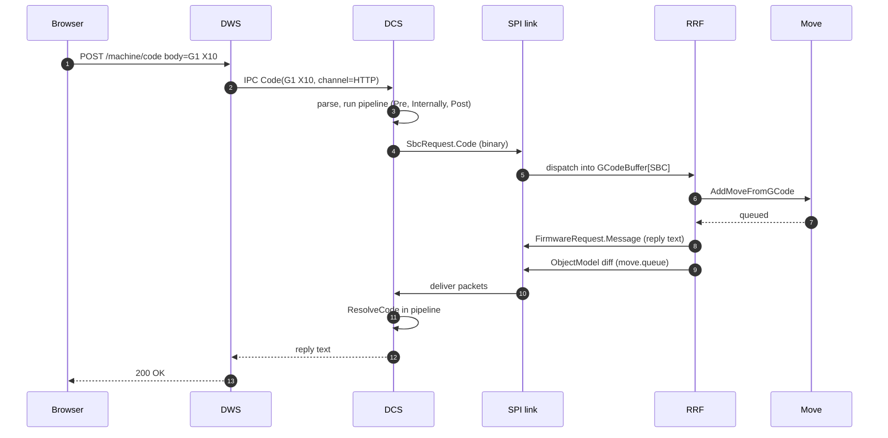
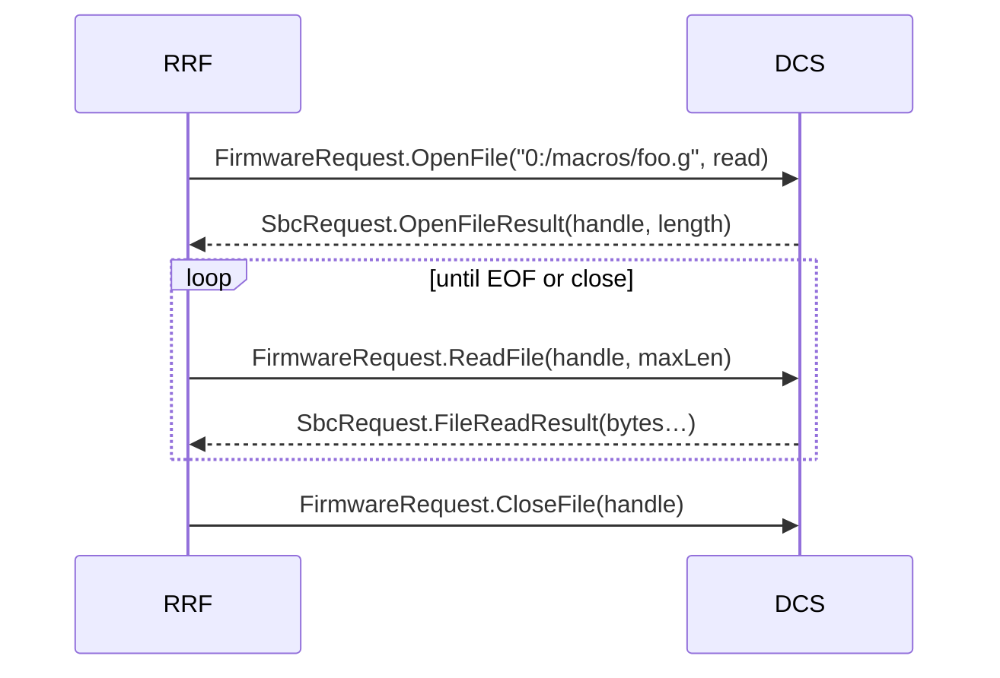
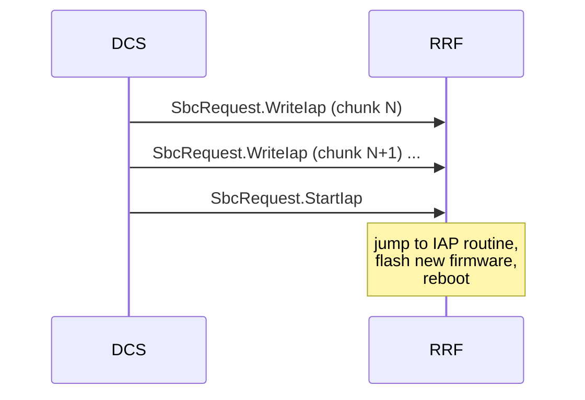

# SBC Interface (SPI link to DSF)

This document describes the **SPI** link between RepRapFirmware (slave) and a Single-Board Computer (master) running [DuetSoftwareFramework](https://github.com/Duet3D/DuetSoftwareFramework/tree/v3.7-andy). The whole link is implemented in [src/SBC/](../../src/SBC).

When this link is up, RRF deliberately disables most of its on-board network and storage code: HTTP / FTP / Telnet are not run by RRF, and the SD card on the Duet is not mounted. Their roles are taken over by DSF's *virtual* SD card and HTTP server.

## 1. Physical link



- **SPI** — typically `/dev/spidev0.0` on the SBC, the dedicated SBC header on the Duet 3.
- **TransferReady** — a GPIO from RRF to the SBC that is toggled when RRF is ready for the next transfer. The SBC waits on the edge with `epoll`/character device so it does not poll. The pin is configurable in DSF (`TransferReadyPin`) and on the Duet's SBC header.
- Maximum SPI clock is hardware-dependent; defaults around 22 MHz for the Pi.

## 2. Framing

A *full transfer* is a fixed-size SPI exchange where both sides send their pending data simultaneously. The buffer size is `SbcTransferBufferSize = 8192 bytes` ([SbcMessageFormats.h](../../src/SBC/SbcMessageFormats.h)) and **must** match between RRF and DSF — the constant is mirrored in DSF's `Consts.cs`.

```
[ TransferHeader (16 B) | Packet 1 | Packet 2 | … | Packet N ]
```

```cpp
struct SpiTransferHeader {
    uint8_t  formatCode;      // 0x5F (SBC mode) or 0x60 (standalone)
    uint8_t  numPackets;
    uint16_t protocolVersion; // SbcProtocolVersion (currently 7)
    uint16_t sequenceNumber;  // monotonic
    uint16_t dataLength;      // payload bytes following this header
    uint32_t crcData;
    uint32_t crcHeader;
};

struct PacketHeader {
    uint16_t request;         // FirmwareRequest or SbcRequest enum value
    uint16_t id;              // packet id, used for retransmit
    uint16_t length;          // payload length following this header
    uint16_t resendPacketId;  // 0 normally, packet id to resend on error
};
```

Both directions share the same transfer-header format. Each packet inside the buffer is a self-contained message of one of the types listed in section 3.

CRCs are CCITT-32 over header / over data. Mismatches cause a resend request: the receiver puts the `resendPacketId` of the packet it lost in the next outgoing header.

## 3. Packet types

The two enums in [SbcMessageFormats.h](../../src/SBC/SbcMessageFormats.h) define every payload type:



The asymmetry is deliberate: most data lives on the SBC, so RRF spends most of its time *requesting* file chunks, macros, and object-model updates from DSF. RRF *generates* movement and sensor data, which it pushes to DSF.

## 4. Transfer state machine (RRF side)

Implemented in [src/SBC/SbcInterface.cpp](../../src/SBC/SbcInterface.cpp) / [DataTransfer.cpp](../../src/SBC/DataTransfer.cpp), running on the SBC FreeRTOS task at high priority:



### Burst mode

Under sustained code traffic (a print running, plugin streams, etc.) the link enters **burst mode**: the inter-transfer delay drops from `SbcTransferDelay = 25` ms to `SbcBurstModeDelay = 2` ms while the `SbcBurstModeWindow = 50` ms window is rearmed. Burst mode is re-armed every time RRF reports an "urgent" event (`SbcEventsRequired = 4` skips the delay even sooner). This is the throughput knob: at idle the link runs ~40 transfers/sec, in burst mode an order of magnitude faster, with each transfer carrying up to `SbcTransferBufferSize = 8192` bytes of codes / replies / OM data.

## 5. Worked example — life of an HTTP-typed G-code (SBC mode)



The same path applies to a code from any "DSF-side" channel — `HTTP`, `Telnet`, `MQTT`, `USB` (when DSF owns the USB CDC), as well as the `File`, `Daemon`, `Trigger`, `Autopause` channels for which DSF owns the file system.

## 6. Object Model replication

Object Model updates flow as `FirmwareRequest::ObjectModel` packets. DSF requests sub-trees with `SbcRequest::GetObjectModel` (key + flags exactly as in `M409 K… F…`), and RRF responds with the JSON serialisation. RRF also pushes diffs whenever a sequence number changes — see [OBJECT_MODEL.md#sequence-numbers](OBJECT_MODEL.md#sequence-numbers).

## 7. Filesystem proxy

When in SBC mode, RRF has no filesystem of its own — the on-board SD card slot is unused. Every file operation is delegated to DSF using the `OpenFile`, `ReadFile`, `WriteFile`, `SeekFile`, `TruncateFile`, `CloseFile`, `CheckFileExists`, `DeleteFileOrDirectory[Recursively]` request pairs:



`FileHandle` is an opaque token allocated by DSF. See [src/SBC/SbcInterface.cpp](../../src/SBC/SbcInterface.cpp) `FileOperation` for the full list of operations that are mediated this way.

## 8. Macro execution

When a code on the SBC channel runs `M98 P"foo.g"`, RRF needs to push a new machine-state frame and start reading from `foo.g` — but RRF can't open files directly. Instead it sends a `FirmwareRequest::ExecuteMacro` packet; DSF opens the file, parses it, and starts streaming pre-tokenised binary codes into the appropriate channel using `SbcRequest::Code` packets, marked as macro codes. When the macro finishes DSF sends `SbcRequest::MacroCompleted`, and RRF pops the frame.

This indirection means **all** filesystem-backed G-code execution (jobs, macros, triggers, daemon, autopause, dsf-config.g) runs through DSF in SBC mode.

## 9. IAP — firmware update over SPI



DSF's `--update` mode is the mechanism `apt`-installed firmware uses on DuetPi.

## 10. USB transport (recent boards)

Recent SAME5x boards optionally support running this same protocol over a USB CDC link instead of SPI. Selected at runtime by `M576` and `RequestUsbSwitch`. The framing changes (`UsbTransferHeader` instead of `SpiTransferHeader`, no `TransferReady` pin) but every packet type is the same. See `SUPPORTS_SBC_OVER_USB`.

## 11. What changes in standalone mode

When running without an SBC, RRF is byte-for-byte the same firmware — `HAS_SBC_INTERFACE` is set at build time but the SBC task simply never connects. The format code `SbcFormatCodeStandalone (0x60)` is what DSF sees on first contact if it ever does come up, and DSF responds by exiting cleanly.

## 12. Where this connects to the rest of the system

- DSF's matching implementation: [`Link/Adapter/SPI.cs`](https://github.com/Duet3D/DuetSoftwareFramework/blob/v3.7-andy/src/DuetControlServer/Link/Adapter/SPI.cs), [`Link/Protocol/`](https://github.com/Duet3D/DuetSoftwareFramework/tree/v3.7-andy/src/DuetControlServer/Link/Protocol).
- The protocol version `SbcProtocolVersion` must match between RRF and DSF. A bump on either side without the other is a hard incompatibility — DSF will exit with code `502`.
- For the cross-process path of a single G-code that originates in a browser and ends as motor pulses on a CAN tool board, see the integration docs: [DuetSoftwareFramework/docs/architecture/GCODE_FLOW.md](https://github.com/Duet3D/DuetSoftwareFramework/blob/v3.7-andy/docs/architecture/GCODE_FLOW.md).
