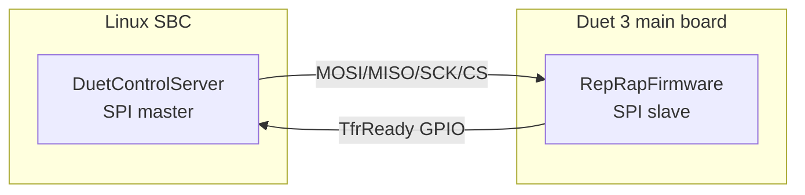
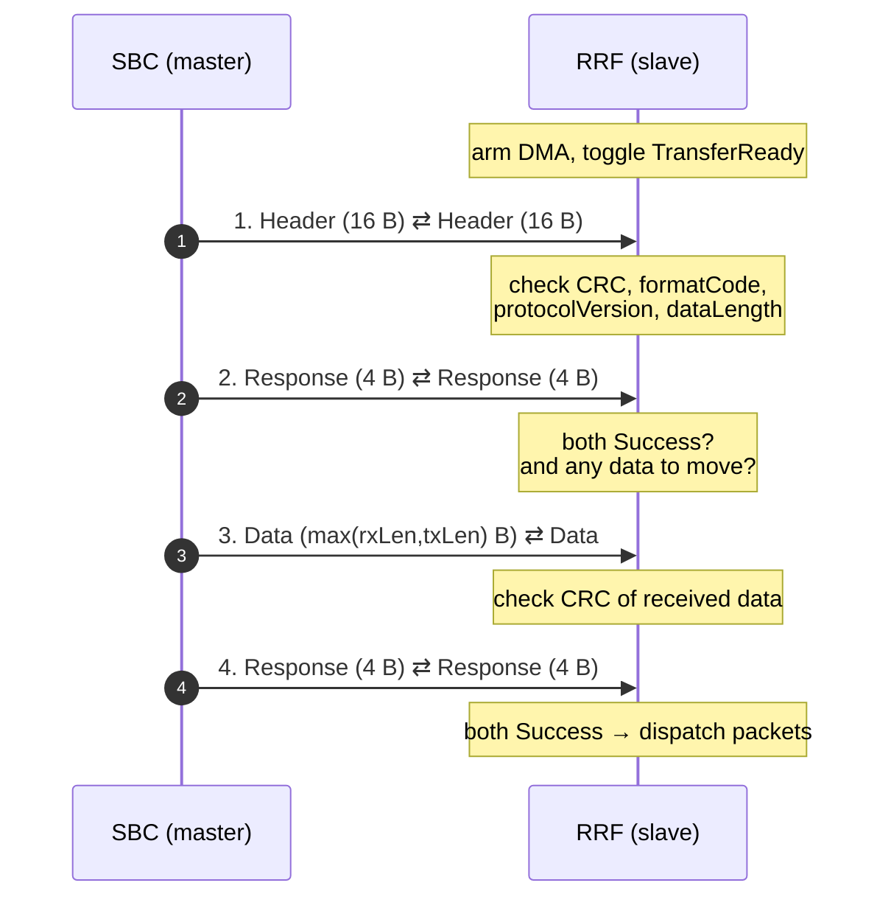
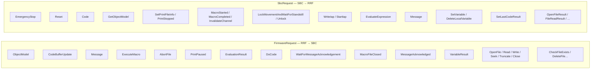
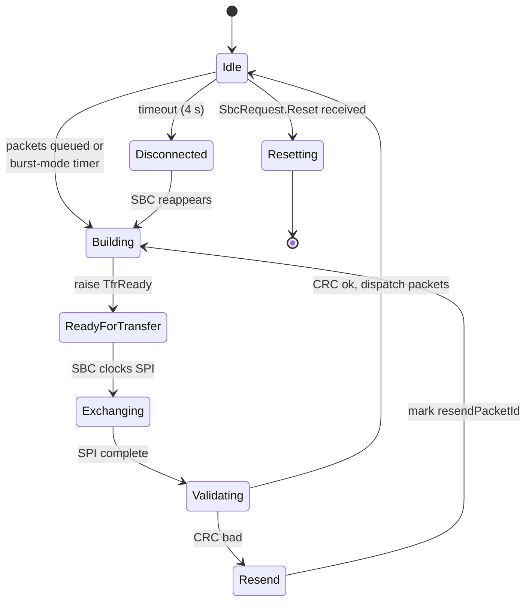
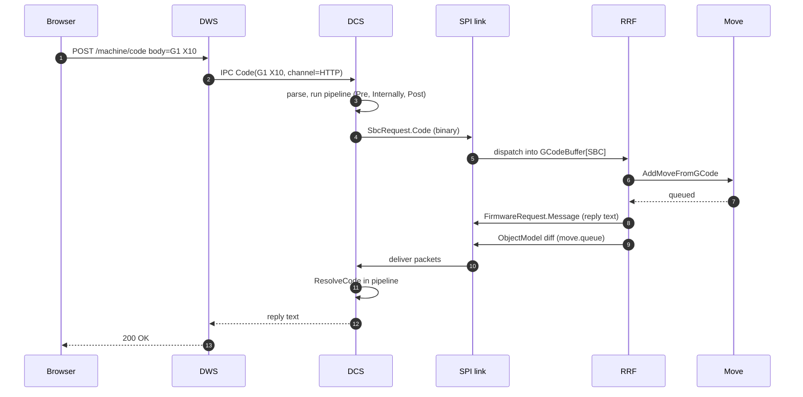
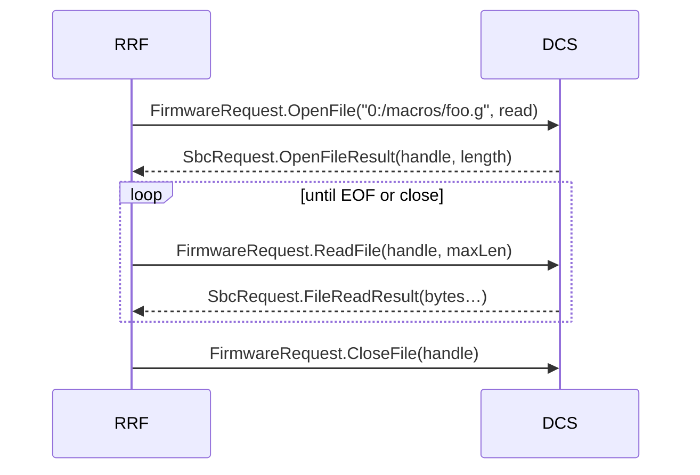
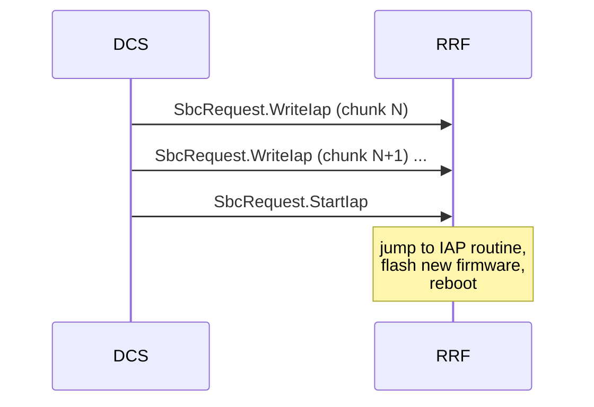

# SBC Interface (SPI link to DSF)

This document describes the **SPI** link between RepRapFirmware (slave) and a Single-Board Computer (master) running [DuetSoftwareFramework](https://github.com/Duet3D/DuetSoftwareFramework/tree/v3.7-andy). The whole link is implemented in [src/SBC/](../../src/SBC).

When this link is up, RRF deliberately disables most of its on-board network and storage code: HTTP / FTP / Telnet are not run by RRF, and the SD card on the Duet is not mounted. Their roles are taken over by DSF's *virtual* SD card and HTTP server.

## 1. Physical link



- **SPI** — typically `/dev/spidev0.0` on the SBC, the dedicated SBC header on the Duet 3.
- **TransferReady** — a GPIO from RRF to the SBC that is toggled when RRF is ready for the next transfer. The SBC waits on the edge with `epoll`/character device so it does not poll. The pin is configurable in DSF (`TransferReadyPin`) and on the Duet's SBC header.
- Maximum SPI clock is hardware-dependent; defaults around 22 MHz for the Pi.

## 2. Framing & message encoding

Everything here is implemented in [DataTransfer.cpp](../../src/SBC/DataTransfer.cpp) / [DataTransfer.h](../../src/SBC/DataTransfer.h), and every wire structure is declared in [SbcMessageFormats.h](../../src/SBC/SbcMessageFormats.h). The same constant file is mirrored on the DSF side (`Consts.cs`), so the two ends must agree byte-for-byte.

A *full transfer* moves one buffer of pending data in each direction. The buffer size is `SbcTransferBufferSize = 8192 bytes`; it must be a whole number of 32-bit words and `≤ 65535` (the `dataLength` field is a `uint16_t`). Because RRF is the SPI **slave** and SPI is full-duplex, a single full transfer is not one SPI burst — it is a short *handshake* of four fixed-size SPI exchanges (section 2.1), each gated by the `TransferReady` pin.

### 2.1 The four-phase handshake

Every exchange clocks the same number of bytes in both directions simultaneously. RRF toggles `TransferReady` before each phase to tell the SBC the slave DMA is armed; the SBC then drives the clock. The phases (driven by the `InternalTransferState` machine in `DataTransfer::DoTransfer`) are:



1. **Header exchange** — both sides clock their 16-byte `SpiTransferHeader` (`ExchangeHeader`). RRF validates the received header: header CRC, then `formatCode == 0x5F`, `protocolVersion == 7`, `dataLength ≤ 8192`.
2. **Header response** — both sides clock a single 4-byte `SpiTransferResponse` word (`ExchangeResponse`) reporting whether the header they received was acceptable.
3. **Data exchange** — only if *both* responses were `Success` **and** at least one side has `dataLength != 0`. The exchange length is `max(rxHeader.dataLength, txHeader.dataLength)`; the shorter side simply clocks out stale buffer bytes that the peer ignores. RRF then validates the data CRC.
4. **Data response** — another 4-byte `SpiTransferResponse` word. When both are `Success`, the payload is accepted, the read/write pointers and packet counter are reset, and RRF dispatches the received packets.

The `SpiTransferResponse` codes ([SbcMessageFormats.h:127](../../src/SBC/SbcMessageFormats.h#L127)):

| Value | Name | Meaning |
|------:|------|---------|
| `1` | `Success` | header/data accepted |
| `2` | `BadFormat` | `formatCode` not `0x5F` |
| `3` | `BadProtocolVersion` | `protocolVersion` mismatch |
| `4` | `BadDataLength` | `dataLength` &gt; buffer size |
| `5` | `BadHeaderChecksum` | header CRC mismatch → whole transfer retried |
| `6` | `BadDataChecksum` | data CRC mismatch → data phase repeated |
| `0xFEFEFEFE` | `BadResponse` | a response word itself was corrupt → resync |

A `BadHeaderChecksum` restarts the full handshake; a `BadDataChecksum` repeats only phase 3; a `BadResponse` resets back to a header exchange (`RestartTransfer`). These error counters surface in `M122` (`failedTransfers`, `checksumErrors`).

### 2.2 Transfer header (16 bytes)

```cpp
struct SpiTransferHeader {
    uint8_t  formatCode;      // 0x5F SbcFormatCode, 0x60 standalone, 0xC9 invalid
    uint8_t  numPackets;      // number of packets packed into the data buffer
    uint16_t protocolVersion; // SbcProtocolVersion (currently 7)
    uint16_t sequenceNumber;  // increments by 1 every transfer (wraps at 16 bits)
    uint16_t dataLength;      // number of payload bytes in the data phase
    uint32_t crcData;         // CRC-32 of the dataLength payload bytes
    uint32_t crcHeader;       // CRC-32 of the preceding 12 header bytes
};
```

`crcHeader` covers `sizeof(SpiTransferHeader) - sizeof(uint32_t)` = the first 12 bytes (everything up to but excluding `crcHeader` itself). `crcData` covers exactly `dataLength` bytes of the data buffer.

`sequenceNumber` is the link-liveness check. Each side increments its own counter every transfer; `IsConnectionReset()` flags a connection loss when the received `sequenceNumber` is not exactly the expected `lastTransferNumber + 1`, which is how RRF detects that DSF restarted (e.g. after a `Reset` request or a crash). A full reset zeroes both counters.

### 2.3 Packet layout inside the data buffer

The data buffer is a tight sequence of `numPackets` packets, each an 8-byte `PacketHeader` followed by its payload:

```
data buffer ─┬─ PacketHeader(8) ─ payload ─ pad ─┬─ PacketHeader(8) ─ payload ─ pad ─┬─ …
             │  packet 0                          │  packet 1                         │
```

```cpp
struct PacketHeader {
    uint16_t request;         // FirmwareRequest (RRF→SBC) or SbcRequest (SBC→RRF) enum value
    uint16_t id;              // monotonically increasing packet id within the transfer
    uint16_t length;          // payload length following this header (before padding)
    uint16_t resendPacketId;  // 0 normally; for a ResendPacket request, the id to resend
};
```

**Alignment is the key encoding rule.** Every `PacketHeader` must start on a 4-byte boundary. `length` records the *unpadded* payload size, but the writer rounds the write pointer up to the next multiple of 4 before laying down the next packet (`AddPadding` / `WritePacketHeader`). The reader mirrors this: `ReadData` advances the read pointer by `AddPadding(length)`, while `ReadPacket` walks packet-to-packet using the padded boundaries. This is why every fixed sub-header in [SbcMessageFormats.h](../../src/SBC/SbcMessageFormats.h) is hand-padded to a multiple of 4 bytes (the `paddingA`/`paddingB`/`dummy` fields), and why `SbcTransferBufferSize` and `MaxGCodeBinaryLength` are asserted to be whole dwords.

`resendPacketId` is the retransmit mechanism at the *packet* level (distinct from the CRC-driven retry of a whole phase): a `FirmwareRequest::ResendPacket` / `SbcRequest` packet carries the `id` of a packet the receiver could not process (e.g. RRF was out of buffer space), asking the peer to send it again next transfer.

### 2.4 Payload encoding

A packet payload is almost always a fixed *sub-header* struct followed by zero or more variable-length blobs (strings, arrays, JSON, file data). The sub-header carries the lengths of what follows so the reader can slice it back apart. Some representative examples:

| Request | Sub-header | Trailing data |
|---------|-----------|---------------|
| `GetObjectModel` | `GetObjectModelHeader{keyLength, flagsLength}` | key string, then flags string |
| `Message` / code reply | `MessageHeader{messageType, length, …}` | `length` bytes of UTF-8 text |
| `ObjectModel` / variable result | `StringHeader{length, …}` | `length` bytes of JSON |
| `SetVariable` | `SetVariableHeader{channel, createVariable, varLen, exprLen}` | variable name, then expression |
| `ExecuteMacro` | `ExecuteMacroHeader{channel, …, fromCode, length}` | `length`-byte filename |
| `OpenFile` | `OpenFileHeader{forWriting, append, filenameLength, …, preAllocSize}` | filename |
| `Code` (SBC→RRF) | `CodeHeader` | parameter table + inline data — see 2.6 |

Strings are **not** NUL-terminated on the wire — the length in the sub-header is authoritative. Note that multiple strings inside one payload are packed back-to-back with no internal padding (`WriteData` just concatenates); only the *next packet header* re-aligns to a dword. Reads copy out with the recorded length (`StringRef::copy`).

`OutputBuffer` chains (object-model JSON, code replies) are streamed straight into the buffer; long replies that don't fit are truncated and the `PushFlag` bit is OR-ed into the `MessageType` so DSF knows more will follow in a later transfer (`WriteCodeReply`).

### 2.5 Checksums

Both CRCs are the **standard CRC-32** (the zlib / PKZIP / ITU-T V.42 variant), *not* CCITT: polynomial `0xEDB88320` (reflected form of `0x04C11DB7`), initial value `0xFFFFFFFF`, input and output reflected, final XOR `0xFFFFFFFF` ([CRC32.cpp](../../src/Storage/CRC32.cpp), `CalcCRC32`). On the SAME5x this runs on the DMAC hardware CRC unit; on other parts it uses the 256-entry table. DSF computes the identical CRC in C#.

### 2.6 Binary G-code encoding (`SbcRequest::Code`)

The most performance-critical payload is a pre-tokenised G/M/T-code. Instead of re-parsing text on the MCU, DSF parses the code once and ships a binary form that RRF's `BinaryParser` reads in place (no copy):

```cpp
struct CodeHeader {
    uint8_t  channel;       // GCodeChannel
    CodeFlags flags;        // bitfield, see below
    uint8_t  numParameters;
    char     letter;        // 'G' / 'M' / 'T' …
    int32_t  majorCode;     // e.g. 1 for G1   (valid if HasMajorCommandNumber)
    int32_t  minorCode;     // e.g. the .1 in G29.1 (valid if HasMinorCommandNumber)
    uint32_t filePosition;  // source offset (valid if HasFilePosition)
    int32_t  lineNumber;    // valid if HasExplicitLineNumber
};

struct CodeParameter {
    char     letter;        // parameter letter, e.g. 'X'
    DataType type;          // how to read the value
    uint16_t padding;
    union { int32_t intValue; uint32_t uintValue; float floatValue; };
};
```

`CodeFlags` ([SbcMessageFormats.h:313](../../src/SBC/SbcMessageFormats.h#L313)) tell the reader which header fields are meaningful: `HasMajorCommandNumber (1)`, `HasMinorCommandNumber (2)`, `HasFilePosition (4)`, `EnforceAbsolutePosition (8)`, `HasExplicitLineNumber (16)`.

Layout of a single `Code` payload:

```
[ CodeHeader ][ CodeParameter × numParameters ][ inline data for arrays / strings / expressions ]
```

For scalar parameters (`Int`, `UInt`, `Float`, `Bool`, `Char`, `DriverId`, bitmaps) the value lives directly in the parameter's union. For variable-length parameters the union instead holds a *length*, and the actual bytes are appended after the parameter table, in parameter order:

- `String` / `Expression` → `intValue` is the string length; the characters follow inline.
- `IntArray` / `UIntArray` / `FloatArray` / `DriverIdArray` → `intValue` is the element count; `count × 4` bytes follow inline.

`BinaryParser::Init` builds a bitmap of which parameter letters are present, then `GetParameter` walks the table skipping over inline data to locate the requested letter. A binary code is capped at `MaxGCodeBinaryLength = 384` bytes.

`DataType` ([SbcMessageFormats.h:51](../../src/SBC/SbcMessageFormats.h#L51)) is the shared value-encoding enum used both here and in expression/variable results:

| # | Type | # | Type | # | Type |
|--:|------|--:|------|--:|------|
| 0 | `Int` (int32) | 7 | `Expression` | 14 | `Null` |
| 1 | `UInt` (uint32) | 8 | `DriverId` (2×uint16) | 15 | `Char` |
| 2 | `Float` | 9 | `DriverIdArray` | 16 | `Bitmap16` |
| 3 | `IntArray` | 10 | `Boolean` | 17 | `Bitmap32` |
| 4 | `UIntArray` | 11 | `BoolArray` (uint8[]) | 18 | `Bitmap64` |
| 5 | `FloatArray` | 12 | `ULong` (uint64) | 19 | `FloatWithDigits` |
| 6 | `String` | 13 | `DateTime` (ISO string) | | |

Both directions share the same transfer-header and packet-header format; only the `request` enum differs (`FirmwareRequest` vs `SbcRequest`, section 3).

## 3. Packet types

The two enums in [SbcMessageFormats.h](../../src/SBC/SbcMessageFormats.h) define every payload type:



The asymmetry is deliberate: most data lives on the SBC, so RRF spends most of its time *requesting* file chunks, macros, and object-model updates from DSF. RRF *generates* movement and sensor data, which it pushes to DSF.

## 4. Transfer state machine (RRF side)

This is the **task-level** view of how RRF decides *when* to transfer; the byte-level handshake that each `Exchanging` edge expands into is described in [section 2.1](#21-the-four-phase-handshake). Implemented in [src/SBC/SbcInterface.cpp](../../src/SBC/SbcInterface.cpp) / [DataTransfer.cpp](../../src/SBC/DataTransfer.cpp), running on the SBC FreeRTOS task at high priority:



### Burst mode

Under sustained code traffic (a print running, plugin streams, etc.) the link enters **burst mode**: the inter-transfer delay drops from `SbcTransferDelay = 25` ms to `SbcBurstModeDelay = 2` ms while the `SbcBurstModeWindow = 50` ms window is rearmed. Burst mode is re-armed every time RRF reports an "urgent" event (`SbcEventsRequired = 4` skips the delay even sooner). This is the throughput knob: at idle the link runs ~40 transfers/sec, in burst mode an order of magnitude faster, with each transfer carrying up to `SbcTransferBufferSize = 8192` bytes of codes / replies / OM data.

## 5. Worked example — life of an HTTP-typed G-code (SBC mode)



The same path applies to a code from any "DSF-side" channel — `HTTP`, `Telnet`, `MQTT`, `USB` (when DSF owns the USB CDC), as well as the `File`, `Daemon`, `Trigger`, `Autopause` channels for which DSF owns the file system.

## 6. Object Model replication

Object Model updates flow as `FirmwareRequest::ObjectModel` packets. DSF requests sub-trees with `SbcRequest::GetObjectModel` (key + flags exactly as in `M409 K… F…`), and RRF responds with the JSON serialisation. RRF also pushes diffs whenever a sequence number changes — see [OBJECT_MODEL.md#sequence-numbers](OBJECT_MODEL.md#sequence-numbers).

## 7. Filesystem proxy

When in SBC mode, RRF has no filesystem of its own — the on-board SD card slot is unused. Every file operation is delegated to DSF using the `OpenFile`, `ReadFile`, `WriteFile`, `SeekFile`, `TruncateFile`, `CloseFile`, `CheckFileExists`, `DeleteFileOrDirectory[Recursively]` request pairs:



`FileHandle` is an opaque token allocated by DSF. See [src/SBC/SbcInterface.cpp](../../src/SBC/SbcInterface.cpp) `FileOperation` for the full list of operations that are mediated this way.

## 8. Macro execution

When a code on the SBC channel runs `M98 P"foo.g"`, RRF needs to push a new machine-state frame and start reading from `foo.g` — but RRF can't open files directly. Instead it sends a `FirmwareRequest::ExecuteMacro` packet; DSF opens the file, parses it, and starts streaming pre-tokenised binary codes into the appropriate channel using `SbcRequest::Code` packets, marked as macro codes. When the macro finishes DSF sends `SbcRequest::MacroCompleted`, and RRF pops the frame.

This indirection means **all** filesystem-backed G-code execution (jobs, macros, triggers, daemon, autopause, dsf-config.g) runs through DSF in SBC mode.

## 9. IAP — firmware update over SPI



DSF's `--update` mode is the mechanism `apt`-installed firmware uses on DuetPi.

## 10. USB transport (recent boards)

Recent SAME5x boards optionally support running this same protocol over a USB CDC link instead of SPI. Selected at runtime by `M576` and `RequestUsbSwitch`. The framing changes (`UsbTransferHeader` instead of `SpiTransferHeader`, no `TransferReady` pin) but every packet type is the same. See `SUPPORTS_SBC_OVER_USB`.

## 11. What changes in standalone mode

When running without an SBC, RRF is byte-for-byte the same firmware — `HAS_SBC_INTERFACE` is set at build time but the SBC task simply never connects. The format code `SbcFormatCodeStandalone (0x60)` is what DSF sees on first contact if it ever does come up, and DSF responds by exiting cleanly.

## 12. Where this connects to the rest of the system

- DSF's matching implementation: [`Link/Adapter/SPI.cs`](https://github.com/Duet3D/DuetSoftwareFramework/blob/v3.7-andy/src/DuetControlServer/Link/Adapter/SPI.cs), [`Link/Protocol/`](https://github.com/Duet3D/DuetSoftwareFramework/tree/v3.7-andy/src/DuetControlServer/Link/Protocol).
- The protocol version `SbcProtocolVersion` must match between RRF and DSF. A bump on either side without the other is a hard incompatibility — DSF will exit with code `502`.
- For the cross-process path of a single G-code that originates in a browser and ends as motor pulses on a CAN tool board, see the integration docs: [DuetSoftwareFramework/docs/architecture/GCODE_FLOW.md](https://github.com/Duet3D/DuetSoftwareFramework/blob/v3.7-andy/docs/architecture/GCODE_FLOW.md).
