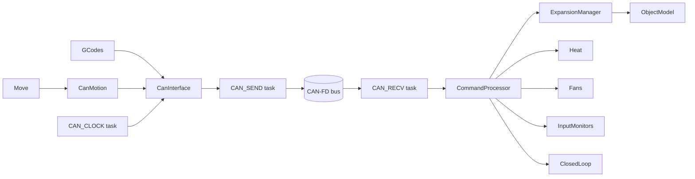
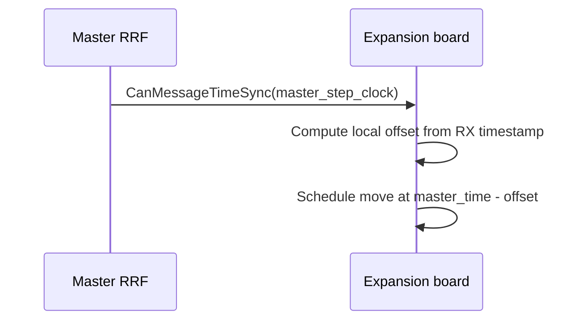

# CAN

`src/CAN/` is RepRapFirmware's CAN-FD master subsystem for Duet 3 expansion and tool boards.

This module owns:

- CAN transport setup and message buffer management
- request/reply transactions to remote boards
- periodic time synchronization used for coordinated stepping
- remote motion packet generation
- discovery, lifecycle, and object model state for expansion boards
- forwarding of asynchronous data streams (inputs, sensors, fan tach, driver status, accelerometer, closed-loop)

It does not own high-level machine behavior. Decisions are made by `GCodes`, `Move`, `Heat`, and other modules; `src/CAN/` turns those decisions into CANlib wire messages and merges remote state back into the master view.

## Scope and deployment model

- The master board is always CAN address `0` (see `CanId::MasterAddress`).
- Expansion/tool boards use nonzero addresses and run Duet3Expansion firmware.
- CAN expansion is independent of standalone vs SBC mode.
- DSF does not drive CAN directly; it consumes CAN-derived state from RRF via object model and diagnostics.

## Source map

### Core transport and lifecycle

| File | Responsibility |
|---|---|
| [CanInterface.h](CanInterface.h) | Public API for CAN operations used by other RRF modules. |
| [CanInterface.cpp](CanInterface.cpp) | Transport init/shutdown, sender/receiver/clock tasks, request tracking, diagnostics, remote command helpers. |
| [CanDriversData.h](CanDriversData.h) | Helpers for collecting remote-driver operations by board/address. |
| [CanDriversData.cpp](CanDriversData.cpp) | Implementation of grouped driver operation helpers. |

### Motion path

| File | Responsibility |
|---|---|
| [CanMotion.h](CanMotion.h) | API for DDA integration and urgent stop/revert control. |
| [CanMotion.cpp](CanMotion.cpp) | Builds per-board move messages, assigns sequence numbers, tracks provisional stops during endstop checking. |

### Message handling and board state

| File | Responsibility |
|---|---|
| [CommandProcessor.h](CommandProcessor.h) | Entry point for processing inbound broadcast/request messages. |
| [CommandProcessor.cpp](CommandProcessor.cpp) | Dispatches announces, status/data streams, replies, and error conditions to owning modules. |
| [ExpansionManager.h](ExpansionManager.h) | Expansion board state model and object-model integration (`boards[]`). |
| [ExpansionManager.cpp](ExpansionManager.cpp) | Announcement handling, status timeout transitions, firmware-update lifecycle, remote board metadata tracking. |

### Generic M-code forwarding

| File | Responsibility |
|---|---|
| [CanMessageGenericConstructor.h](CanMessageGenericConstructor.h) | Builder for generic forwarded command packets. |
| [CanMessageGenericConstructor.cpp](CanMessageGenericConstructor.cpp) | Serializes G-code parameters into `CanMessageGeneric` payloads and sends via request/reply path. |

## Architecture and control flow

Key runtime loops in `CanInterface.cpp`:

- `CAN_SEND`: sends motion, urgent, request, response, broadcast traffic
- `CAN_RECV`: drains receive FIFOs and forwards to `CommandProcessor`
- `CAN_CLOCK`: broadcasts periodic time-sync frames

## Message model and wire contract

Wire message layouts are defined in CANlib (`CanMessageFormats.h`) and must remain compatible with Duet3Expansion.

Main families used by this module:

- time and housekeeping: announce, acknowledge, time sync, diagnostics, update control
- motion: shaped linear moves, stop movement, revert position
- generic request/reply: forwarded command payloads with standard/extended replies
- streaming data: remote inputs, temperatures, fan data, driver status, accelerometer and closed-loop samples

## Time synchronization behavior

Remote moves are scheduled in master step-clock time, so offset errors directly affect multi-board motion quality.

Implementation details (from `CanInterface.cpp`):

- periodic sync interval: `CanClockIntervalMillis = 211`
- tolerated max scheduling/transmit delay bound: `MaxTimeSyncDelay`
- dedicated TX buffer class for time sync (`TxBufferIndexTimeSync`)

The 211 ms interval is intentionally relatively prime to periodic board status cadence to reduce deterministic collision patterns.

## Motion path details

`CanMotion` is called by movement preparation (`DDA::Prepare`) and performs per-board aggregation:

1. `StartMovement()` clears stale movement and stop state.
2. `AddAxisMovement()` and `AddExtruderMovement()` fill per-driver fields.
3. `FinishMovement()` stamps `whenToExecute`, assigns per-destination sequence (`seq`), and queues via `CanInterface::SendMotion()`.

Important behaviors:

- One move packet per destination board per prepared move (when that board has active remote drivers).
- Sequence numbers are tracked per destination (`nextSeq[address]` in `CanMotion.cpp`).
- During endstop/provisional-stop paths, ISR-safe stop state is accumulated and converted into urgent stop/revert CAN messages by sender-side polling (`GetUrgentMessage()`).

## Request/reply transaction model

`CanInterface` provides a synchronous transaction API for higher-level modules:

- `AllocateRequestId(destination, buffer)` reserves a request ID slot.
- `SendRequestAndGetStandardReply(...)` sends and blocks for reply timeout/result.
- `SendRequestAndGetCustomReply(...)` supports non-standard reply types via callback.

These APIs are used by remote driver configuration, diagnostics, address changes, handle management, and forwarded generic commands.

Default timeouts (`CanInterface.h`):

- response timeout: `UsualResponseTimeout = 1000 ms`
- send timeout: `UsualSendTimeout = 200 ms`

## Expansion board lifecycle and object model integration

`ExpansionManager` maintains per-address board metadata (`ExpansionBoardData`) and board state transitions (`BoardState`):

- `unknown`, `flashing`, `flashFailed`, `resetting`, `running`, `timedOut`

Operational points:

- board announcements are accepted via `ProcessAnnouncement(...)`
- periodic board status updates refresh liveness and telemetry
- timeout to `timedOut` occurs if no status arrives within `StatusMessageTimeoutMillis = 5000`
- firmware-update workflows are coordinated from this manager
- state is exposed into object model `boards[]`

## Interfaces to other RRF modules

- [../Movement/README.md](../Movement/README.md): remote motion splitting and synchronization
- [../Heating/README.md](../Heating/README.md): remote heater/sensor data and configuration
- [../Fans/README.md](../Fans/README.md): remote fan control and tach reporting
- [../InputMonitors/README.md](../InputMonitors/README.md): remote input handles and state changes
- [../ClosedLoop/README.md](../ClosedLoop/README.md): remote closed-loop telemetry collection
- [../ObjectModel/README.md](../ObjectModel/README.md): `boards[]` and related remote-board state
- [../GCodes/README.md](../GCodes/README.md): command entry points that trigger remote operations

## Build-time and platform constraints

Primary compile-time gates used in this module:

- `SUPPORT_CAN_EXPANSION`: enables the subsystem
- `SUPPORT_REMOTE_COMMANDS`: enables expansion-side command handlers and announce paths
- `DUAL_CAN`: enables secondary CAN device path and plain message helpers
- `SAME70` / non-`SAME70`: affects timestamp and hardware details

Practical constraints:

- CAN message buffer pressure can stall high-rate paths if free buffers drop too low
- remote linear driver index must fit `MaxLinearDriversPerCanSlave`
- time-sync quality is bounded by arbitration delay and bus loading
- message schema changes require synchronized CANlib + RRF + Duet3Expansion updates

## Error handling and diagnostics

Primary diagnostics entry points:

- `CanInterface::Diagnostics(...)` for local CAN subsystem counters and status
- `CanInterface::RemoteDiagnostics(...)` for board-targeted diagnostic requests
- `M122 B<address>` for remote diagnostics

Common failure modes and where to look:

- no board detected: announcement handling and CAN addressing (`M952`, announce traffic)
- intermittent timeout: bus load/bit timing, request/reply timeout paths, status timeout transitions
- motion desync: time-sync delay spikes and dropped/late motion sends
- stale remote state: `ExpansionManager` status reception and object model update path

## Verification checklist after CAN changes

Use this checklist for protocol or behavior changes in `src/CAN/`:

1. Build a CAN-enabled target (for example `make Duet3_MB6HC -j`).
2. Boot with at least one known expansion board and verify announce + `boards[]` population.
3. Run `M122 B<address>` and confirm remote diagnostics reply path still works.
4. Exercise remote driver config commands (`M569`, `M584`, `M906`) on a remote address.
5. Run coordinated motion across local + remote drivers and check for sync artifacts.
6. If touching streaming data paths, validate one real producer path (remote temp, input, fan, accelerometer, or closed-loop).
7. If touching message formats, verify matching CANlib and Duet3Expansion branches/builds.

## Relationship to DSF and Duet3Expansion

- DSF: no direct CAN bus ownership. DSF sees post-merge machine state from RRF.
- Duet3Expansion: peer implementation of the same CANlib protocol on remote boards.

## Related documentation

- [../../docs/devel/CAN_BUS.md](../../docs/devel/CAN_BUS.md)
- [../../docs/devel/ARCHITECTURE.md](../../docs/devel/ARCHITECTURE.md)
- [../../docs/devel/OBJECT_MODEL.md](../../docs/devel/OBJECT_MODEL.md)
- [../../docs/devel/MOTION_PIPELINE.md](../../docs/devel/MOTION_PIPELINE.md)
- [../../docs/devel/HEATING.md](../../docs/devel/HEATING.md)
- [Duet3Expansion CAN protocol](https://github.com/Duet3D/Duet3Expansion/blob/3.7-docker/docs/devel/CAN_PROTOCOL.md)
