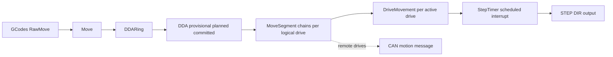
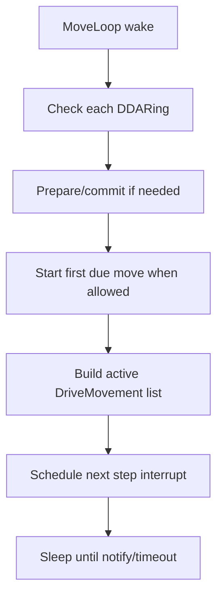
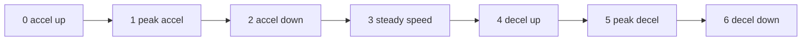
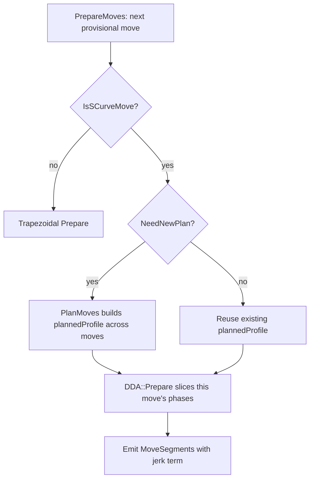
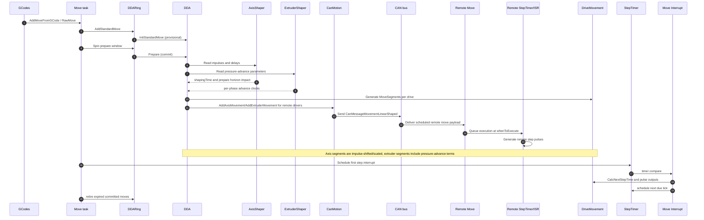

# Movement

`src/Movement/` is the motion engine of RepRapFirmware. It turns parsed moves into timed step output, handling kinematics, look-ahead, shaping, pressure advance, bed compensation, and the split between local drivers and CAN-attached remote drivers.

## Key Files And Areas

| Area | Purpose |
|---|---|
| [Move.cpp](Move.cpp), [Move2.cpp](Move2.cpp), [Move3.cpp](Move3.cpp) | Top-level motion control and queue management. |
| [DDA.cpp](DDA.cpp), [DDARing.cpp](DDARing.cpp) | Digital differential analyzer objects and queue structures. |
| [DDA_3rdOrder.cpp](DDA_3rdOrder.cpp), [MovementProfile.cpp](MovementProfile.cpp) | S-curve (3rd-order, jerk-limited) planning and per-move phase generation. |
| [DriveMovement.cpp](DriveMovement.cpp), [MoveSegment.cpp](MoveSegment.cpp) | Per-drive and per-segment execution details. |
| [StepTimer.cpp](StepTimer.cpp) | Step-timing and ISR-facing timing support. |
| [Kinematics/](Kinematics) | Machine-type-specific kinematics implementations. |
| [BedProbing/](BedProbing), [HeightControl/](HeightControl) | Probe-driven movement support and related motion behaviors. |
| [StepperDrivers/](StepperDrivers) | Smart-driver integration. |

## Motion Pipeline At A Glance

The subsystem accepts high-level move intent from `GCodes`, transforms it into motor-space movement, and prepares deterministic per-drive step timing. It owns the most timing-sensitive code in the firmware.

The short version:

- `Move` is the orchestrator and policy owner.
- `DDARing` is the queue of coordinated moves for one motion system.
- `DDA` is a single coordinated move, with look-ahead-adjustable kinematics and speed profile.
- `DriveMovement` is executable per-drive state derived from DDA segments.
- `StepTimer` provides absolute-time callback scheduling at step-clock resolution.
- `AxisShaper` and `ExtruderShaper` modify motion/extrusion dynamics to reduce ringing and pressure lag.
- `MovementProfile` holds the optional S-curve (3rd-order, jerk-limited) plan, which can span several queued moves.

For Duet 3 systems it also owns the split between local and remote execution. The move planner produces a single coherent machine motion, then separates the local-driver portion from the pieces that must be sent over CAN to expansion boards.

## `Move`: Top-Level Motion Coordinator

Primary files: [Move.cpp](Move.cpp), [Move2.cpp](Move2.cpp), [Move3.cpp](Move3.cpp), [Move.h](Move.h)

`Move` is the top-level runtime controller for motion. It combines configuration, queue management, kinematics ownership, and ISR-facing execution control.

Core responsibilities:

- Own movement-system queues (`DDARing` instances) and decide when to start/prepare/retire moves.
- Own machine motion configuration: steps/mm, acceleration, jerk/instant DV, axis limits, backlash, pressure advance, shaping, microstepping, driver enable/disable behavior.
- Coordinate with `GCodes` and `MovementState` to receive moves and update current machine state.
- Hold the active `Kinematics` implementation and perform cartesian-to-motor mapping setup.
- Bridge high-level planning and low-level stepping by maintaining active `DriveMovement` lists and scheduling interrupts.
- Support optional paths (CAN expansion, S-curve, phase stepping, async moves, laser/IO bits, probe-scanning).

Runtime model:

- Planning/execution orchestration runs in the dedicated MOVE task (`MoveLoop`).
- Hard-real-time step production runs through the step interrupt callback path (`Move::Interrupt`), scheduled via `StepTimer`.
- `MoveLoop` and ISR share state carefully (critical sections + atomic/volatile paths) to avoid races.

High-level control loop:

Important interactions:

- Input from [../GCodes/README.md](../GCodes/README.md): parsed move intent (`RawMove`) plus mode/tool context.
- Output to `ObjectModel`: current move telemetry, shaping state, queue stats.
- Calls into `CanMotion` when parts of a committed move belong to remote boards.

### `Move::dms`: Why It Is Bigger Than The Logical-Drive Count

`Move` owns one central `DriveMovement` array in [Move.h](Move.h):

- `dms[MaxAxesPlusExtruders + NumDirectDrivers]`

This array intentionally has two index ranges:

| `dms` index range | Meaning | Typical usage |
|---|---|---|
| `0 .. MaxAxesPlusExtruders-1` | **Logical drives** (axes + extruders in motion-space coordinates) | Normal queued movement (`G0/G1`, look-ahead, shaping, extrusion tracking) |
| `MaxAxesPlusExtruders .. MaxAxesPlusExtruders+NumDirectDrivers-1` | **Per-local-driver slots** (one slot per onboard stepper channel) | Special per-motor operations such as leadscrew adjustment moves |

Why this design exists:

- Most planner code is expressed in terms of logical drives, because that matches kinematics and user-visible axis/extruder semantics.
- Some operations need direct per-motor control on local hardware channels, bypassing shared-axis logical abstraction.
- Keeping both in one `DriveMovement` array lets the ISR and segment machinery stay uniform.

Logical drive versus local driver:

- **Logical drive**: an abstract movement channel in RRF motion space. This includes visible axes and extruders. It may map to one local driver, multiple local drivers, remote CAN drivers, or a mixture.
- **Local driver**: a specific onboard stepper output channel (a physical step/dir pair on the current board).

A useful rule of thumb:

- Logical drives answer "what axis/extruder motion should happen?"
- Local drivers answer "which physical motor channel should pulse on this board?"

Examples:

- A simple Cartesian X axis often has one logical drive mapped to one local driver.
- A kinematic or mirrored axis can map one logical drive to multiple local drivers.
- A CAN-mapped axis can have a logical drive with no local step pulses on the main board.
- Leadscrew adjustment may target local drivers individually, using the extra `dms` range above `MaxAxesPlusExtruders`.

Where this appears in code paths:

- Regular axis/extruder movement calls `AddLinearSegments` with logical-drive indices.
- Leadscrew adjustment moves call `AddLinearSegments` with `localDriver + MaxAxesPlusExtruders`, which uses the per-local-driver section of `dms`.

### CAN Motion: What Is Sent To Remote Boards

When a DDA includes remote drivers, `DDA::Prepare` feeds those parts into `CanMotion`, which builds one movement message per destination board for that DDA.

Send path summary:

1. `CanMotion::StartMovement` clears prior transient state.
2. `CanMotion::AddAxisMovement` adds integer step counts for remote axis drivers.
3. `CanMotion::AddExtruderMovement` adds float extrusion amounts for remote extruder drivers and sets pressure-advance intent.
4. `CanMotion::FinishMovement` stamps execution time/sequence and hands messages to CAN TX.

Primary movement payload (`CanMessageMovementLinearShaped`):

| Field group | Meaning on wire |
|---|---|
| `whenToExecute` | Master step-clock timestamp for synchronized move start on the remote board. |
| `accelerationClocks`, `steadyClocks`, `decelClocks` | Duration of each profile phase in step clocks. |
| `acceleration`, `deceleration` | Normalized base accel/decel coefficients (distance normalized to 1.0). |
| `numDrivers` | Number of per-drive entries included for this board. |
| `extruderDrives` | Bitmask indicating which per-drive entries are extruders. |
| `usePressureAdvance` | Instructs remote execution to apply extruder PA behavior. |
| `useLateInputShaping` | Instructs remote execution to use shaped segment behavior. |
| `seq` | Per-destination sequence counter for duplicate/out-of-order detection. |
| `perDrive[]` | Per local driver on that destination board: either `steps` (axis) or `extrusion` (extruder). |

Important implementation details:

- Messages are destination-board specific, so each board receives only its own per-drive subset.
- Variable-length framing is used (`GetActualDataLength`), so only `numDrivers` entries are transmitted.
- Messages with no effective motion are dropped (`HasMotion` check).
- For S-curve plans, remote payload currently sends equivalent averaged accel/decel terms rather than full 3rd-order profile data.

Abort and recovery control messages:

- `CanMessageStopMovement`: immediate stop request with a drive bitmap.
- `CanMessageRevertPosition`: post-stop correction, including final step counts and allowed clock budget.

Those urgent messages are used when stopping remote motion during events like probe/endstop-triggered interruption, so remote step counts can be reconciled with main-board state.

## `DDARing`: Queue And Scheduling Envelope

Primary files: [DDARing.cpp](DDARing.cpp), [DDARing.h](DDARing.h)

`DDARing` is one circular queue of `DDA` objects for a motion system. It controls admission, preparation timing, and retirement.

What it stores:

- `addPointer`: next free slot for a new move.
- `getPointer`: oldest move that is either committed or provisional.
- ring-level scheduling controls (`gracePeriod`, underrun counters, scheduled/completed counters, optional simulation time).

Lifecycle behavior:

1. New move admitted as `provisional` DDA (speed still adjustable by look-ahead).
2. As execution approaches, ring calls `DDA::Prepare`, which freezes dynamic parts and marks move `committed`.
3. Move remains in ring while executing and slightly after finish time for telemetry/reporting.
4. Once expired, ring frees DDA slot and advances `getPointer`.

Admission constraints enforced by `CanAddMove`:

- Ring intentionally avoids consuming the last free slot to keep safe access patterns for preparation logic.
- Ring also limits unprepared horizon to keep response latency acceptable.

Scheduling behavior in `Spin`:

- Retire committed+expired moves.
- If already executing, prepare additional provisional moves ahead of the current horizon.
- If idle and allowed to start, commit/start the next move.
- Return next wake interval hint to MOVE task.

## `DDA`: One Coordinated Move Unit

Primary files: [DDA.cpp](DDA.cpp), [DDA.h](DDA.h)

`DDA` (digital differential analyzer move record) represents one coordinated move over one or more logical drives.

What a DDA contains:

- Endpoints in motor coordinates (`endPoint`) and normalized direction vector.
- Geometric and profile metrics: total distance, requested/start/top/end speeds, accel/decel (plus jerk/S-curve data when enabled).
- Move flags (printing/non-printing, endstop checking, isolated move, pressure advance usage, laser/IO control, and runtime done-flags).
- Links to predecessor and successor in ring for look-ahead.
- Committed-time data such as move start time and clocks needed.

State machine:

- `empty`: free slot.
- `planned` (plus `created` on S-curve builds): queue-resident, still mutable by look-ahead.
- `committed`: frozen into executable segment/remote representation.

For S-curve moves the speed profile is not owned by the individual DDA but by a `MovementProfile` that may span several queued moves; see [S-Curve (3rd-Order) Motion Planning](#s-curve-3rd-order-motion-planning).

Key responsibilities:

- Build from `RawMove` (`InitStandardMove`) including kinematic transform and axis/extruder delta computation.
- Perform look-ahead coupling to neighboring moves (`DoLookahead`) to smooth junction speed transitions.
- Freeze execution profile in `Prepare` and generate per-drive segment data for local/remote execution.
- Provide live move metrics used by diagnostics and object model.

Why DDA exists as separate from DriveMovement:

- DDA is move-level and multi-drive.
- DriveMovement is drive-level and step-execution-oriented.
- This separation keeps planning math and ISR math decoupled.

## `DriveMovement`: Per-Drive Executable Step State

Primary files: [DriveMovement.cpp](DriveMovement.cpp), [DriveMovement.h](DriveMovement.h)

A `DriveMovement` is the real-time execution context for one logical drive (axis or extruder) for the currently active segment chain.

What it tracks:

- Current state (`DMState`), including start/end and profile variants (`cartAccel`, `cartLinear`, decel/reverse variants, optional phase stepping).
- Segment list pointer (`MoveSegment` chain), current segment math coefficients, direction, and step counters.
- Current motor position and per-segment/per-move origin positions.
- Endstop/probe flags copied from active segment.
- Extruder-specific pressure-advance state (`ExtruderShaper`) and accumulation fields.

Execution model:

1. On segment start, `NewSegment` selects/initializes the next executable segment.
2. Each generated step calls `CalcNextStepTime`.
3. Fast path handles repeated fixed interval stepping without full recompute.
4. Full path (`CalcNextStepTimeFull`) handles profile transitions, direction reversals, short-segment merges, and next due tick calculation.
5. Segment retirement advances to next segment or returns to idle.

Design notes:

- Uses fixed-point/clock-domain math in the critical path.
- Supports acceleration, deceleration, and direction reversal cases without floating-point-heavy ISR cost.
- Provides helpers for endstop-triggered stop accounting (`GetNetStepsTakenThisMove/Segment`).

## `StepTimer`: Absolute-Time Callback Engine For Stepping

Primary files: [StepTimer.cpp](StepTimer.cpp), [StepTimer.h](StepTimer.h)

`StepTimer` wraps the hardware timer/counter into a step-clock scheduler used by motion ISR code and a small set of other callback clients.

Key behaviors:

- Maintain a high-resolution monotonic step clock (`GetTimerTicks`).
- Schedule next interrupt at absolute tick (`ScheduleCallback*` methods).
- Handle "already due" deadlines by returning immediate execution hints.
- Maintain movement delay offset (`movementDelay`) used when system needs to intentionally lag movement time for safety/synchronization.
- In CAN expansion contexts, support delay propagation and time synchronization with master.

Interrupt model:

- Timer compare fires.
- `StepTimer::Interrupt` dispatches due callbacks from pending list.
- Motion callback (`Move::Interrupt`) computes and schedules next earliest step deadline.

Timing constraints:

- Extremely small scheduling margin in critical paths.
- Platform-specific timer implementations keep same logical API across SAME70/SAME5x/SAM4* families.

## `AxisShaper` And `ExtruderShaper`: Dynamics Compensation

Primary files: [AxisShaper.cpp](AxisShaper.cpp), [AxisShaper.h](AxisShaper.h), [ExtruderShaper.cpp](ExtruderShaper.cpp), [ExtruderShaper.h](ExtruderShaper.h)

### `AxisShaper` (M593)

Purpose:

- Reduce mechanical ringing by convolving planned motion with an impulse sequence.

What it stores:

- Type (`none`, `zvd`, `zvdd`, `zvddd`, `mzv`, `ei2`, `ei3`, `custom`).
- Frequency and damping ratio.
- Impulse coefficients and delays in step clocks.
- Derived `shapingTime` and `prepareAdvanceTime` used by planner to ensure enough horizon.

Behavior:

- Configured by `M593` (`AxisShaper::Configure`).
- Recomputes coefficients/delays and updates planner requirements.
- Can propagate settings to remote boards in CAN configurations.

How it is actually applied to motion:

- For each axis drive, the planner builds the unshaped accel/steady/decel segment set first.
- If shaping is enabled for the move, it then replays that same segment pattern once per impulse.
- Each replay is scaled by impulse amplitude and shifted by impulse delay.
- The shifted/scaled segments are merged into one per-drive `MoveSegment` timeline.

Mathematically, this is a discrete convolution in time:

$$
a_{shaped}(t) = \sum_{i=0}^{N-1} c_i\,a_{base}(t-d_i)
$$

Where:

- $c_i$ are impulse coefficients (`coefficients[]`, summing to 1).
- $d_i$ are impulse delays in step clocks (`delays[]`).
- $N$ is the number of impulses (`numImpulses`).

Runtime implications of that model:

- More impulses means more segment superposition work and a longer "tail" after nominal move end.
- `shapingTime` is the final impulse delay and represents that extra in-flight time.
- `prepareAdvanceTime` is increased so moves are prepared early enough to avoid underruns when delayed impulses overlap future moves.
- For isolated moves (for example endstop-checking moves), shaping is intentionally disabled (`noShaping`) to keep semantics deterministic.

Practical interpretation of shaper types:

- ZV/ZVD/ZVDD/ZVDDD: progressively more robust to modeling error, at the cost of longer delay.
- MZV/EI variants: alternatives that trade delay, robustness, and smoothing style.
- `custom`: explicit impulse amplitudes and delays, useful for experimentally tuned systems.

Configuration/timing guardrails from implementation:

- Frequency is constrained to 4 to 400 Hz.
- Damping ratio is constrained to 0.00 to 0.99.
- Coefficients are normalized so total gain remains 1.0.
- The planner enforces an advance-prepare minimum even if shaping is off.

### `ExtruderShaper` (Pressure Advance)

Purpose:

- Compensate extrusion lag caused by melt/compression dynamics by preemptively adjusting extrusion during speed transitions.

Model:

- Stores `k0`, `k1`, and `dk` (piecewise pressure-advance parameters).
- Derives `vk` and `d0` for efficient runtime evaluation.
- Supports simple single-slope and full piecewise parameterization.

Use at runtime:

- Drive-level extrusion step timing/path uses these parameters while building or executing extruder segments.

How the pressure-advance model works:

- RRF models advance distance as piecewise linear vs extrusion speed.
- Up to knee speed $v_k$, slope is $k_0$.
- Above $v_k$, slope transitions to $k_1$ while preserving continuity.

Equivalent form used by code:

$$
d_{pa}(v)=
\begin{cases}
k_0 v, & v \le v_k \\
d_0 + k_1 v, & v > v_k
\end{cases}
$$

with:

$$
v_k = \frac{d_k}{k_0}, \quad d_0 = d_k\left(1-\frac{k_1}{k_0}\right)
$$

Segment-level usage details:

- The planner computes average pressure-advance clocks per segment phase (accel/steady/decel, or each S-curve subphase).
- If a segment's speed range crosses the knee, it computes an averaged value across both regions.
- That advance term is folded into segment distance and effective acceleration terms before stepping, rather than as an afterthought in ISR.

Important behavioral nuances:

- Pressure advance is applied only where extrusion semantics indicate printing forward extrusion; non-printing moves skip it.
- For CAN remote extruders, the host includes pressure-advance intent/parameters in movement messages so remote execution stays time-aligned.
- Because it is integrated at segment-generation time, PA naturally tracks input-shaped acceleration profiles.

Tuning implications:

- Increasing `k0` increases anticipatory extrusion during speed changes.
- Nonzero `k1` and `dk` allow high-speed behavior to differ from low-speed behavior, reducing overcompensation at extremes.
- Excessive values can produce reversals or abrupt extruder dynamics; diagnostics should be checked if step timing anomalies appear.

Axis shaping and pressure advance together:

- Axis shaping changes the acceleration timeline.
- Pressure advance uses that changed timeline to compute extrusion pre-compensation.
- Net effect: ringing reduction and pressure compensation remain consistent rather than fighting each other.

## S-Curve (3rd-Order) Motion Planning

Primary files: [MovementProfile.cpp](MovementProfile.cpp), [MovementProfile.h](MovementProfile.h), [DDA_3rdOrder.cpp](DDA_3rdOrder.cpp)

By default RRF uses trapezoidal (2nd-order) motion: each move is an accel / steady / decel profile in which acceleration changes instantaneously at the phase boundaries. S-curve planning replaces this with **3rd-order, jerk-limited** motion, where `jerk` is the rate of change of acceleration. Acceleration is ramped up and down smoothly rather than switched on and off, which reduces the high-frequency content that excites mechanical resonance and reduces stress on the drive train.

### When S-Curve Is Active

S-curve is gated at both compile time and run time:

- **Compile time**: `SUPPORT_S_CURVE` (enabled by default on the Duet 3 MB6HC). It cannot be built without `SUPPORT_PHASE_STEPPING` — the two are coupled by a hard `#error` in [Pins.h](../Config/Pins.h).
- **Run time**: enabled only when an acceleration time has been configured (`M201 T<seconds>`, stored as `accelerationTime`) **and** every local driver is in phase-stepping mode (`StepMode::phase`). `Move::UpdateSCurveFlagAndJerk` re-evaluates this and sets the `usingSCurve` flag; if the requirement isn't met it falls back to trapezoidal motion and reports a warning.

The per-axis jerk is *derived*, not configured directly:

$$
\text{jerk}_{axis} = \frac{\text{acceleration}_{axis}}{\text{accelerationTime}}
$$

So `accelerationTime` is the time taken to ramp from zero to full acceleration; a longer time means lower jerk and smoother (but slower-responding) motion.

S-curve is **not** transmitted over CAN. Remote drivers still receive trapezoidal payloads with equivalent averaged accel/decel terms (see [CAN Motion](#can-motion-what-is-sent-to-remote-boards)), which is why a mixed local/remote machine can run S-curve locally while remote slices stay 2nd-order.

### The 7-Phase Profile

`MovementProfile` describes one jerk-limited profile as up to seven phases. The end acceleration is always zero, and currently the end speed is always zero too (a full profile ramps a sequence of moves up from rest and back down to rest).

| Phase | `distances[]` | Meaning |
|---|---|---|
| 0 | `distances[0]` | Acceleration increasing (positive jerk) up to peak acceleration. |
| 1 | `distances[1]` | Constant peak acceleration (only if the acceleration limit is reached). |
| 2 | `distances[2]` | Acceleration decreasing back to zero — passes through and beyond top speed. |
| 3 | `distances[3]` | Constant top speed (steady phase). |
| 4 | `distances[4]` | Deceleration increasing (negative jerk) up to peak deceleration. |
| 5 | `distances[5]` | Constant peak deceleration (only if the deceleration limit is reached). |
| 6 | `distances[6]` | Deceleration decreasing back to zero. |

Not every profile uses all seven phases. The planner degrades gracefully depending on which limits bind:

- **7 phases**: top speed, max acceleration and max deceleration are all reached.
- **5 phases**: phases 1 and/or 5 (constant accel/decel) or phase 3 (steady speed) drop out when the corresponding limit is not reached.
- **3 phases**: short moves that reach neither the requested speed nor the acceleration limit — accel-up, accel-down (through the peak), decel-down.

`MovementProfile::CalculateSimpleSCurvePlan` / `CalculateSimpleFivePhasePlan` handle the common symmetric case (start speed, end speed and start acceleration all zero, with peak deceleration equal to minus peak acceleration). `CalculateGeneralSCurvePlan` handles the general case with non-zero start speed/acceleration. Phase durations come from solving the cubic/quadratic/quartic equations relating distance, speed, acceleration and jerk (`SmallestNonNegativeCubicSolution`, `SmallestNonNegativeQuadraticSolution`, and a quartic solver).

To avoid rounding errors from extremely short phases, the planner enforces a `MinimumPhaseDuration` (about 0.5 ms). If a phase would be shorter than this it reduces the top speed to lengthen it, recomputing the profile (often dropping from a 7-phase to a 5-phase plan).

### Planning Across Multiple Moves

This is the key structural difference from trapezoidal lookahead. Trapezoidal look-ahead (`DDA::DoLookahead`) adjusts the *junction speeds* between individually-profiled moves. S-curve planning instead builds **one `MovementProfile` that can span several queued moves** — a single jerk-limited ramp can accelerate across the start of one move and decelerate across the end of another.

The active plan is held on the `DDARing` (`plannedProfile`) and persists across moves. `DDARing::PrepareMoves` re-uses it where possible:

- `DDA::IsSCurveMove` selects S-curve handling for a move.
- `DDARing::NeedNewPlan` decides whether the existing plan is still valid, or whether a new one must be built — for example a new plan is needed when there is no plan yet, or when the plan covered all queued moves and more moves have since been added (unless we have already passed the point of no return, such as the reducing-deceleration phase).
- `DDA::PlanMoves(firstUnpreparedMove, plannedProfile, stopping)` builds (or rebuilds) the multi-move profile.

The profile tracks `numberOfMovesCovered`, `reachesRequestedSpeed` and `usesAllMoves` so that re-planning can be skipped when nothing relevant has changed.

### From Plan To Segments

`DDA::Prepare` consumes the part of `plannedProfile` belonging to this DDA and converts each phase's distance into a duration in step clocks, filling `PrepParams`:

- `phaseClocks[7]`: step-clock duration of each phase (`TotalAccelClocks` = phases 0–2, `SteadyClocks` = phase 3, `TotalDecelClocks` = phases 4–6).
- `initialAcceleration` / `peakAcceleration`, `initialDeceleration` / `peakDeceleration`, and `jerk`.

Because a single profile can span several moves, one DDA may carry only some of the seven phases; `Prepare` records the last phase number it consumed and leaves the remainder for following moves. The resulting `MoveSegment` objects carry an extra jerk coefficient `j` (only present when `SUPPORT_S_CURVE` is built), so the per-step position function integrated in the ISR is a cubic in time rather than the quadratic used for trapezoidal motion. Pressure advance (`ExtruderShaper`) averages its advance term across each phase, including the S-curve sub-phases, so extrusion compensation tracks the jerk-limited acceleration timeline.

## Component Interaction Deep Dive

## Operational And Debug Notes

- Queue starvation or too-short planning horizon appears as look-ahead underruns in ring diagnostics.
- Excess ISR load can increase movement delay; `StepTimer` tracks and reports this.
- Endstop/probe-isolated moves are intentionally serialized to avoid unsafe overlap.
- Input shaping increases required prepare horizon; if changed, queue behavior and latency may change.

## Verification Guidance

When modifying these subsystems, validate all three levels:

1. Planning-level checks:
   - DDA state transitions (`planned` -> `committed`), expected speed transitions, no impossible junctions.
2. Execution-level checks:
   - Correct segment generation/count, no negative-time or reverse-edge glitches, stable interrupt scheduling.
3. System-level checks:
   - Homing/probing isolated moves, CAN-split moves, pressure-advance behavior, and shaping-enabled print quality.

For build and runtime references see [../../docs/devel/MOTION_PIPELINE.md](../../docs/devel/MOTION_PIPELINE.md) and [../../docs/devel/PLATFORM_AND_TASKS.md](../../docs/devel/PLATFORM_AND_TASKS.md).

## Interfaces Within RepRapFirmware

- [../GCodes/README.md](../GCodes/README.md) is the main entry path.
- [../Endstops/README.md](../Endstops/README.md) and [../InputMonitors/README.md](../InputMonitors/README.md) participate in homing and probing.
- [../CAN/README.md](../CAN/README.md) carries remote motion execution.
- [../Platform/README.md](../Platform/README.md) provides the low-level driver and timing resources.
- [../ObjectModel/README.md](../ObjectModel/README.md) exposes the resulting motion state.

## DSF And Duet3Expansion Interfaces

- **DSF**: DSF does not plan motion, but DCS feeds motion-producing codes into RRF and observes the resulting state and replies. In SBC mode, the motion subsystem is one of the most important consumers of the SBC channel.
- **Duet3Expansion**: this module is the main-board peer of Duet3Expansion's own motion-execution code. RRF plans the machine motion; expansion boards execute their assigned slices.

## Standalone Vs SBC

The motion subsystem is common to both modes. The entry path differs, not the motion math or timing model.

## Related Docs

- [../../docs/devel/MOTION_PIPELINE.md](../../docs/devel/MOTION_PIPELINE.md)
- [../CAN/README.md](../CAN/README.md)
- [../GCodes/README.md](../GCodes/README.md)
- [Duet3Expansion/docs/devel/MOTION.md](https://github.com/Duet3D/Duet3Expansion/blob/3.7-docker/docs/devel/MOTION.md)
