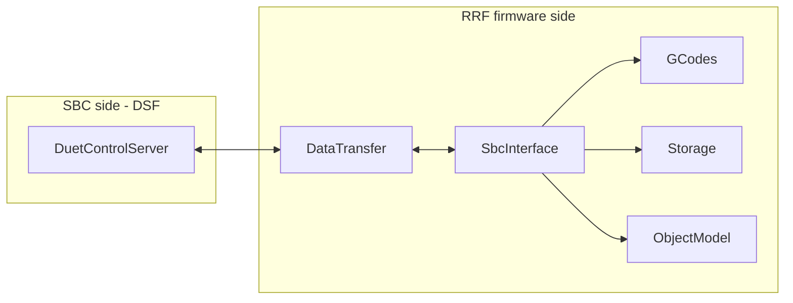
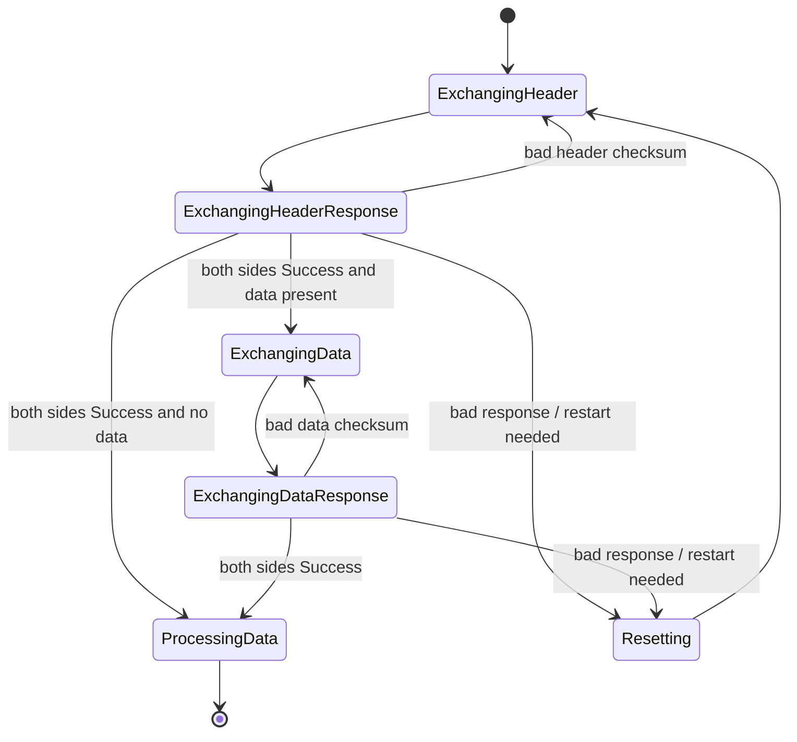
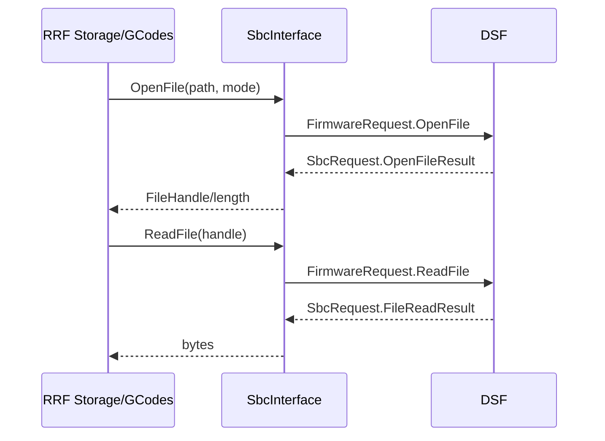

# SBC

src/SBC/ is the firmware-side implementation of the RepRapFirmware (RRF) to DuetSoftwareFramework (DSF) control link. It provides transport, framing, packet exchange, file-operation proxying, object-model exchange, and the dedicated SBC G-code ingress path.

In SBC mode, this module is the boundary where DSF becomes the front end and RRF remains the real-time machine controller.

## What This Module Owns

- Connection and transfer lifecycle between DSF and RRF.
- SPI framing (and USB framing when enabled) for bidirectional packet batches.
- Packet parsing and dispatch for SbcRequest (DSF -> RRF).
- Packet generation for FirmwareRequest (RRF -> DSF).
- Buffered binary G-code intake for the SBC channel.
- Proxy of filesystem operations to DSF (open/read/write/seek/truncate/close/delete).
- Object model query/reply path.
- Message and code-reply transport.
- Recovery behavior for timeouts, resets, and checksum failures.

## Key Files

| File | Purpose |
|---|---|
| [SbcInterface.cpp](SbcInterface.cpp) / [SbcInterface.h](SbcInterface.h) | Main SBC task loop, request dispatch, channel/file integration, mode and recovery behavior. |
| [DataTransfer.cpp](DataTransfer.cpp) / [DataTransfer.h](DataTransfer.h) | Transport state machine, SPI/USB transfer execution, packet read/write helpers, CRC validation. |
| [SbcMessageFormats.h](SbcMessageFormats.h) | Protocol constants, wire headers, request enums, size/time limits. |

## Architecture At A Glance

DataTransfer handles the transport transaction mechanics. SbcInterface handles semantic packet processing and integration with the rest of firmware subsystems.

## Protocol And Framing

All packet payload types and constants are defined in [SbcMessageFormats.h](SbcMessageFormats.h).

Important constants:

- SbcProtocolVersion = 7
- SbcTransferBufferSize = 8192 bytes
- SbcCodeBufferSize = 4096 bytes
- SbcTransferDelay = 25 ms
- SbcBurstModeDelay = 2 ms
- SbcBurstModeWindow = 50 ms
- SbcConnectionTimeout = 4000 ms
- SbcTransferTimeout = 500 ms

SPI transfer framing uses SpiTransferHeader followed by 0..N packet payload bytes. Each packet starts with PacketHeader.

SPI header validation checks:

- formatCode must match SbcFormatCode
- protocolVersion must match SbcProtocolVersion
- dataLength must be <= SbcTransferBufferSize
- crcHeader and crcData must match computed CRC32 values

If any check fails, DataTransfer replies with a specific SpiTransferResponse error and retries or resets as needed.

## Transfer Lifecycle (SPI)

DataTransfer::DoTransfer runs a multi-phase exchange:

1. Exchange transfer headers.
2. Exchange header responses.
3. Exchange payload data buffers (if any).
4. Exchange data responses.
5. Mark transfer finished or restart/reset depending on status.

Important behavior details:

- Packet IDs are assigned per outgoing packet and reset on each completed transfer.
- resendPacketId in PacketHeader is used by the receiver to request resend of a previously failed packet.
- Payload alignment is padded to 4-byte boundaries.
- FreeTxSpace reserves room so resend requests can still be emitted under pressure.

## Transfer Lifecycle (USB)

When SUPPORTS_SBC_OVER_USB is enabled, DataTransfer can switch to USB transport.

USB path behavior:

1. DSF sends UsbTransferHeader.
2. RRF replies with its UsbTransferHeader.
3. DSF sends payload bytes.
4. RRF sends payload bytes.

There is no SPI TransferReady GPIO in USB mode, but packet formats stay the same at payload level.

## SbcInterface Task Flow

SbcInterface::TaskLoop runs as a dedicated high-priority firmware task:

1. Start transfer.
2. Advance transfer until complete/timeout/reset.
3. On completed transfer:
	 - parse incoming SbcRequest packets,
	 - enqueue outgoing FirmwareRequest packets,
	 - schedule next transfer.
4. On timeout/reset:
	 - log disconnect reason,
	 - invalidate local resources,
	 - reset transport state.

This loop is where transport-level completion is converted into firmware actions.

## Incoming Requests (DSF -> RRF)

Incoming packet types are SbcRequest values. High-impact categories include:

- Machine control: EmergencyStop, Reset, LockMovementAndWaitForStandstill, Unlock.
- G-code feed: Code.
- Object model requests: GetObjectModel.
- Print and macro lifecycle: SetPrintFileInfo, PrintStopped, MacroStarted, MacroCompleted, InvalidateChannel.
- Expression/variable services: EvaluateExpression, SetVariable, DeleteLocalVariable, SetLastCodeResult.
- File operation results: CheckFileExistsResult, FileDeleteResult, OpenFileResult, FileReadResult, FileWriteResult, FileSeekResult, FileTruncateResult.
- System updates: ObjectModelKeyChanged.

If a request cannot be processed immediately (for example, resource lock contention), SbcInterface asks for packet resend by writing a ResendPacket response packet.

## Outgoing Requests (RRF -> DSF)

Outgoing packet types are FirmwareRequest values. Main flows:

- Object model replies: ObjectModel.
- Code buffer watermarks: CodeBufferUpdate.
- Human-readable output and replies: Message.
- Macro control: ExecuteMacro, AbortFile, MacroFileClosed.
- Pause and acknowledgements: PrintPaused, WaitForMessageAcknowledgment, MessageAcknowledged.
- Code forwarding: DoCode.
- Expression/variable replies: EvaluationResult, VariableResult.
- File operations: CheckFileExists, DeleteFileOrDirectory, SecureDeleteFile, OpenFile, ReadFile, WriteFile, SeekFile, TruncateFile, CloseFile.

Many of these are emitted opportunistically inside each exchange cycle based on pending work.

## SBC G-code Buffering

Incoming SbcRequest::Code packets are copied into a ring buffer (SbcCodeBufferSize). Each entry has a BufferedCodeHeader and encoded code payload.

Key points:

- txPointer/rxPointer/txEnd manage ring segments and wrap-around.
- If insufficient contiguous space exists, packet acknowledgement is deferred and resend is requested.
- FillBuffer consumes queued code records for a matching GCodeBuffer channel.
- DefragmentBufferedCodes is used to reduce stalls due to fragmentation.
- CodeBufferUpdate tells DSF how much room remains so DSF can pace code injection.

## File Operation Proxying

In SBC mode, RRF delegates file operations to DSF. SbcInterface exposes synchronous-looking methods such as:

- FileExists
- DeleteFileOrDirectory
- SecureDeleteFile
- OpenFile
- ReadFile
- WriteFile
- SeekFile
- TruncateFile
- CloseFile

Internally, each call sets shared operation state, emits a corresponding FirmwareRequest packet, and waits on fileSemaphore for the matching SbcRequest result packet.

Write operations may span multiple transfer cycles; pending bytes are advanced as acknowledgements arrive.

## Object Model Exchange

DSF requests object model content via SbcRequest::GetObjectModel (key + flags). RRF serializes the requested content and returns it as FirmwareRequest::ObjectModel.

If a response is too large to fit one transfer buffer, RRF sends an empty response for that request and logs an error.

## Message And Reply Path

RRF messages to DSF are transported via FirmwareRequest::Message and may be chunked when transfer space is limited. Chunk continuation is marked using PushFlag.

DSF messages to RRF use SbcRequest::Message and are routed through Platform messaging paths, including targeted code-reply completion behavior.

## Timing, Backoff, And Burst Mode

After each exchange cycle, SbcInterface may delay the next transfer to reduce host CPU load:

- Normal delay: maxDelayBetweenTransfers (default SbcTransferDelay).
- File-open delay: maxFileOpenDelay while files are open.
- Burst delay: burstModeDelay when burst mode is active.
- Skip delays when enough events are pending or file operations are waiting.

Burst mode is activated for urgent/interactive traffic and remains active for burstModeWindow after each activation.

M576 exposes runtime tuning of these values.

## Error Handling And Recovery

Recovery paths include:

- Header/data CRC mismatch handling with explicit error responses.
- Bad format/protocol/length rejection.
- Transfer restart on bad responses.
- Connection reset detection using transfer sequence number discontinuity.
- Connection timeout handling in the SBC task.
- Full resource invalidation on disconnect, including:
	- invalidating open file state,
	- clearing pending replies,
	- aborting SBC-executed files/macros,
	- flagging print as aborted,
	- switching off heaters.

This ensures the firmware returns to a consistent safe state after transport faults.

## Interfaces Within RepRapFirmware

- [../GCodes/README.md](../GCodes/README.md): consumes SBC channel input and macro/message control.
- [../Storage/README.md](../Storage/README.md): uses SBC file-proxy operations in SBC mode.
- [../ObjectModel/README.md](../ObjectModel/README.md): supplies machine-state data exported to DSF.
- [../Platform/README.md](../Platform/README.md): provides lower-level hardware, task, and messaging facilities.

## DSF And Duet3Expansion Interfaces

- DSF: direct peer through DuetControlServer link/protocol implementation.
- Duet3Expansion: no direct DSF link; expansion boards remain behind RRF on CAN.

## Standalone Vs SBC

This module defines SBC mode behavior. In standalone mode it remains inactive and RRF owns the local front-end/network/filesystem surface directly.

## Related Docs

- [../../docs/devel/SBC_INTERFACE.md](../../docs/devel/SBC_INTERFACE.md)
- [../../docs/devel/STANDALONE_VS_SBC.md](../../docs/devel/STANDALONE_VS_SBC.md)
- [../../docs/devel/GCODE_PROCESSING.md](../../docs/devel/GCODE_PROCESSING.md)
- [DuetSoftwareFramework/src/DuetControlServer/README.md](https://github.com/Duet3D/DuetSoftwareFramework/blob/v3.7-andy/src/DuetControlServer/README.md)
